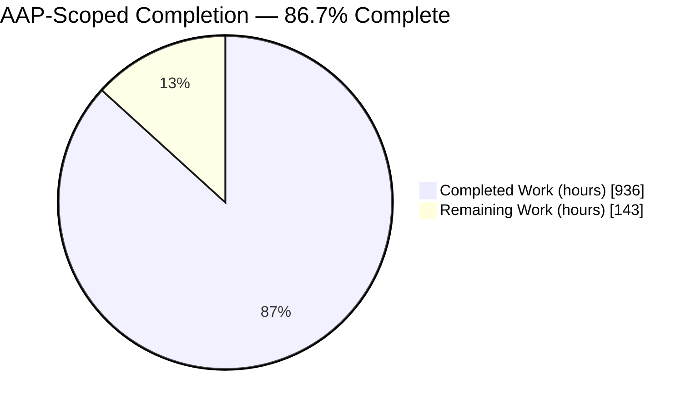
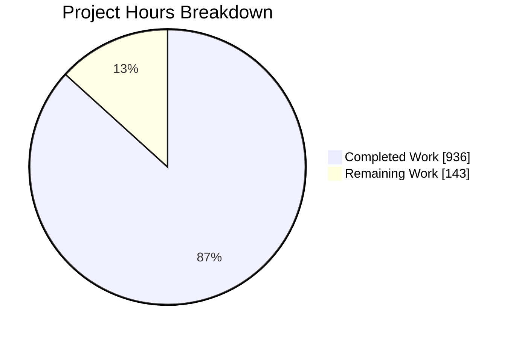
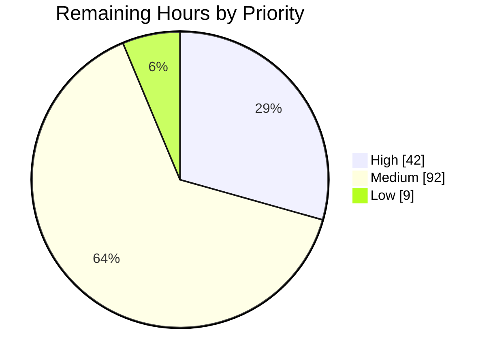
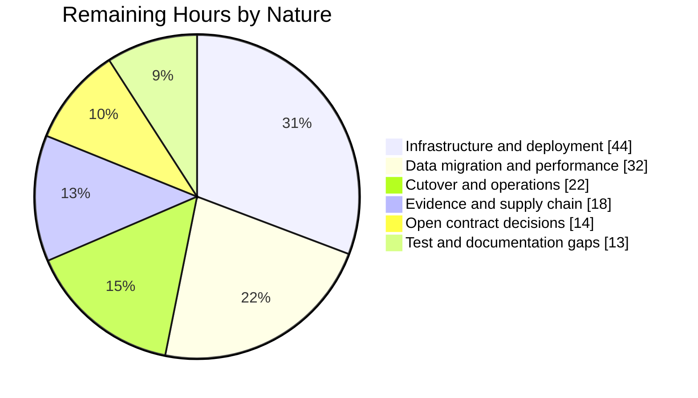
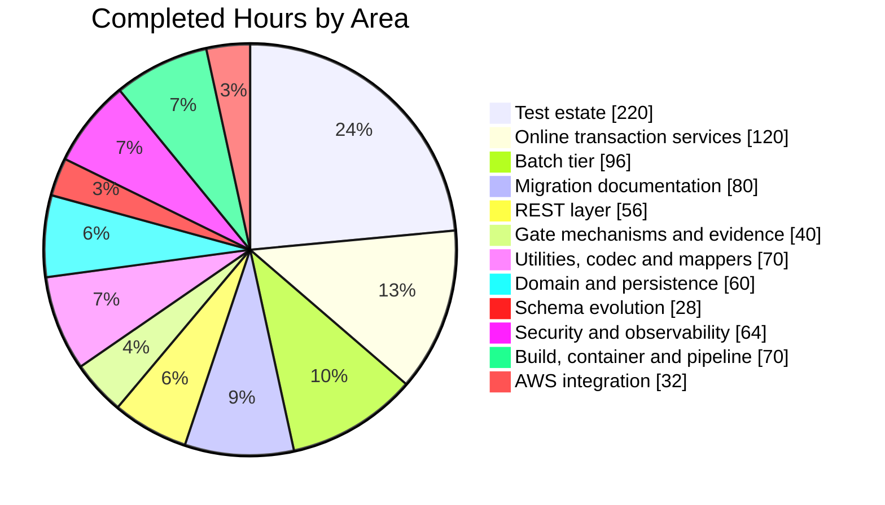

# 1. Executive Summary

## 1.1 Project Overview

The AWS CardDemo credit-card estate — 28 COBOL programs of 19,254 lines, 28 copybooks, 17 BMS mapsets, 29 JCL members and its VSAM data layer — now runs as a Java 25 LTS and Spring Boot 3.5.16 service in the self-contained `carddemo-java/` module. Card servicing, account maintenance, posting, accrual, statement generation and reporting are preserved behaviour for behaviour, with the four contractual output formats byte-identical. For the group that owns the card platform, the 3270 screen contract is now a documented REST surface, the batch schedule is Spring Batch, and VSAM is PostgreSQL 16.

## 1.2 Completion Status



<!-- Blitzy brand colours: Completed = Dark Blue #5B39F3 · Remaining = White #FFFFFF -->

| Metric | Value |
| --- | --- |
| **Total Hours** | **1,079** |
| **Completed Hours (AI + Manual)** | **936** (936 autonomous, 0 manual) |
| **Remaining Hours** | **143** |
| **Percent Complete** | **86.7%** — 936 ÷ 1,079 × 100 |

Completion covers AAP-scoped delivery plus the path to production. Every AAP requirement is implemented; 98 of the 143 remaining hours are infrastructure, deployment, data conversion, alerting and cutover — outside the delivered scope by design.

## 1.3 Key Accomplishments

- ✅ All 28 programs translated; 544 of 544 paragraphs mapped to a named method and a covering test.
- ✅ Four contractual widths byte-identical: 430-byte rejects, 80- and 100-byte statements, 133-byte report.
- ✅ Truncating arithmetic demonstrated, not assumed — 28 of 50 accruals differ from half-up rounding.
- ✅ 17 screen transactions published as 19 REST operations; frozen texts and page sizes intact.
- ✅ Nine batch jobs launchable and observable, including the one the legacy schedule never wired.
- ✅ 28,789 tests pass, zero failures or skips; 96.06% line coverage against a build-failing 80% floor.
- ✅ Zero-warning clean-checkout build under `-Xlint:all -Werror` at release 25.
- ✅ All eight validation gates evidenced and reproducible on the six-service local stack.

## 1.4 Critical Unresolved Issues

| Issue | Impact | Owner | ETA |
| --- | --- | --- | --- |
| Gate evidence is bound to a revision and command rather than to a pipeline run, because the workflow has not been executed on this branch | A sign-off that requires a durable run identifier cannot be completed yet | DevOps / Release | 6 h |
| Pinned action digests, container image digests and the two advisory records are not independently attested against their upstream sources | Final security approval remains open; the pins are internally consistent but unconfirmed | Security | 4 h |
| One high-severity advisory is carried under a dated determination expiring 2026-11-13, with residual critical findings on two loopback-only images | The build fails closed at expiry unless a patched release is adopted first | Security | 8 h |
| Card primary account number and verification code are stored in cleartext, matching the legacy design | Regulated data exposure if the database or a backup is compromised; closing it requires a requirement change | Product / Security | 8 h |
| Two contract divergences await a decision: the middle-name and second-address-line fields are unvalidated, and sign-on replies distinguish an unknown identifier from a wrong secret | The REST contract accepts input the screen rejects, and identifiers remain enumerable at a throttled rate | Product | 6 h |
| Five account-update failure arms and the two helpers behind them are not exercised by any test | Those arms are documented rather than proven; the arms each failure maps onto are covered | Backend | 4 h |
| Production infrastructure, deployment manifests, data conversion, alerting and cutover are outside the delivered scope | The service cannot be released until a target environment exists | Platform / DevOps | 98 h |

## 1.5 Access Issues

| System/Resource | Type of Access | Issue Description | Resolution Status | Owner |
| --- | --- | --- | --- | --- |
| Upstream registries and advisory databases | Outbound network | Digest and advisory records cannot be fetched from their sources in the delivery environment, so pin correspondence rests on the committed values | Unresolved | Security |
| AWS account (S3, SQS, SNS) | Cloud credentials | Every queue, object-store and notification contract is proven against the local emulator; no real account, identity policy or account identifier is available | Unresolved | Platform |
| Repository CI pipeline | Workflow execution | The workflow has never been triggered, so no run or artefact identifier exists to cite | Unresolved | DevOps |
| PostgreSQL 16, emulator, metrics, dashboards, traces (local) | Loopback services | All six reachable on 127.0.0.1 with defaulted local values; nothing blocks local build, test or gate execution | Resolved | — |

## 1.6 Recommended Next Steps

1. **[High]** Execute the pipeline on this branch and cite its run and artefact identifiers — 6 h.
2. **[High]** Attest the pinned digests and advisory records from a network-authorised environment, then re-scan before sign-off — 9 h.
3. **[High]** Provision the target environment: PostgreSQL 16 schema tier, object store, queue and topic with identity policies and encryption, and thirteen production values in a secret manager — 24 h.
4. **[Medium]** Decide the three open contract questions: middle-name validation, sign-on reply wording, and card-number protection at rest — 14 h.
5. **[Medium]** Re-run posting and accrual at production volume against the recorded baseline, then set alert rules from the result — 22 h.

# 2. Project Hours Breakdown

## 2.1 Completed Work Detail

| Component | Hours | Description |
| --- | ---: | --- |
| Build, toolchain and Maven manifest | 24 | `carddemo-java/pom.xml` on the Spring Boot 3.5.16 parent at `<release>25</release>` with `-Xlint:all -Werror`, the committed Maven wrapper pinned to 3.9.16, coverage and vulnerability gates bound to `verify`, and separated unit and integration providers |
| Domain model | 34 | 12 entities over the 11 verified record layouts with exact `BigDecimal` scales, preserved source field spellings and `@Version` locking; 3 composite-key classes; 9 enums carrying the legacy condition names |
| Persistence layer | 26 | 18 repository types including the two alternate-index finders, the processing-date range query, keyset cursors and paged browse preserving the 7 / 10 / 10 page sizes and descending backward fill |
| Schema evolution | 28 | Five Flyway scripts in profile-scoped schema and seed locations — 11 tables, index equivalents, fixed-width invariants over 74 columns, the reference seed and ten hashed sign-on identities — plus the migration configuration and its callbacks |
| Zoned-decimal codec and record mappers | 34 | `util/ZonedDecimalCodec` with overpunched signs, scale 2 and truncation toward zero, and 12 hand-written offset mappers over the verified layouts with no reflection or mapping framework |
| COBOL utility primitives, templates and formatters | 36 | The three string primitives, attention-key translation, the 17-card job-submission image builder, the 80- and 100-byte statement literal templates, the 133-byte report line formatter, the fixed-width field reader and the bounded external sorter |
| Online transaction services | 120 | The 17 screen transactions and the shared date subprogram across 37 service classes, with control flow reproduced paragraph for paragraph — the 85-paragraph account-update program, the 11-stage date cascade, the field-decoration surface and the highest-key-plus-one identifier |
| Screen-derived REST layer | 56 | 10 controllers publishing 19 operations, 32 request and response types from the 17 symbolic maps, the two-state field-error contract, contract adapters, the global error handler and the published API description |
| Batch tier | 96 | Nine job configurations from the nine application job steps, the shared program-lifecycle template, four processors, the 430-byte reject writer, the reader factory, the staged-generation store with its advisory publication lock and the launch coordinator |
| AWS integration | 32 | Object-store staging with versioning, the FIFO job-submission bridge preserving 80-character cards and ignore-on-error semantics, terminal job notification, client configuration and the resource-trust verifier |
| Security | 34 | Authentication with hashed credentials and the administrator split, token issue and verification, the 18-route authorization matrix with deny-all beneath, field-level protection of regulated values and the production configuration validator |
| Observability | 30 | Health groups and nine components, per-endpoint and per-step timers, trace export with parent-child continuity across the REST-to-batch boundary, structured JSON logging, the metrics scrape configuration and the provisioned dashboard |
| Container image and local validation stack | 22 | The multi-stage image with provenance enforcement and a health probe, and the six-service stack — database, emulator, application, metrics, dashboards and traces — all digest-pinned and bound to loopback |
| Test estate | 220 | 454 unit, 74 integration and 3 end-to-end classes with independently authored oracles, the container base classes, the golden output fixtures at five widths and the ten named input fixtures |
| Gate mechanisms and recorded evidence | 40 | The byte-equivalence comparator, the run-scoped performance recorder, the paragraph census and traceability reconciler, the unsafe-code audit, the published-figure guards and the emitted evidence bundle |
| Migration documentation | 80 | The 544-row traceability matrix, 370 recorded translation decisions, the architecture reference, the onboarding walkthrough, the gate evidence page, the summary deck, the estate front page and the documentation-site and catalog metadata |
| Continuous-integration pipeline definition | 24 | The workflow definition scoped into the module: toolchain setup, the full gate sequence, coverage enforcement, an executed vulnerability scan, evidence upload and the published-figure reconciliation steps |
| **Total** | **936** | |

## 2.2 Remaining Work Detail

| Category | Hours | Priority |
| --- | ---: | --- |
| Execute the pipeline and bind gate evidence to a durable run identifier | 6 | High |
| Externally attest pinned action, image and advisory digests | 4 | High |
| Supply-chain follow-through — re-scan, adopt the patched servlet container, retire the determination, re-ask the image determinations at expiry | 8 | High |
| Provision production infrastructure — managed PostgreSQL 16, object store, FIFO queue and topic with identity policies and encryption, transport material, secret manager | 24 | High |
| Deployment manifests and rollout — orchestration, ingress, autoscaling, probe wiring | 20 | Medium |
| Production data migration and reconciliation from the legacy datasets | 20 | Medium |
| Monitoring, alerting and service levels on the recorded performance baseline | 10 | Medium |
| Performance validation at production volumes | 12 | Medium |
| Cutover, parallel-run and rollback runbook | 12 | Medium |
| Close the account-update failure-arm coverage gap and re-publish the affected figures | 4 | Medium |
| Decide the two directive-driven contract divergences | 6 | Medium |
| Decide card number and verification-code protection at rest | 8 | Medium |
| Extend golden coverage to the remaining reject reason codes and the supplemental width | 5 | Low |
| Refresh dated per-run evidence and settle prior-page and capture-artefact disposition | 4 | Low |
| **Total** | **143** | High 42 · Medium 92 · Low 9 |

## 2.3 Prioritised Human Task List

Each task maps to one Section 2.2 category and the two views reconcile subtotal for subtotal.

| # | Priority | Task | Hours |
| ---: | --- | --- | ---: |
| 1 | High | Run the workflow on this branch and cite its run and artefact identifiers on the evidence page | 6 |
| 2 | High | From a network-authorised environment, confirm each pinned action digest, image digest and advisory record against its upstream source | 4 |
| 3 | High | Re-run the dependency scan immediately before sign-off; adopt the patched servlet-container release when it publishes and delete the determination the build will then reject as unused | 5 |
| 4 | High | Re-ask the two container-image determinations at their stated expiry and decide the transitive telemetry advisory | 3 |
| 5 | High | Provision managed PostgreSQL 16 and apply the schema tier only, leaving both seed scripts unapplied | 6 |
| 6 | High | Provision the object store, FIFO queue and notification topic with identity policies, server-side encryption and public-access controls | 10 |
| 7 | High | Place the thirteen production values in a secret manager and supply the transport keystore | 8 |
| 8 | Medium | Author deployment manifests, ingress and autoscaling, wiring the liveness and readiness groups to the platform probes | 20 |
| 9 | Medium | Build and reconcile the production data conversion, with row-level and balance-level reconciliation | 20 |
| 10 | Medium | Define alert rules and service levels against the recorded baseline and point them at the production metrics store | 10 |
| 11 | Medium | Re-run posting and accrual at representative production volume and publish the comparison | 12 |
| 12 | Medium | Write the cutover, parallel-run and rollback runbook, including how a partly posted day is resumed | 12 |
| 13 | Medium | Add tests that make the account-update repository calls raise, then re-publish the four coverage counters and both tier totals in the same change | 4 |
| 14 | Medium | Decide whether the middle-name and second-address-line fields should be validated as the program validates them, and whether sign-on replies should stop distinguishing an unknown identifier | 6 |
| 15 | Medium | Decide whether the card number and verification code must be protected at rest, and schedule the field-level work if so | 8 |
| 16 | Low | Derive golden records for the four reject reason codes the committed reject file does not exercise, and optionally for the supplemental width, from job runs | 5 |
| 17 | Low | Refresh the dated coverage cells and performance rows from the run that ships, and settle the disposition of the two prior-delivery pages and the committed capture artefacts | 4 |
| | | **Total** | **143** |

# 3. Test Results

Every figure below was produced by `./mvnw -B clean verify` from `carddemo-java/`, which finished `BUILD SUCCESS` in 11 minutes 58 seconds against a live PostgreSQL 16 and AWS emulator. The whole suite is **525 classes and 28,789 executions with 0 failures, 0 errors and 0 skips**: 451 unit classes / 27,123 executions and 74 integration and end-to-end classes / 1,666 executions. Coverage is the merged figure across both tiers over a 496-class bundle — **line 23,371 / 24,329 = 96.06%**, branch 89.41%, instruction 96.30%, method 98.87% — and the 80% line floor is a build-failing check, not a report.

| Area / Category | Framework | Tests | Passed | Failed | Coverage | What This Proves |
| --- | --- | ---: | ---: | ---: | ---: | --- |
| Screen-derived REST contracts (10 controllers, 32 request/response types) | JUnit 5, Mockito, Spring MVC Test, Testcontainers | 10,133 | 10,133 | 0 | 99.71% / 98.18% | The 19 published operations answer with the legacy field names, widths, page metadata and two-state field errors |
| Online transaction services (17 transactions plus the shared date subprogram) | JUnit 5, Mockito, AssertJ | 5,182 | 5,182 | 0 | 95.81% | Screen logic behaves paragraph for paragraph, including the 11-stage date cascade and the 39 decorated fields |
| Fixed-width codec, mappers, templates and formatters | JUnit 5, AssertJ | 4,235 | 4,235 | 0 | 96.43% | Every record image round-trips with its overpunched sign, negative zero included, and arithmetic truncates rather than rounds |
| Domain model, persistence and error contracts (12 entities, 11 repositories, 7 exception types) | JUnit 5, Testcontainers PostgreSQL 16 | 4,148 | 4,148 | 0 | 99.74% | Monetary scales, key shapes and fixed-width constraints hold against a real server, and every file-status path maps to its declared outcome |
| Batch tier — 9 job configurations and their step components | JUnit 5, Spring Batch Test, Testcontainers | 2,143 | 2,143 | 0 | 94.21% / 95.23% | All nine jobs run to completion with the legacy return codes, reject cascade order and staged-output lifecycle |
| Configuration, security and build contracts | JUnit 5, Spring Boot Test, Testcontainers | 2,492 | 2,492 | 0 | 94.37% | Profiles, the 18-route authorization matrix, migration topology and the published build figures hold as declared |
| End-to-end pipeline, online journeys, gate verification and the shared test harness | JUnit 5, Testcontainers PostgreSQL 16 + AWS emulator | 456 | 456 | 0 | included above | The four contractual widths are byte-identical to committed goldens, the queue drains 17 ordered 80-byte cards, and all eight gates hold |
| **Total** | | **28,789** | **28,789** | **0** | **96.06% line (merged)** | |

Rows aggregate the owning package across both tiers; fixture-contract, census and container-base classes are counted with the area they serve.

**Byte-equivalence measured in this run.** The four contractual outputs compared expected against actual on every record and every byte: reject file 38 records × 430 = 16,340 bytes; transaction report 519 × 133 = 69,027; statement 1,262 × 80 = 100,960; statement HTML 6,632 × 100 = 663,200. All four PASS. Supply-chain scanning ran in the same build over 166 dependency entries with **zero unsuppressed findings at or above CVSS 7.0**.

**Not covered — test before release**

- **Five failure arms in `carddemo-java/src/main/java/com/carddemo/service/AccountUpdateService.java`** (lines 3326, 3374, 3415, 3528, 3547) and the two helpers behind them: no test makes those repository calls raise. The arms each failure maps onto, and their locking effect, are covered; the raising path is not. Stub those five calls to throw and assert the resulting message and lock release.
- **Four of the five reject reason codes have no golden record.** The committed 430-byte reject file exercises one code; the other four are unit-tested only. Derive golden records for them from a job run.
- **The supplemental 40-byte category-balance width has no golden expected file.** Its width, edited-balance formatting and three-key ordering are asserted in-job instead; the gate defines four expected outputs and a fifth was deliberately not minted.
- **Eleven of the 544 traceability rows register no covered instructions.** They are a closed, reasoned exemption set — non-implemented and duplicate-label paragraphs; the remaining 533 execute.
- **Twelve EBCDIC datasets are never decoded.** They are verified present and byte-accounted, and the credential seed is recovered from its ASCII provisioning stream instead, so no character-set conversion path exists to test.
- **Prose claims on the published documentation pages are not individually asserted.** Identifier sequences, cross-references, counted figures and link targets are machine-checked; the surrounding narrative is not.

# 4. Runtime Validation &amp; UI Verification

The service was driven over real HTTP against the six-service local stack — application, PostgreSQL 16, AWS emulator, metrics, dashboards and traces — with every port bound to loopback. There is no browser interface by design: the 3270 screen contract is published as REST and consumed by clients and tests, so "UI verification" here means the screen-derived contracts and the operator-facing consoles.

- ✅ **Start-up and health** — `/actuator/health` returns `{"status":"UP","groups":["liveness","readiness"]}`, both group endpoints answer 200, and nine health components report up. All six stack services are healthy.
- ✅ **Sign-on and role routing (CC00)** — `ADMIN001` routes to `admin-menu` and `USER0001` to `user-menu`, each with a 312-character token in the `Authorization` response header; a wrong secret returns the frozen literal `Wrong Password. Try again ...` with focus on `PASSWD`, and an unknown identifier returns its own frozen text.
- ✅ **Authorization partition** — an administrator route answers 200 with an administrator token, 403 with a standard-user token and 401 anonymous, across the 18 enumerated routes with deny-all beneath them.
- ✅ **Account and customer screens (CAVW, CAUP)** — the view operation returns the joined contract with two-decimal money values, masked regulated fields for a standard user and revealed values for an administrator; the update operation holds the row, re-checks under the lock and reports change detection.
- ✅ **Card and transaction screens (CCLI, CCDL, CCUP, CT00, CT01, CT02)** — the card page returns exactly 7 rows with cursor metadata, the transaction page exactly 10 with descending backward fill, and the add flow reproduces the confirm turn before committing.
- ✅ **Bill payment and administration (CB00, CU00–CU03)** — payment mints the identifier as highest key plus one and answers `Your Transaction ID is 0000000000000001`; the ten seeded identities list, add, update and delete under administrator authority only.
- ✅ **Report submission to the queue bridge (CR00)** — the confirm turn then the submit turn drove the queue from empty to exactly 17 messages, each body exactly 80 characters in one message group, with the end-of-stream card transmitted last and the four ten-character date slots substituted at their frame offsets.
- ✅ **Batch surface** — nine job names are launchable and observable; `categoryBalanceReportJob` was launched and polled to `COMPLETED` with exit code `COMPLETED`, and illegal parameters are refused with a controlled 400 that discloses no inventory.
- ✅ **Persistence and migrations** — five migrations applied in order 1, 2, 2.2, 3, 4 all reporting success; 11 application tables plus the batch metadata tables; seeded 50 accounts, 50 cards, 50 customers, 300 daily transactions, 51 disclosure rows and 10 credential digests.
- ✅ **Observability and integrations** — the metrics endpoint serves 453,732 bytes of exposition, the metrics store reports the application target up, the dashboard service reports its database ok, the trace UI answers 200, and the emulator holds the staging bucket, the FIFO queue and the notification topic.

**Not exercised at runtime.** Posting the same daily file into the long-lived local database ends abnormally with file status 31, because that database already holds those postings — faithful legacy behaviour rather than a defect, and the job is proven end to end against fresh databases in the test tier. One of the four file-probe modes was not driven by hand; all four are covered by its integration test. The production profile was not started, since it fails fast on thirteen values this environment does not hold.

# 5. Compliance &amp; Quality Review

## 5.1 Compliance Matrix

Each row is the verified state of a deliverable as it stands now.

| # | Deliverable / Benchmark | Status | Verified State |
| ---: | --- | :---: | --- |
| 1 | Complete program coverage — all 28 COBOL programs translated | ✅ Pass | 544 of 544 paragraphs mapped to 22 target classes and 527 distinct method pairs; the unwired daily-transaction program is delivered as a launchable job; the unreferenced copybook is deliberately not migrated |
| 2 | Byte-level parity on the contractual outputs | ✅ Pass | Four widths compared expected against actual on every byte in this build: 430 × 38, 133 × 519, 80 × 1,262, 100 × 6,632 |
| 3 | Decimal identity with no floating-point substitution | ✅ Pass | Every monetary field is `BigDecimal` at the scale its picture declares; all nine rounding-mode uses truncate toward zero; no floating-point column exists |
| 4 | Control-flow semantics preserved | ✅ Pass | Range performs, backward jumps and clause ordering reproduced; the statement generator is an explicit state machine; the empty fee paragraph remains an invoked no-op |
| 5 | External interface contracts unchanged | ✅ Pass | Frozen message texts, page sizes 7 / 10 / 10, the 17-card job image with its end-of-stream card and the four fixed-width file formats all reproduced verbatim |
| 6 | Zero-warning deployable build from a clean checkout | ✅ Pass | 246 production and 547 test sources compile with zero diagnostics under `-Xlint:all -Werror` at release 25; the sole warning line in the build is the vulnerability scanner's banner |
| 7 | PostgreSQL 16 behind profiles, forward-only schema evolution | ✅ Pass | Five migrations in profile-scoped schema and seed locations; production stops below both seeds; 11 fixed-width invariants over 74 columns |
| 8 | Object store, FIFO queue and notification integration | ✅ Pass | Verified against a real emulator: versioned staging, 17 ordered 80-byte messages in one group, ignore-on-error tolerated, terminal notification published |
| 9 | Test estate where none existed | ✅ Pass | 28,789 executions across 525 classes, zero failures, errors or skips; 96.06% merged line coverage against a build-failing 80% floor with zero untested classes |
| 10 | Unsafe and low-level code budget | ✅ Pass | Production measures zero for process execution, reflection, native queries, raw SQL assembly, wildcard imports, legacy namespace imports and warning suppressions; five checked casts against a budget of five |
| 11 | Supply chain | ⚠ Pass with caveat | 166 dependency entries scanned in this build with zero unsuppressed findings at or above CVSS 7.0; one high-severity advisory carried under a dated determination and one medium carried openly |
| 12 | Observability, no feature expansion, legacy estate untouched | ✅ Pass | Health groups, per-endpoint and per-step timers, trace continuity and structured logging in place; nothing added that the source does not do; the 148-file legacy tree is byte-identical to the baseline |

## 5.2 AAP &amp; Rule Divergences and Gaps

No user-specified rules were supplied for this project, so no rule divergence is possible; the plan's twelve substituted enterprise standards governed instead and each is satisfied. Eight divergences from the plan of record were identified.

| # | What the AAP/Rule Required | What Was Delivered Instead | Why It Diverged | Impact | Remediation |
| ---: | --- | --- | --- | --- | --- |
| 1 | No validation constraint on the middle-name or second-address-line fields | Exactly that — while the source program does edit the middle name | An explicit, repeated plan directive outranked parity | The REST contract accepts a middle name the screen would reject | Product decision, then a constraint plus tests if reversed |
| 2 | Four flat migrations `V1`–`V4` under one location | Five scripts in two profile-scoped locations at production target 2.2 | Profile-scoped seeds and schema-level invariants needed versions sorting below every seed | Strictly stronger isolation; additive and forward-only | None required |
| 3 | 26 service classes and 11 record mappers | 37 service classes and 12 record mappers | Delivery decomposition plus a work-area mapper with no table behind it | Documentation-only; both figures are published with the arithmetic | None required |
| 4 | Four expected outputs for the end-to-end gate | Four gated comparisons plus a fifth contractual width asserted in-job | Minting a fifth expectation would assert a baseline the gate does not define | The fifth contract is verified, but by a different form of evidence | Optional golden derived from a job run |
| 5 | "Zero critical or high" vulnerabilities | Zero *unsuppressed* critical or high, plus one dated determination at CVSS 7.5 | No patched servlet-container release publishes; the advisory is a documented false match | Narrower wording than the plan's, stated identically in six places and enforced by tests | Adopt the fixed release when published |
| 6 | A durable run and artefact identifier for gate evidence | Revision-and-command binding, with the absence stated explicitly | The pipeline has never been executed on this branch | Evidence is reproducible but not retrievable from a run URL | Run the workflow and cite it |
| 7 | A module-wide reflection budget of zero | Zero in production; reflection and process execution used in the test harness | The audit is scoped to production sources; the alternative was widening production surface for a test | None on the shipped artefact; the audit re-measures zero | None required |
| 8 | The named file inventory for the module and documentation | Six additive artefacts outside that inventory | Each is forced by a tool constraint or a platform behaviour | Additive; no published count or contract moves | Settle the disposition of the committed capture artefacts |

**1 — Middle name and second address line carry no validation.** `carddemo-java/src/main/java/com/carddemo/api/dto/AccountUpdateRequest.java:293` carries the comment `INTENTIONALLY UNANNOTATED - DO NOT ADD ANY CONSTRAINT, NOT EVEN @Size`, and the second address line is treated identically. The source program *does* edit the middle name, so the directive and parity genuinely conflict; the directive was followed and the conflict recorded rather than hidden. The practical effect is that a middle name containing a digit is accepted here and refused by the screen. Reversing it means adding constraints the plan currently forbids, so this is a direction change for the product owner, not a code defect. Fifteen tests pin the unvalidated behaviour and would move with it.

**2 — Five migrations in two locations rather than four in one.** `carddemo-java/src/main/resources/db/migration/schema/` holds `V1__create_schema.sql`, `V2__create_indexes.sql` and `V2_2__add_protected_value_invariants.sql`; `db/migration/seed/` holds `V3__seed_reference_data.sql` and `V4__seed_user_security.sql`. The split exists because seeded reference data and seeded credentials must never reach production, and because column-level protected-value invariants are schema that must sort below every seed version. The migration configuration resolves only the schema location under production and refuses the shared parent under every profile, so a stale version pin can under-migrate the schema half but can never expose a seed. Three independent controls hold it — the location list, the version ceiling and a seed-rejection callback — and the applied history in a live database reads 1, 2, 2.2, 3, 4.

**3 — Service and mapper counts exceed the planned figures.** `ls carddemo-java/src/main/java/com/carddemo/service/*Service.java` returns 37 and the mapper glob returns 12, against 26 and 11 in the plan. The plan's 26 is its enumeration of screen and batch programs, which is intact; the extra eleven are support services that emerged as those programs were decomposed. The twelfth mapper handles the statement work area, which has no table behind it, so the plan's count of eleven *persisted layouts* is also correct. Both numbers are published with the arithmetic that reconciles them, and a test derives each from the tree so neither can drift silently. Nothing behavioural follows from it.

**4 — A fifth contractual output width is verified without a golden.** The category-balance report emits a 40-byte line that the plan's four-output list does not name. It carries a committed 53-record expected file and is compared byte for byte inside its own job's integration test, which also asserts the edited-balance formatting and ordering. It was kept out of the four gated comparisons, because adding an expectation the gate does not define would invent a requirement. The result is that all five widths are proven and only the *form* of evidence differs. If a fifth gated golden is wanted, derive it from a job run rather than from the formatter, so the oracle stays independent of the code.

**5 — The vulnerability claim is narrower than the plan's wording.** `carddemo-java/owasp-suppressions.xml` carries one entry: CVE-2026-66299 at CVSS 7.5 against `tomcat-embed-core-10.1.57.jar`. No patched release exists on any line, so removing the entry would leave the build permanently red and breach the zero-warning *deployable* requirement. The advisory targets the WebSocket chat example, and none of the 2,036 archive entries across the embedded jars is an examples or webapps entry. The build still fails on any unsuppressed finding at or above CVSS 7.0, and it also fails on an unused suppression — so the entry retires itself the moment a fixed release publishes. One medium advisory at CVSS 5.3 is carried openly rather than suppressed.

**6 — Gate evidence is bound to a revision, not to a pipeline run.** The workflow at `.github/workflows/carddemo-java-ci.yml` is complete and mirrors the local gate sequence, but it has never been triggered, so no run or artefact identifier exists. The evidence page therefore cites the revision and the exact command that produced each figure, and states plainly that the run citation is still to be added. Inventing an identifier was refused. A reader can reproduce every number from a clean checkout — this assessment did — but cannot yet retrieve them from a build record, which matters for any sign-off that requires one. One execution of the workflow closes it.

**7 — The reflection budget is met in production and not in the test harness.** A scan of `carddemo-java/src/main/java` returns zero for reflection, process execution, native queries, raw SQL assembly, wildcard imports and warning suppressions. The test tree does use reflection and process execution, in harness code that reaches package-private state and runs the launcher scripts. The audit's scope is production sources, and the alternative — widening a nested class, its constructor and several methods so a test could reach them — would have added production surface for no runtime benefit. Counterbalancing this, the warning-suppression audit was widened beyond the plan's scope to cover *both* trees, and measures zero in each.

**8 — Six additive artefacts sit outside the named inventory.** A repository-root `overrides/main.html` exists because the documentation tool resolves a theme override relative to its configuration file and rejects one inside the documentation directory. A root `.gitattributes` carries one rule so lines added to the CRLF-encoded estate front page are not flagged as trailing whitespace. The telemetry version is raised above the pinned figure because that release calls a memory API the platform will soon reject. A two-second freshness window bounds three outbound health probes. Twenty-seven capture artefacts are committed under `blitzy/`, and the two prior-delivery pages received light figure corrections. None moves a published count or an external contract; only the capture artefacts need a disposition decision.

# 6. Risk Assessment

These are forward-looking exposures for the release, not history.

| Risk | Category | Severity | Probability | Mitigation | Status |
| --- | --- | :---: | :---: | --- | :---: |
| The pipeline has never been executed on this branch, so a first run may meet host behaviour the local runs never did — a cold vulnerability-database download takes roughly 31 minutes against about 1 minute warm, and the container-backed tier needs a working container runtime | Technical | Medium | Medium | The workflow mirrors the local gate sequence command for command and every gate is self-enforcing; run it once before merge and keep the database cache warm | Open |
| Behaviour at production data volumes is unproven: the recorded baseline is 300 daily transactions against 50 accounts at 102.21 records per second and 323,520,032 bytes peak heap, and no legacy throughput figure exists anywhere in the estate to compare against | Technical | Medium | Medium | Per-endpoint and per-step timers already export, so a volume run yields a directly comparable tuple; set-based queries replaced record-at-a-time reads, which should help rather than hurt | Open |
| Deliberate parity residuals could be "corrected" by a future maintainer and silently break byte equivalence — the accrual run leaves the final account group unposted because the source's end-of-file break is unreachable, posting is per-record durable with no job-level rollback, and one invoked fee paragraph is empty | Technical | Low | Medium | Each residual is recorded with its reasoning and pinned by tests that fail if the behaviour is changed | Accepted (documented) |
| The card primary account number and verification code are stored in cleartext, matching the legacy design | Security | High | Low | Standard-user responses mask regulated fields and reveal is decided from the authenticated identity on every turn; the government identifier, date of birth and funds-transfer account are sealed at rest. Closing it needs a requirement change | Accepted (documented) |
| One high-severity advisory is carried under a determination that expires 2026-11-13, and residual critical findings remain on two loopback-only container images | Security | Medium | Medium | The determination is scoped to a documented false match; the build fails on any unsuppressed finding at or above CVSS 7.0 and also on an unused suppression, so the entry retires itself when a patched release publishes | Monitored |
| Two frozen contracts carry known exposure: sign-on replies distinguish an unknown identifier from a wrong secret, and statement HTML emits printable markup from persisted data unescaped | Security | Low | Medium | Sign-on turns are timing-equalised so the reply text is the only signal, and escaping is refused because it would break byte parity; both are recorded parity exceptions | Accepted (documented) |
| Production start-up is fail-fast on thirteen un-defaulted values and no cutover runbook exists yet, so a mis-provisioned environment refuses to boot rather than starting degraded | Operational | Medium | Medium | Each refusal names the category, variable, property and published minimum without echoing the value, and the module manual enumerates all thirteen | Mitigated |
| Every object-store, queue and notification contract is proven against a local emulator; real identity policies, bucket public-access controls, server-side encryption and FIFO throughput are not provisioned | Integration | Medium | Medium | The resource-trust verifier requires the expected account identifier with no fallback and refuses readiness when write capability is unproven, so a mis-scoped environment fails visibly at start-up | Open |

# 7. Visual Project Status

**Project hours — 936 completed of 1,079 total (86.7%)**



<!-- Blitzy brand colours: Completed Work = Dark Blue #5B39F3 · Remaining Work = White #FFFFFF · accents Violet-Black #B23AF2 · highlight Mint #A8FDD9 -->

**Remaining work by priority — 143 hours**



**Remaining work by nature — where the 143 hours sit**



**Completed work by area — 936 hours**



Both hour figures are the same ones stated in Section 1.2 and detailed in Sections 2.1 and 2.2: 936 completed, 143 remaining, 1,079 total, 86.7% complete.

# 8. Summary &amp; Recommendations

**What was delivered.** The whole CardDemo estate now exists as a Java 25 and Spring Boot 3.5.16 service in `carddemo-java/`, built from a committed Maven wrapper with no external prerequisite beyond a JDK and a container runtime. All 28 COBOL programs are translated and all 544 procedure paragraphs are mapped to a named method and a covering test, including the daily-transaction program the legacy schedule never wired. The 17 screen transactions are published as 19 REST operations that reproduce the frozen message texts, the 7 / 10 / 10 page sizes and the backward-fill order. The nine application job steps are nine launchable Spring Batch jobs. VSAM is PostgreSQL 16 with natural business keys, forward-only migrations and no surrogate identifiers. Object-store staging, the FIFO job-submission bridge and terminal notification replace sequential-dataset staging and the transient data queue. The legacy tree is byte-identical to the baseline and remains the parity authority.

**What was verified.** A clean `verify` run for this assessment finished `BUILD SUCCESS` in 11 minutes 58 seconds: 246 production and 547 test sources compiled with zero diagnostics under `-Xlint:all -Werror`, 28,789 tests passed with no failures, errors or skips, merged line coverage measured 96.06% against a build-failing 80% floor with no untested classes, and the vulnerability scan covered 166 dependency entries with nothing unsuppressed at or above CVSS 7.0. The four contractual output widths compared byte for byte against committed goldens and matched on every record and every byte. The queue bridge was drained from a real queue to exactly 17 ordered 80-character cards with its end-of-stream card last. Truncating arithmetic was demonstrated rather than asserted: 28 of 50 interest computations differ from half-up rounding, and every one carries the truncated value. All eight validation gates hold, and each is reproducible on a developer machine from the six-service local stack.

**What remains.** The project stands at **86.7% complete — 936 of 1,079 hours**. No AAP requirement is unimplemented; the remaining 143 hours are dominated by path-to-production work that was outside the delivered scope: 44 hours of infrastructure provisioning and deployment manifests, 32 hours of data conversion and volume performance validation, 22 hours of monitoring and cutover planning, 18 hours of pipeline execution and supply-chain follow-through, 14 hours of open contract decisions and 13 hours of residual test and documentation gaps. Three items need a human decision rather than engineering: whether the middle-name and second-address-line fields should be validated the way the source program validates them, whether sign-on replies should stop distinguishing an unknown identifier from a wrong secret, and whether the card number and verification code must be protected at rest. Each is a departure the reader agreed to or a gap the legacy design already had, so none is a defect — but all three are visible in the shipped contract.

**The critical path to production.** Run the pipeline once so gate evidence carries a durable run identifier and the digest attestation can be completed; provision the target database, object store, queue and topic with identity policies and encryption, and place the thirteen production values in a secret manager; then convert and reconcile the production data and re-measure posting and accrual at real volume against the recorded baseline. Deployment manifests, alert rules and the cutover runbook follow from those. The success metrics are already instrumented and need no new work: byte equivalence on the four output contracts, the coverage floor, zero unsuppressed high or critical advisories, and the per-step throughput and heap figures the timers publish.

**Production readiness.** The module is functionally complete and independently verifiable, and its quality gates are self-enforcing rather than asserted — a warning fails the build, a coverage drop fails the build, an unused vulnerability suppression fails the build, and a tampered golden byte fails the build. It is not yet releasable, for reasons of environment rather than code: no target infrastructure exists, no pipeline run has been recorded, and the two credential-exposure decisions are open. Given a provisioned environment, the sequence above is a matter of days rather than weeks, and nothing in the assessment suggests rework of the delivered code.

# 9. Development Guide

Every command below was executed against this checkout and the output shown is what it printed. All commands run from `carddemo-java/` unless stated otherwise.

## 9.1 System Prerequisites

| Requirement | Version verified | Notes |
| --- | --- | --- |
| JDK | Eclipse Temurin 25.0.3+9 | `java -version` → `openjdk version "25.0.3" 2026-04-21 LTS` |
| Maven | 3.9.16, via the committed wrapper | There is no system `mvn` and none is needed |
| Container runtime | Docker 29.7.0 with Compose 5.3.1 | Required for the integration tier and the local stack |
| PostgreSQL client | psql 17.10 | Optional, for inspecting the local database |
| Disk / memory | ≈ 3 GB for the dependency and vulnerability caches; 4 GB RAM for the stack | A cold vulnerability-database download is ≈ 31 minutes; warm ≈ 1 minute |

```bash
# The non-interactive shell does not source the profile scripts, so set this explicitly.
export JAVA_HOME=/usr/lib/jvm/temurin-25
java -version
./mvnw -v      # Apache Maven 3.9.16 (2bdd9fddda4b155ebf8000e807eb73fd829a51d5)
```

## 9.2 Environment Setup

The `local` profile needs no secrets — every value is defaulted, and every published port binds to `127.0.0.1`.

```bash
cd carddemo-java
docker compose up -d                 # postgres, localstack, jaeger, prometheus, grafana, app
docker compose ps                    # expect 6 services, all "healthy"
```

Rebuilding the application image requires provenance; the image refuses the all-zero sentinel:

```bash
export APP_VERSION="$(./mvnw -q -DforceStdout help:evaluate -Dexpression=project.version)"
export SOURCE_REVISION="$(git rev-parse HEAD)"
export SOURCE_DATE_EPOCH="$(git log -1 --format=%ct)"
docker compose up -d --build
```

The production profile is deliberately not runnable here: it resolves thirteen values from the environment with no fallback (`CARDDEMO_DB_URL`, `CARDDEMO_DB_USERNAME`, `CARDDEMO_DB_PASSWORD`, `CARDDEMO_JWT_SECRET`, `CARDDEMO_MANAGEMENT_TOKEN`, `CARDDEMO_FIELD_ENCRYPTION_KEY`, `CARDDEMO_SQS_QUEUE`, `CARDDEMO_AWS_ACCOUNT_ID`, `AWS_REGION`, `OTEL_EXPORTER_OTLP_TRACES_ENDPOINT` and four `CARDDEMO_TLS_*` values) and refuses to start if any is absent or weak.

## 9.3 Build and Test

```bash
# Full gate: compile, unit tier, integration tier, coverage check, vulnerability scan. ~12 min warm.
./mvnw -B clean verify

# Fastest zero-warning check. Measured 47.5 s.
./mvnw -B clean test-compile -Ddependency-check.skip=true

# Unit tier only, no containers needed.
./mvnw -B test

# Everything except the container-backed tier.
./mvnw -B verify -DskipITs

# Skip only the vulnerability scan.
./mvnw -B verify -Ddependency-check.skip=true
```

Expected from the full gate:

```
[INFO] Compiling 246 source files with javac [debug parameters release 25] to target/classes
[INFO] Compiling 547 source files with javac [debug parameters release 25] to target/test-classes
[INFO] Tests run: 27123, Failures: 0, Errors: 0, Skipped: 0      <- unit tier
[INFO] Tests run: 1666,  Failures: 0, Errors: 0, Skipped: 0      <- integration and end-to-end tier
[INFO] Analyzed bundle 'carddemo-java' with 496 classes
[INFO] All coverage checks have been met.
[INFO] BUILD SUCCESS
[INFO] Total time:  11:58 min
```

Exactly one `[WARNING]` line appears in the whole build and it is the vulnerability scanner's findings banner, never a compiler diagnostic. Never relax `-Werror`, the 80% line floor with its zero-untested-classes rule, the CVSS 7.0 build-failure threshold or the unused-suppression rule. The `scoped-tests` profile relaxes coverage and exists only for scoped runs.

## 9.4 Verification

```bash
curl -s http://127.0.0.1:8080/actuator/health
# {"status":"UP","groups":["liveness","readiness"]}

curl -s -o /dev/null -w '%{http_code}\n' http://127.0.0.1:8080/actuator/health/liveness    # 200
curl -s -o /dev/null -w '%{http_code}\n' http://127.0.0.1:8080/actuator/health/readiness   # 200
curl -s http://127.0.0.1:8080/actuator/prometheus | wc -c                                  # 453732

# Migration history and seeded volumes
PGPASSWORD=carddemo psql -h 127.0.0.1 -p 5432 -U carddemo -d carddemo \
  -c "select version, script, success from flyway_schema_history order by installed_rank"
# 1 V1__create_schema.sql t | 2 V2__create_indexes.sql t | 2.2 V2_2__add_protected_value_invariants.sql t
# 3 V3__seed_reference_data.sql t | 4 V4__seed_user_security.sql t
PGPASSWORD=carddemo psql -h 127.0.0.1 -p 5432 -U carddemo -d carddemo -tAc \
  "select count(*) from account"        # 50   (card 50, customer 50, daily_transaction 300, user_security 10)

# Emulated AWS resources
docker exec carddemo-localstack awslocal s3 ls              # carddemo-batch-staging
docker exec carddemo-localstack awslocal sqs list-queues    # .../JOBS.fifo
docker exec carddemo-localstack awslocal sns list-topics    # carddemo-job-notifications

# Metrics, dashboards, traces
curl -s 'http://127.0.0.1:9090/api/v1/query?query=up'       # carddemo-app = 1
curl -s http://127.0.0.1:3000/api/health                    # {"database":"ok","version":"13.1.3"}
curl -s -o /dev/null -w '%{http_code}\n' http://127.0.0.1:16686/   # 200
```

## 9.5 Example Usage

```bash
# Sign on. keyAction is mandatory; the token comes back in the Authorization RESPONSE header.
TOKEN=$(curl -s -D- -o /dev/null -X POST http://127.0.0.1:8080/api/auth/signon \
  -H 'Content-Type: application/json' \
  -d '{"userId":"ADMIN001","password":"PASSWORD","keyAction":"ENTER"}' \
  | grep -i '^authorization:' | sed 's/[Aa]uthorization: //I' | tr -d '\r')
# Response body: {"nextRoute":"admin-menu","navigationContext":{"fromTransactionId":"CC00",
#                 "fromProgram":"COSGN00C","toTransactionId":"CA00","toProgram":"COADM01C",...}}
# USER0001 is the standard-user identity and routes to "user-menu".

# The legacy message contract is reproduced verbatim.
curl -s -X POST http://127.0.0.1:8080/api/auth/signon -H 'Content-Type: application/json' \
  -d '{"userId":"ADMIN001","password":"WRONGPWD","keyAction":"ENTER"}'
# {"message":"Wrong Password. Try again ...","focusScreenFieldId":"PASSWD",
#  "transactionName":"CC00","programName":"COSGN00C", ...}

# Account view (CAVW)
curl -s -X POST http://127.0.0.1:8080/api/accounts/view -H "Authorization: $TOKEN" \
  -H 'Content-Type: application/json' -d '{"accountId":"00000000010","keyAction":"ENTER"}'

# Authorization partition
curl -s -o /dev/null -w 'admin token=%{http_code}\n' -X POST http://127.0.0.1:8080/api/admin/users/list \
  -H "Authorization: $TOKEN" -H 'Content-Type: application/json' -d '{"keyAction":"ENTER"}'   # 200
curl -s -o /dev/null -w 'anonymous=%{http_code}\n'  -X POST http://127.0.0.1:8080/api/admin/users/list \
  -H 'Content-Type: application/json' -d '{"keyAction":"ENTER"}'                              # 401

# Launch a batch job and poll it (administrator authority required)
curl -s -X POST http://127.0.0.1:8080/api/batch/jobs/categoryBalanceReportJob/launch \
  -H "Authorization: $TOKEN" -H 'Content-Type: application/json' -d '{}'
# {"executionId":41,"jobName":"categoryBalanceReportJob"}
curl -s http://127.0.0.1:8080/api/batch/jobs/executions/41 -H "Authorization: $TOKEN"
# {"executionId":41,"jobName":"categoryBalanceReportJob","status":"COMPLETED","exitCode":"COMPLETED"}

# Published contract (local profile only; the interactive explorer is deliberately disabled
# and there is no browser interface by design)
curl -s http://127.0.0.1:8080/v3/api-docs | python3 -c 'import sys,json;print(len(json.load(sys.stdin)["paths"]))'   # 19
```

Nine job names are launchable: `postTransactionJob`, `interestCalculationJob`, `combineTransactionsJob`, `createStatementJob`, `transactionReportJob`, `backupTransactionJob`, `categoryBalanceReportJob`, `fileProbeJob` and `dailyTransactionReadJob`.

## 9.6 Troubleshooting

| Symptom | Cause | Resolution |
| --- | --- | --- |
| `JAVA_HOME` is not set | Non-interactive shells do not source the profile scripts | `export JAVA_HOME=/usr/lib/jvm/temurin-25`; Maven itself does not need it |
| Port 8080 already in use | The stack's application container holds it | `docker compose stop app`, then `SPRING_PROFILES_ACTIVE=local java -jar target/carddemo-java-1.0.0.jar` |
| Start-up fails on a migration checksum mismatch | A long-lived local volume was migrated from a different tree | Recreate the service and its volume: `docker compose down -v && docker compose up -d`. Every test tier uses a fresh container database and is unaffected |
| The build sits for half an hour in the scan | Cold vulnerability database | Let it populate once (≈31 min); later runs are ≈1 min. `-Ddependency-check.skip=true` skips only that goal |
| A job launch is refused | An identical parameter set is already complete | Supply a distinct parameter, or read the earlier execution through the status operation |
| Posting ends abnormally with file status 31 locally | That database already holds those postings — faithful legacy behaviour | Recreate the database volume, or rely on the integration tier, which posts against a fresh database every run |
| The production profile refuses to start | One of the thirteen values is absent or too weak — by design | Read the refusal: it names the category, variable, property and published minimum without echoing the value |
| The image build fails on provenance | `APP_VERSION`, `SOURCE_REVISION` or `SOURCE_DATE_EPOCH` is unset | Export all three as shown in 9.2 before `docker compose up -d --build` |

# 10. Appendices

## A. Command Reference

| Purpose | Command (run from `carddemo-java/`) |
| --- | --- |
| Full gate — compile, both test tiers, coverage, vulnerability scan | `./mvnw -B clean verify` |
| Fast zero-warning check | `./mvnw -B clean test-compile -Ddependency-check.skip=true` |
| Unit tier only, no containers | `./mvnw -B test` |
| Everything except the container tier | `./mvnw -B verify -DskipITs` |
| Skip only the vulnerability scan | `./mvnw -B verify -Ddependency-check.skip=true` |
| Package without tests | `./mvnw -B clean package -DskipTests` |
| Report the module version | `./mvnw -q -DforceStdout help:evaluate -Dexpression=project.version` |
| Bring the local stack up / down | `docker compose up -d` / `docker compose down` (add `-v` to wipe volumes) |
| Rebuild the application image | export `APP_VERSION`, `SOURCE_REVISION`, `SOURCE_DATE_EPOCH`, then `docker compose up -d --build` |
| Run the jar on the host | `SPRING_PROFILES_ACTIVE=local java -jar target/carddemo-java-1.0.0.jar` |
| Inspect emulated AWS resources | `docker exec carddemo-localstack awslocal s3 ls` / `awslocal sqs list-queues` / `awslocal sns list-topics` |
| Inspect the local database | `PGPASSWORD=carddemo psql -h 127.0.0.1 -p 5432 -U carddemo -d carddemo` |

## B. Port Reference

| Service | Host binding | Purpose |
| --- | --- | --- |
| Application | `127.0.0.1:8080` | REST surface, health groups, metrics exposition, published contract |
| PostgreSQL 16 | `127.0.0.1:5432` | Application schema, seeds and batch metadata |
| AWS emulator | `127.0.0.1:4566` | Object store, FIFO queue, notification topic |
| Metrics store | `127.0.0.1:9090` | Scrapes `/actuator/prometheus` |
| Dashboards | `127.0.0.1:3000` | Provisioned datasource and overview dashboard |
| Trace UI / OTLP | `127.0.0.1:16686`, `127.0.0.1:4317`, `127.0.0.1:4318` | Trace query interface and export endpoints |

## C. Key File Locations

| Path | Contents |
| --- | --- |
| `carddemo-java/pom.xml` | Build manifest: release 25, `-Xlint:all -Werror`, coverage floor, vulnerability gate, provider routing |
| `carddemo-java/mvnw`, `.mvn/wrapper/maven-wrapper.properties` | Pinned build tool so a clean checkout needs only a JDK |
| `carddemo-java/src/main/java/com/carddemo/` | 246 production sources: `api` 21, `api/dto` 32, `batch` 13, `batch/step` 11, `config` 18, `domain` 12, `domain/enums` 9, `domain/id` 3, `exception` 7, `repository` 18, `service` 63, `util` 38, plus the entry point |
| `carddemo-java/src/main/resources/db/migration/schema/`, `.../seed/` | Five forward-only migrations, split so seeds never reach production |
| `carddemo-java/src/main/resources/lookup/` | Externalised validation tables — 490 area codes (410 + 80), 56 state codes, 240 state-and-postal-prefix pairs |
| `carddemo-java/src/main/resources/application{,-local,-test,-prod}.yml` | Shared defaults and the three profile overlays |
| `carddemo-java/src/test/resources/fixtures/input/` | Ten named input fixtures byte-identical to the legacy sample data |
| `carddemo-java/src/test/resources/fixtures/expected/` | Golden outputs at 430, 133, 80, 100 and 40 bytes plus the archive and lookup oracles |
| `carddemo-java/docker-compose.yml`, `Dockerfile`, `localstack/init/`, `config/prometheus/`, `config/grafana/` | The six-service local stack, the image and their provisioning |
| `carddemo-java/owasp-suppressions.xml`, `container-scan-determinations.txt` | The one written advisory determination and the container-image determinations |
| `docs/traceability-matrix.md` | 544 rows: member, paragraph, line, target class, method, covering test |
| `docs/decision-log.md` | 370 recorded translation decisions and parity exceptions |
| `docs/architecture.md`, `docs/onboarding-guide.md`, `docs/gate-evidence.md`, `docs/presentation/index.html` | Architecture reference, first-run walkthrough, recorded gate evidence, summary deck |
| `.github/workflows/carddemo-java-ci.yml` | Pipeline definition, scoped into the module |
| `app/` | The legacy estate — 148 files, read-only reference and parity baseline |

## D. Technology Versions

| Component | Version |
| --- | --- |
| Java | Eclipse Temurin 25.0.3+9 (LTS), compiled at `<release>25</release>` |
| Maven | 3.9.16 via the committed wrapper |
| Spring Boot | 3.5.16 (web, data-jpa, batch, security, validation, actuator) |
| PostgreSQL | 16.14 (server image), driver from the managed set |
| Flyway | 11.x, five migrations, production ceiling 2.2 |
| Surefire / Failsafe | 3.5.6 each, non-overlapping selection |
| JaCoCo | 0.8.15, single line rule at 0.80, zero-untested-classes rule |
| OWASP dependency-check | 12.1.3, `failBuildOnCVSS=7.0`, unused-suppression rule enabled |
| Testcontainers | managed by the framework parent; PostgreSQL 16.14 and emulator 4.14.0 modules |
| Observability | Micrometer with a metrics registry, OpenTelemetry 1.62.0 export, structured JSON logging |
| Local stack images | PostgreSQL 16.14, emulator 4.14.0, trace collector 2.20.0, metrics store 3.13.2, dashboards 13.1.3 — all digest-pinned |

## E. Environment Variable Reference

| Variable | Profile | Notes |
| --- | --- | --- |
| `JAVA_HOME` | all | `/usr/lib/jvm/temurin-25`; needed by tooling, not by Maven |
| `SPRING_PROFILES_ACTIVE` | all | `local` for the stack, `test` is supplied by the test harness, `prod` for a real deployment |
| `APP_VERSION`, `SOURCE_REVISION`, `SOURCE_DATE_EPOCH` | image build | Provenance; the image refuses the all-zero sentinel |
| `CARDDEMO_DB_URL`, `CARDDEMO_DB_USERNAME`, `CARDDEMO_DB_PASSWORD` | prod | No fallback; a missing value stops start-up |
| `CARDDEMO_JWT_SECRET`, `CARDDEMO_MANAGEMENT_TOKEN`, `CARDDEMO_FIELD_ENCRYPTION_KEY` | prod | No fallback; each has a published minimum strength |
| `CARDDEMO_SQS_QUEUE`, `CARDDEMO_AWS_ACCOUNT_ID`, `AWS_REGION` | prod | Queue name, expected account for the trust check, region |
| `OTEL_EXPORTER_OTLP_TRACES_ENDPOINT` | prod | Trace export target |
| `CARDDEMO_TLS_KEYSTORE`, `CARDDEMO_TLS_KEYSTORE_PASSWORD`, `CARDDEMO_TLS_KEYSTORE_TYPE`, `CARDDEMO_TLS_KEY_ALIAS` | prod | Transport material |
| `CARDDEMO_TRUSTED_PROXIES`, `CARDDEMO_TRACING_SAMPLE_RATE`, `CARDDEMO_SQS_MESSAGE_GROUP_ID`, `CARDDEMO_SNS_TOPIC`, `CARDDEMO_JWT_EXPIRATION` | prod | Operational settings that do carry defaults; none is a secret |

The `local` profile requires none of the above: every value it needs is defaulted, which is why the stack starts with no configuration.

## F. Developer Tools Guide

- **Coverage report** — `carddemo-java/target/site/jacoco-merged/index.html` after a full `verify`; the CSV beside it is what the floor is computed from.
- **Vulnerability report** — `carddemo-java/target/dependency-check-report.{html,json,xml}`, written at `verify`; the JSON's `reportDate` identifies the build that produced it.
- **Gate evidence bundle** — `carddemo-java/target/gate-evidence/` holds the byte-equivalence comparison, two performance baselines and the sign-off table for the run that just executed.
- **Test reports** — `target/surefire-reports/` (unit) and `target/failsafe-reports/` (integration and end-to-end); the two selections do not overlap.
- **Published contract** — `GET /v3/api-docs` under the local profile; the interactive explorer is deliberately disabled.
- **Documentation site** — the pages under `docs/` publish through the site configuration at the repository root; the summary deck is a standalone page needing no server.
- **Dashboards** — the provisioned overview dashboard at `127.0.0.1:3000` carries per-endpoint and per-step panels fed by the metrics store.

## G. Glossary

| Term | Meaning |
| --- | --- |
| Paragraph unit | One COBOL procedure paragraph. 544 exist across 28 programs and two procedural copybooks, and each has a row in the traceability matrix |
| Zoned decimal / overpunch | The legacy numeric storage form in which the final byte carries both a digit and the sign; the codec decodes and re-encodes it, negative zero included |
| Truncating store | Storing a computed value by discarding excess decimals rather than rounding — the source specifies no rounding anywhere, so this is the parity-correct behaviour |
| Golden fixture | A committed expected-output file compared byte for byte against what a job produces; the oracles are authored independently of the emitting code |
| Byte equivalence | Equality of produced and expected output on record count, byte count and every byte, including trailing blanks and sign bytes |
| Contractual width | A fixed record length that is part of an external contract: 430-byte rejects, 80-byte statements, 100-byte statement HTML, 133-byte report, and a supplemental 40-byte category-balance line |
| Condition-code gate | The batch rule that a step runs only when every prior step returned zero, carried across from the job stream |
| Determination | A written, dated, scoped acceptance of a vulnerability finding; the build fails if one is unused, so a determination cannot outlive its cause |
| Profile-scoped migration | A migration resolvable only under named profiles, which is how seeded reference data and seeded credentials are kept out of production |
| Navigation context | The explicit successor-route payload that replaces the shared communication area the screens used to carry between turns |
