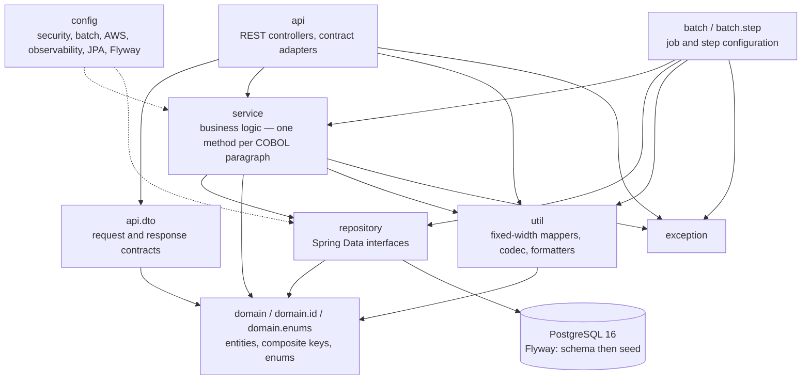
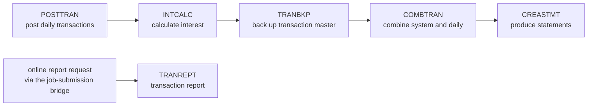
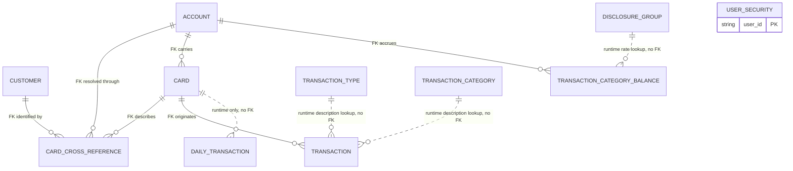

# Architecture

This page is the structural reference for the Java module that reproduces the AWS CardDemo mainframe
estate. It describes the layers and their permitted dependency directions, the responsibility of every
package, the eleven-entity data model, the batch pipeline and its ordering, the applied design patterns,
and the observability and security posture. It is the vocabulary the other migration pages build on:
[gate-evidence.md](gate-evidence.md) evidences the instrumentation it describes,
[decision-log.md](decision-log.md) carries the reasoning behind every divergence it names, and
[traceability-matrix.md](traceability-matrix.md) maps each legacy paragraph to the classes it inventories.
[onboarding-guide.md](onboarding-guide.md) is the delivered first-run walkthrough — clone to green build to
running stack — and the module's own `carddemo-java/README.md` carries the operator detail beneath it.

**Every page named above is delivered and registered.** `mkdocs.yml` carries an explicit `nav`, and it lists
all eight pages under `docs/`: the landing page, this one, the onboarding guide, the traceability matrix, the
decision log, the gate evidence, and the two prior-delivery references. A page the nav does not name exists
in the repository and never appears on the published site, which is the quieter of the two ways a
documentation deliverable fails — so both are checked by
`carddemo-java/src/test/java/com/carddemo/config/BuildAndCiContractTest`, which requires each of the eight to
be a regular file *and* to appear in the nav, and requires the landing page to link every one of them. The
migration deck at [`presentation/index.html`](presentation/index.html) is deliberately not a nav entry: it is
a self-contained HTML deck served as a static asset and reached from the landing page.

The onboarding guide is published, and the documentation nav names all eight pages including this one and the
traceability matrix.

Where a claim here is a count or a width, it was measured against the analysed checkout rather than
quoted. Where the mechanism in the code differs from what the plan anticipated, this page describes the
code.

## What the module is

A single, self-contained Maven module at `carddemo-java/`, carrying its own build, its own wrapper, its
own container definitions, its own schema migrations, its own configuration and its own test estate, so
that a clean checkout builds and validates it without reference to any mainframe asset.

```text
com.carddemo:carddemo-java:1.0.0
```

The base package is **`com.carddemo`** — two `d`s. Prior delivery documentation under `docs/` carried a
misspelt variant with a letter dropped; that spelling is wrong and is not used anywhere in this module.
Every package, every import and every configuration key uses `com.carddemo`. The `1.0.0` is the module's
own version, not a placeholder for an unresolved third-party coordinate.

Exactly two categories of deliverable sit outside the module boundary, each for a platform reason rather
than a design preference. The continuous-integration definition lives at
`.github/workflows/carddemo-java-ci.yml` because GitHub Actions resolves workflows only from the
repository root, and it scopes itself back into the module with a working-directory default. The
documentation set — this page among it — lives under `docs/` because that is where the documentation site
resolves its content root.

### Provenance

Two identifiers are the durable link between this module and the estate it was derived from, and they are
the only correct answer to "which COBOL did this Java come from?".

| Identifier | Value |
| :--------- | :---- |
| Analysed checkout commit SHA | `7756d895ffeb65f7ea72aaa609e356d9899afcec` |
| Upstream release stamp | `CardDemo_v1.0-15-g27d6c6f-68`, dated 2022-07-19 |

The release stamp is carried in the trailer comment of **78** legacy members, which is how the estate
identifies its own vintage. The repository carries no Git tags, so the checkout SHA is the only precise
anchor for the source side of every mapping.

### The legacy estate is reference, never a dependency

The estate under `app/` is **read-only**. Nothing in this migration modifies, moves, deletes or
reformats it, and it remains byte-identical to the analysed checkout — which is precisely what makes the
traceability matrix verifiable against it.

**No legacy source text is reproduced in the module or in this documentation for traceability purposes** —
not a program, not a paragraph, not a statement, and not in a comment. Traceability is by citation: member
names, paragraph names, line numbers, record widths, byte offsets, key lengths and offsets, and
picture-clause shapes are interface metadata and appear here freely; source lines do not appear at all. The
claim is mechanically checkable rather than asserted — a grep over `carddemo-java/src/**/*.java` comments
for a COBOL or CICS verb carrying one of the legacy program's own identifiers, literals or argument lists
returns nothing.

**One category of legacy text does appear in the module, and naming it is the point of a certification.**
Where a preservation requirement obliges the module to *emit* legacy text byte for byte, that text is
present as **contract data** rather than as a transcription: the seventeen fixed 80-column job-submission
card images and their `/*EOF` sentinel in `util/JclCardImageBuilder`, the 80- and 100-byte statement
template literals, and the seven sign-on message texts. Reproducing those is what *"external system
interfaces MUST maintain identical contracts"* requires — Gate 5 verifies the card images by draining them
back out of a real queue — and it is a different thing from carrying a paragraph's source across, which
nothing here does.

### The estate being reproduced

**The inventory this migration was scoped against is 169 substantive repository files**, of which **145
are the legacy estate under `app/`** — the artifacts the module actually reproduces — and 24 are the
diagrams, emulator samples, documentation pages and root metadata that sit beside it. Both figures are
stated because both are load-bearing and they answer different questions: 169 is the scope the migration
was assessed over, 145 is the subtotal that has a Java counterpart.

| Legacy artifact | Count | Notes |
| :-------------- | ----: | :---- |
| COBOL programs | 28 | 19,254 source lines — 17 CICS online transactions, 10 batch programs, 1 shared date-validation subprogram |
| Copybooks | 28 | data layouts, validation-lookup tables, 2 procedural copybooks, 1 macro copybook |
| BMS mapsets | 17 | the 24×80 screen-layout authority |
| Generated symbolic-map copybooks | 17 | the field-level screen contract |
| JCL members | 29 | batch job definitions and dataset provisioning |
| Cataloged procedures | 2 | the reporting procedure and the copy procedure |
| CICS resource definition | 1 | 18 transaction definitions, 18 program definitions, 17 mapsets, 1 transient data queue |
| Utility control cards | 1 | the copy-utility control statements |
| Catalog listing | 1 | dataset attributes, consulted for key offsets and record sizes |
| Sample datasets | 21 | 9 ASCII fixtures + 12 EBCDIC sequential datasets |
| **Substantive `app/` subtotal** | **145** | the sum of every row above: the artifacts with a Java counterpart |
| Other substantive repository files | 24 | 6 diagrams, 8 emulator samples, 3 documentation pages, 7 root metadata and licence files |
| **Substantive files in the analysed checkout** | **169** | the scope inventory this migration was assessed over |
| **Traceable paragraph units** | **544** | 528 program paragraphs + 16 procedural-copybook paragraphs — 14 in `CSUTLDPY`, 2 in `CSSTRPFY` |

At the analysed commit the repository tracked 172 files, three of which are empty directory placeholders,
which is how 172 becomes the 169 above. Both totals are measurable rather than asserted:

```bash
git ls-tree -r --name-only 7756d895ffeb65f7ea72aaa609e356d9899afcec | grep -vc gitkeep       # 169
git ls-tree -r --name-only 7756d895ffeb65f7ea72aaa609e356d9899afcec app/ | grep -vc gitkeep  # 145
```

The 28 programs divide as **17 online CICS transactions, 10 batch programs and 1 shared subprogram** —
`CSUTLDTC`, the date-validation routine callable from both tiers. That split matters: the shared
subprogram is not an eighteenth interactive program, and describing it as one would misstate both the
online inventory and the injection graph.

## Layers and the dependency direction

The module is layered by package, and the dependency direction is a **hard rule rather than a
convention**: dependencies run downward only, and **nothing depends upward**.



The permitted edges, stated as a rule:

| Package | May depend on | Must not depend on |
| :------ | :------------ | :----------------- |
| `api`, `api.dto` | `service`, `domain`, `domain.enums`, `util`, `exception` | anything — nothing sits above it |
| `batch`, `batch.step` | `service`, `repository`, `domain`, `util`, `exception`, `config` | `api`, `api.dto` |
| `service` | `repository`, `domain`, `util`, `exception` | `api`, `api.dto`, `batch` |
| `repository` | `domain` **only** | `service`, `api`, `batch`, `util` |
| `domain`, `domain.id`, `domain.enums` | itself | every package above it, and every Spring type beyond persistence annotations |
| `util`, `exception` | `domain` (`util` only) | everything above them |
| `config` | the layers it wires | — |

### The rule is verified, not merely asserted

An import census over the whole main source tree confirms every edge above and finds no upward
dependency anywhere:

```bash
cd carddemo-java/src/main/java/com/carddemo

# service never imports api — prints nothing
grep -rc 'import com.carddemo.api' service/ | grep -v ':0'

# repository reaches only the domain and its composite-key subpackage
grep -rhoE 'import com\.carddemo\.[a-z.]+' repository/ | sort -u

# domain imports no Spring type at all — prints nothing
grep -rc 'import org.springframework' domain/ | grep -v ':0'

# the transport contracts reach only the domain enums
grep -rhoE 'import com\.carddemo\.[a-z.]+' api/dto/ | sort -u

# no javax.* import and no wildcard import in the PRODUCTION tree — both print nothing.
# Run these from src/main/java/com/carddemo, not from the module root: the test tree
# legitimately imports two JDK javax packages, and the reason is given below.
grep -rc 'import javax\.' . | grep -v ':0'
grep -rcE 'import [a-z].*\*;' . | grep -v ':0'
```

That `service` imports nothing from `api` is not an accident of tidiness; it is the reason the `api`
package contains contract adapters. The service tier declares its **own** turn-result types — its own
navigation record, its own page metadata, its own field-error marks — and the adapters in `api` map those
onto the published transport contract. Without that seam, either the service layer would have to import
the transport DTOs, inverting the dependency, or the transport contract would leak into business logic.
The adapters are the price of the rule, and the rule is what keeps the service tier independently
testable.

### Two structural isolations that give the rule meaning

**Fixed-width record knowledge is confined to `util`.** Byte offsets, field widths, and the
overpunched-sign convention by which a zoned-decimal field carries its sign in its final byte are
knowledge of the legacy record image, not of the business rules. All twelve record mappers, together with
`FixedWidthFieldReader` and `ZonedDecimalCodec`, live in `util`. No service and no controller performs
offset arithmetic, and no service applies its own scaling — which is what prevents an inconsistent
rounding policy from creeping in through a single careless call site.

**Persistence and validation annotations are `jakarta.*` exclusively.** Every annotation that the Jakarta
rename moved — persistence, validation, servlet, transaction — is imported from `jakarta.*`, and the
**production tree carries no `javax.*` import line at all**, which is mandatory on this framework
generation.

**The scope of that claim is stated precisely, because "no `javax.*` anywhere" would be false and a false
absolute is worse than a qualified truth.** It is a claim about *Jakarta-migrated APIs in production code*,
not about the token `javax.` in the repository. Two categories sit outside it and both are Java SE platform
packages that were never in scope for the rename, so neither is a migration leak:

| Where | What | Why it is not a `jakarta.*` violation |
| --- | --- | --- |
| production, `util/SensitiveFieldCodec` | **ten** fully-qualified uses of `javax.crypto` — no import line, so the grep above stays silent | `javax.crypto` is the JDK's own cryptography API. It has no `jakarta` counterpart and never will |
| test tree | `javax.sql.DataSource` (7 imports) and four `javax.xml` imports — `XMLConstants`, `DocumentBuilder`, `DocumentBuilderFactory`, `ParserConfigurationException` | Both are JDK packages. The XML ones parse the build file and the suppression file in the contract tests; the datasource one is the JDK interface every pool implements |

Every import is explicit, with **no wildcard imports at all** in either tree, so an auditor can establish
what a file actually depends on by reading it rather than by resolving it.

### Injection and immutability, without code generation

Collaborators are supplied by **constructor injection** throughout. This is what replaces the estate's
**27** static inter-program call sites — 13 from the statement generator into its data-access helper, 9
to the Language Environment abort routine, 4 to the shared date-validation subprogram, and 1 to the
Language Environment date routine. Transport and turn-result types are records or final classes.

No Lombok, MapStruct or AutoValue is used, and **no code-generating annotation processor participates in
the build**. Two forces make that a requirement rather than a preference: the module compiles under
`-Xlint:all -Werror`, where processor-generated sources are a live origin of build-failing diagnostics,
and the unsafe-code audit holds reflection at zero, which forbids annotation-driven or convention-based
object mapping outright. Boilerplate is therefore written explicitly. The single annotation-bearing
coordinate in the build is a test-scoped, **annotation-only** companion required to read a third-party
library's published signatures under `-Xlint:all`; the processor-bearing artifact of that same library is
deliberately excluded.

## Package responsibilities

Twelve packages sit under `com.carddemo`, plus the `CardDemoApplication` entry point. The counts below
are of the source files actually present in the module.

| Package | Files | Responsibility | Legacy antecedent |
| :------ | ----: | :------------- | :---------------- |
| `config` | 18 | Wiring: security, JWT, batch, AWS clients, observability, JPA auditing, schema migration, the menu catalog, the published interface description | the CICS resource definition's transaction and program tables; the sign-on program's role split |
| `api` | 21 | REST controllers, the global error surface, and the contract adapters that map service turn results onto the transport contract | the 17 3270 screen transactions |
| `api.dto` | 32 | Request and response contracts, navigation context, page metadata, the field-error contract | the 17 generated symbolic maps |
| `domain` | 12 | The 11 JPA entities, plus the shared natural-key and stored-amount shape rules | the 11 verified record layouts |
| `domain.id` | 3 | The three composite primary keys | the three multi-field cluster keys |
| `domain.enums` | 9 | Typed state: account and card status, user type, transaction source, key action, file status, reject reason, date format, report period | the 508 level-88 condition names |
| `repository` | 18 | 11 entity-facing Spring Data interfaces, plus 4 batch scan projections and the insert and write seams | the 10 VSAM base clusters plus the daily-transaction sequential input |
| `service` | 63 | 37 concrete `*Service.java` classes — the 26 translation-bearing services that carry the 528 program paragraphs and 16 procedural-copybook paragraphs as named methods, one per program or program family, plus 11 focused support services — and 26 further files holding their command, outcome and turn-result types | the 28 programs and 2 procedural copybooks |
| `batch` | 13 | 9 job configurations, the shared parameter contract, the launch coordinator, staging and completion notification | the 9 application job steps |
| `batch.step` | 11 | The step template, the item processors, the reject writer, the reader factory and the publication locks | the batch programs' read-process-write skeletons |
| `util` | 38 | 12 fixed-width record mappers, the zoned-decimal codec, the field reader, the COBOL string primitives, the key translator, the job-card builder, the statement and report formatters, and the three diagnostic primitives — failure-chain rendering, observation propagation and the sanitised observation every outbound boundary is observed through | the record layouts, the string verbs, the function-key copybook |
| `exception` | 6 | Abend, file status, record-not-found, validation, optimistic-lock conflict, job submission | the abend paths and the file-status error branches |

The `service` row is the one whose two figures are easiest to confuse, so both are stated and both are
countable. The **26** translation-bearing services are the ones a paragraph maps to, and every row of
[`traceability-matrix.md`](traceability-matrix.md) that names a service names one of them. The other
**11** carry no COBOL paragraph and exist because a translated service needed a collaborator it should
not itself be: `AccountConcurrencyTokenService` and `CardConcurrencyTokenService`,
`FieldErrorTranslationService`, `SignOnStateService`, `UserListPageTokenService`,
`CardListPageTokenService`, `TransactionListPageTokenService`, `CredentialDigestService`,
`SensitiveFieldEncryptionService`,
`BatchJobLaunchService` and `JobCompletionNotificationService`.
The first two are described under
[Optimistic locking](#optimistic-locking-in-two-mechanisms-because-the-legacy-check-spans-two-windows).
There is no staging service among them, and its absence is deliberate rather than an oversight: the
batch tier's object-store boundary is `batch.BatchStagingArea` for the named staging object a step reads
and `batch.step.StagedGenerationStore` for durable generation publication, and those two are what the nine
job configurations inject. A `service.BatchStagingService` sat beside them for one checkpoint, reached by
no configuration and injected by nothing; it was removed as dead surface rather than retained pending a
decision, and the correction notes on decision-log entries DL-146 and DL-147 record the move and what it
leaves observed and unobserved.
26 + 11 = 37, which is every concrete `*Service.java` in the
package; the balance of the 63 files — **26** of them — are the service-owned records, enums and interfaces
those classes exchange, and they are not services. Counted directly:

```bash
ls carddemo-java/src/main/java/com/carddemo/service/*Service.java | wc -l   # 37
ls carddemo-java/src/main/java/com/carddemo/service/*.java         | wc -l   # 63
```

Every figure in the table above and in this paragraph is now **asserted against the directory it describes**
rather than transcribed. The counts in the first revision of this page were correct when it was written and
had drifted by four packages a checkpoint later, which is the failure mode a transcribed count has and a
measured one does not. `config/DocumentedSourceCountsTest` reads the table, counts the files and fails on a
disagreement, so a package that gains a class either updates this page or breaks the build. Recorded in
[decision-log.md](decision-log.md) DL-316.

### `config`

`SecurityConfig` derives its route-to-role table from the resource definition's **18** transaction
definitions and their program bindings, so the authorisation surface is a translation of the legacy
transaction table rather than a fresh invention. `JwtTokenProvider` and `JwtProperties` replace the
common-area state carriage described under [Security posture](#security-posture). `BatchConfig` supplies
the job infrastructure; `AwsConfig` and `AwsProperties` the object-store and queue clients, with an
endpoint override so the local emulator can stand in for the real services; `ObservabilityConfig` the
metric registry and trace wiring; `JpaAuditConfig` the clock and auditing that replace a per-program
current-date work area included by all 17 online programs; `FlywayConfig` the migration posture described
under [Schema evolution](#schema-evolution); `MenuOptionCatalog` the 10 user options and 4 administrative
options; `OpenApiConfig` and `WebMvcConfig` the published contract and web layer. Four further classes
enforce configuration safety at startup: an AWS resource health check, a fixed-locale message
interpolator, a production configuration validator, and a callback that refuses a production start
against a seeded database.

### `api` and `api.dto`

Controllers replace the screen transactions one feature at a time: sign-on, the user and administrative
menus, account view and update, card list, detail and update, transaction list, view and add, report
request, bill payment, administrative user management, and batch job launch and status.

Navigation is the load-bearing change. The estate performs **25** program-to-program transfer-control
dispatches and re-arms itself for the next terminal interaction with **19** return-with-transaction-id
statements, across 17 programs. It contains **zero** program-link calls — every dispatch is a transfer,
never a call-and-return. Both constructs become **route constants returned in the response body**: the
server forwards nothing, and the client drives the next call. That is what makes each endpoint
independently testable, and it is why a route is data rather than control flow.

Each symbolic map's input group becomes a request contract and its redefined output group becomes a
response contract, with field names, lengths and numeric typing preserved. Three contracts carry semantics
worth naming:

- `NavigationContext` replaces the common area that all 17 online programs included textually.
- `ErrorResponse` carries a per-field state of **`MISSING`** or **`INVALID`**, not a single boolean. The
  legacy field decorator distinguishes a flag that is blank — for which it writes a marker character —
  from a flag that is merely not-OK, for which it only changes the field's colour, and it fires **only on
  re-submission**. Two states are therefore the minimum faithful contract.
- `PageMetadata` carries the browse cursor and direction, because page fill order is behavioural: the
  three paginated screens use page sizes of 7, 10 and 10, and backward paging fills its rows in the
  reverse order of forward paging.

### `repository`

Eleven entity-facing Spring Data interfaces replace the ten VSAM base clusters plus the daily-transaction
sequential input. Ten extend the standard JPA repository; the user-security interface deliberately extends
the bare repository marker and declares exactly the operations the module performs, inheriting nothing
else — an interface is a capability grant, and a narrower grant is a smaller attack surface. Four
additional scan interfaces exist for the batch tier's keyset-ordered projections, alongside the insert and
record-write seams.

The browse triad — start-browse, read-next, read-previous, end-browse — becomes `Pageable`, **with
direction preserved**. A backward page must present its rows in the same order the legacy screen did, so
direction is part of the contract rather than a presentation detail.

### `service`

The mapping unit is the paragraph: each of the 528 program paragraphs and 16 procedural-copybook paragraphs
becomes a named method, which is what makes a 544-row traceability matrix possible in the first place.

**Where those 544 methods actually live, counted from the matrix rather than assumed.** The package holds
**37** concrete `*Service.java` classes, of which **26** are the translation-bearing services — one per
legacy program or program family. But the 544 rows resolve to **22 distinct owning classes**, not 26:
**21 services plus one utility class**, `util.PfKeyTranslator`, which owns the two paragraphs of the
attention-key copybook and is a utility precisely because five online programs include that copybook rather
than one owning it. Read the census yourself out of
[traceability-matrix.md](traceability-matrix.md) — the target-class column is the authority:

| Owning class | Rows | Owning class | Rows |
| :--- | ---: | :--- | ---: |
| `service.AccountUpdateService` | 85 | `service.DailyTransactionReadService` | 18 |
| `service.UserManagementService` | 47 | `service.TransactionAddService` | 18 |
| `service.CardUpdateService` | 45 | `service.BillPaymentService` | 16 |
| `service.CardListService` | 39 | `service.DateValidationService` | 16 |
| `service.AccountViewService` | 35 | `service.TransactionListService` | 16 |
| `service.CardDetailService` | 34 | `service.MenuService` | 14 |
| `service.TransactionPostingService` | 26 | `service.StatementDataAccessService` | 14 |
| `service.TransactionReportService` | 26 | `service.ReportRequestService` | 10 |
| `service.StatementGenerationService` | 25 | `service.TransactionViewService` | 9 |
| `service.InterestCalculationService` | 22 | `service.AuthenticationService` | 6 |
| `service.FileMaintenanceService` | 21 | `util.PfKeyTranslator` | 2 |
| | | **Total** | **544** |

**Five of the 26 translation-bearing services own no paragraph at all, and that is correct rather than a
gap.** `ValidationLookupService`, `NavigationService`, `MessageCatalogService`, `AbendService` and
`JobSubmissionService` derive from copybooks and cross-cutting constructs rather than from procedure
divisions: a lookup table, a dispatch graph, a message catalogue, an abend structure and a queue write are
each *data or a mechanism* the paragraphs use, not paragraphs themselves. A matrix row exists for a
paragraph; these five have none to claim. Saying "26 services own all 544 units" would therefore be wrong
in two directions at once — it would credit five classes with rows they do not have, and it would hide the
one utility class that does own rows.

The remaining **11** of the 37 are focused support services with no legacy antecedent — account and card
concurrency tokens, credential digesting, sensitive-field encryption, sign-on state, the user-list, card-list
and transaction-list page tokens, batch launch, and job-completion notification and field-error
translation. So the arithmetic closes twice over: **26 + 11 = 37** service classes, and **21 + 1 = 22**
owning classes covering **544** rows. The two sums count different things and neither is a correction of the
other: the first counts the classes in the package, the second counts the classes a traceability row names.

The package holds **63** files in all: those 37 services plus **26** service-owned command, outcome,
browse-window and turn-result types — the types the `api` adapters map from, and the reason `service` never
imports `api`.

### The file-status model needs two levels, not one enum

The batch programs never branch on the raw two-byte file status. They normalise it first — success becomes
an OK result, end-of-file becomes an EOF result, and everything else becomes an ERROR result — and then
branch on that coarser value. The normalised value, not the raw code, is what the read loops actually
test.

The module therefore carries **both**: a raw `FileStatus` enum for the two-byte code, **plus** a tri-state
I/O outcome of OK, EOF and ERROR, **plus** the terminal abend path. Collapsing the two levels into one
enum would erase the end-of-file-versus-error distinction that every batch read loop depends on, and a
reader that cannot tell "the file ended" from "the read failed" is not a faithful translation.

The literal vocabulary actually compared in status-test context across the estate is narrow, which is why
the raw enum is small and honest: `'00'` **73** times, `'10'` **7** times, and `'23'` on **three
status-test lines** carrying **one branching decision**. The three lines are `CBTRN02C` line 481 and
`CBACT04C` lines 422 and 436; two of them admit `'23'` alongside `'00'` as a not-an-error outcome, and only
`CBACT04C` line 436 branches on `'23'` alone — the disclosure-group default-group fallback. The
specification's "exactly once" counted that decision rather than the occurrences, and the corrected
distribution is recorded as entry DL-255 in [decision-log.md](decision-log.md). Codes that appear in prior
documentation but are compared nowhere in the source may exist as documented values, but no code path
depends on them; that discrepancy is recorded in the same place.

## The batch tier

### Nine job classes, not one per step — the finding that shapes the tier

Of the **79** program-execution steps across the 29 JCL members and 2 cataloged procedures — 76 in the job
members and 3 in the procedures — **only nine invoke an application COBOL program**. The remaining **70**
invoke system utilities:

| Utility | Steps | What those steps do |
| :------ | ----: | :------------------ |
| `IDCAMS` | 52 | define, delete and copy datasets |
| `SDSF` | 8 | inspect spool output |
| `SORT` | 5 | external ordering |
| `IEFBR14` | 3 | allocate, and toggle CICS file availability |
| `IEBGENER` | 1 | copy the in-stream user-security records |
| `DFHCSDUP` | 1 | drive the CICS resource-definition utility |

**Those steps do not become Spring Batch steps at all.** Dataset definition and deletion is absorbed by
the Flyway migrations, dataset staging by the container service definitions and the object store, spool
inspection by the job repository and the metrics surface, and copy operations by ordinary read-and-write
steps inside the job that needs them. That absorption is the entire reason the batch tier has **nine job
configuration classes rather than seventy-nine step classes**.

The figures above are a direct count at this checkout, and the utility breakdown tabled above is itself the
70: 52 + 8 + 5 + 3 + 1 + 1. **The prior specification framed the same census as 78 steps with a utility
remainder of 69**, which disagrees with its own arithmetic by one step independently of any measurement.
That framing is historical and is superseded here; it is recorded as a documented specification defect,
entry DL-251, in [decision-log.md](decision-log.md), and the module's own README publishes the same
79-9-70 figures this page does. The load-bearing claim — nine job configuration classes rather than one
per step — holds under either count, because the count of application steps is 9 in both.

### There is no master orchestrator, and the pipeline order is an operational convention

**No in-repository master orchestrator exists.** The batch pipeline order is an **operational convention
documented in the root `README.md`, not a coded dependency.** This reproduces the prior specification's
finding and was independently re-proven at this checkout: across all 29 JCL members and both cataloged
procedures there are **zero** internal-reader job submissions, **zero** job-to-job invocations, and the
only procedure invocation targets the cataloged copy procedure. Nothing in the estate encodes "run
interest calculation after posting"; the ordering lives in prose.

The module reproduces that faithfully. Each job is independently launchable, the launch surface exposes
them individually, and **no master-orchestrator class exists** — there is deliberately no single class that
chains the pipeline, because the estate has no such artifact to translate. An operator or scheduler
composes the sequence, exactly as the mainframe operator did.

### The pipeline order



The core application sequence the specification frames is **POSTTRAN, then INTCALC, then COMBTRAN, then
statement creation and reporting**. The root README's run list — the only in-repository authority — agrees
on that spine and differs from it in two respects that are documented here rather than smoothed away:

- The README places **`TRANBKP`**, the transaction-master backup, **between `INTCALC` and `COMBTRAN`**. It
  also lists `TRANBKP` a second time much earlier, where the same member is used to create the transaction
  master rather than to back it up.
- The README **does not list `TRANREPT` in the run sequence at all**, and its job-and-program table omits
  it too. That is consistent rather than an oversight: the transaction report is reached from the **online
  report request** through the job-submission bridge, not from the daily pipeline. `PRTCATBL`, the
  category-balance listing, is likewise absent from both README tables.

Neither difference is a defect and neither is invented away. The diagram above shows both the README spine
and the online path by which reporting is actually triggered. **Because the ordering is a convention, the
diagram is documentation of intent, not a dependency the code enforces.**

### The nine job configurations

| Job configuration | Job name | Legacy antecedent |
| :---------------- | :------- | :---------------- |
| `PostTransactionJobConfig` | `postTransactionJob` | `app/jcl/POSTTRAN.jcl` — daily transaction posting |
| `InterestCalculationJobConfig` | `interestCalculationJob` | `app/jcl/INTCALC.jcl` — disclosure-group driven interest |
| `CombineTransactionsJobConfig` | `combineTransactionsJob` | `app/jcl/COMBTRAN.jcl` — two concatenated inputs merged and ordered |
| `CreateStatementJobConfig` | `createStatementJob` | `app/jcl/CREASTMT.JCL` — four steps, three condition-code gates |
| `TransactionReportJobConfig` | `transactionReportJob` | `app/jcl/TRANREPT.jcl` with `app/proc/TRANREPT.prc` |
| `BackupTransactionJobConfig` | `backupTransactionJob` | `app/jcl/TRANBKP.jcl` — one condition-code gated step |
| `CategoryBalanceReportJobConfig` | `categoryBalanceReportJob` | `app/jcl/PRTCATBL.jcl` — category-balance listing |
| `FileProbeJobConfig` | `fileProbeJob` | `READACCT`, `READCARD`, `READCUST` and `READXREF` collapsed into one parameterized job |
| `DailyTransactionReadJobConfig` | `dailyTransactionReadJob` | `app/cbl/CBTRN01C.cbl` — the one job with **no legacy driver**: registered and launchable like the rest, with no place in the conventional order; see below |

`JobParameterValidators` is the tenth entry in that inventory and is **not a tenth job** — it is not a job
at all. It is the shared parameter contract across all nine, deriving its validation from the in-stream
date-parameter conventions the reporting procedure and the statement job declare. The total is **nine job
configurations**, and it stays nine wherever this page counts them. Of those nine, **eight have a legacy job
stream as their antecedent and one has none**; the exception is the subject of the next section.

**All nine are registered and independently launchable, and none of them is a member of a coded
sequence.** `BatchJobCatalog` names all nine job beans and `BatchJobController` launches any of them, so
"wired" here can only mean one thing: **eight of the nine have a legacy job stream as their antecedent and
one has none.** There is no pipeline object to be inside or outside of — see the section above — so no job
carries sequence membership, and the ordering an operator follows is convention rather than code.

### The ninth job is the one with no legacy driver

`DailyTransactionReadJobConfig` is a fully defined Spring Batch job whose program, `CBTRN01C`, is a
complete **491-line, 18-paragraph** batch program that **no JCL member, no cataloged procedure and no CICS
definition invokes**. It is migrated deliberately, not accidentally: leaving it out would make the estate
coverage incomplete, and inventing a scheduled position for it would invent a pipeline stage the mainframe
never ran.

Two things follow, and they are easy to conflate. It is **registered and launchable exactly like the other
eight** — it appears in the catalogue, it can be launched over the job surface, and the end-to-end suite
does launch it, because nothing in the estate would have. What it does **not** have is a place in the
conventional daily order, since there is no legacy stream to take that place from. "Exercised only by
tests" would understate it: the delivered module makes it available to an operator, and only its
*position* is absent.

### Condition-code gates

Condition-code logic in this estate is sparse and precisely located. **Exactly four steps** carry a
step-level condition code:

| Member | Step | Condition | Meaning |
| :----- | :--- | :-------- | :------ |
| `app/jcl/CREASTMT.JCL` | `STEP020` | `COND=(0,NE)` | run only if every prior step returned zero |
| `app/jcl/CREASTMT.JCL` | `STEP030` | `COND=(0,NE)` | run only if every prior step returned zero |
| `app/jcl/CREASTMT.JCL` | `STEP040` | `COND=(0,NE)` | run only if every prior step returned zero |
| `app/jcl/TRANBKP.jcl` | `STEP10` | `COND=(4,LT)` | run unless a prior step returned more than 4 |

**All four become the same delivered gate, and that is a recorded divergence rather than a flattening.**
The module carries exactly one condition-code decider, `BatchConfig.ConditionCodeGate.ALL_PRIOR_STEPS_ZERO`,
which admits a guarded step only when the highest code any earlier step produced is exactly zero, and all
four gates route through it. The fourth member's literal is the divergent one: `COND=(4,LT)` would tolerate
a warning-level return, and the delivered gate does not. The migration plan freezes the strict form for all
four, so **the literal is recorded rather than implemented** — entry DL-145 in
[decision-log.md](decision-log.md) — and no second, looser ceiling exists in the code. Introducing one
would run a guarded step the plan holds to zero, which is a behavioural change no test written afterwards
could detect.

**One rule, but one *placement* of it per gated step.** Spring Batch's flow builder keys the decision state
it creates by the object handed to it, so a flow that hands it the same enumeration singleton at three points
gets one shared state holding three pairs of transitions — and every gate then routes wherever the first pair
pointed, back into the step just run. The statement job therefore wires
`ConditionCodeGate.ALL_PRIOR_STEPS_ZERO.atOnePlacement()` once per gated step: three placements of one rule,
each its own state, all reaching the identical verdict. The backup job places the gate once and uses the
constant directly. Any future job with more than one gate must do the same; DL-145's integrated-state note
records the defect this prevents.

The two jobs differ in what a refusal *does*, and that distinction is real: the statement job's three gates
**propagate** the failure, so the job ends `FAILED`, while the backup job's single gate ends its flow. Two
further condition tokens appear in the estate — in the reporting job and its procedure — but those are
sort record-selection conditions that filter which records enter the sort, not step gates, and they become a
repository date-range predicate rather than a job transition.

### Ordering is external, and the comparators are per-job

The estate contains **zero** internal COBOL sort statements and **zero** merge statements. All ordering is
external, in **four** distinct specifications, which is why the comparators are **per-job rather than
shared**:

- The combine job orders two concatenated inputs by transaction identifier, ascending, then writes them as
  one dataset.
- The reporting procedure declares its sort symbols with the transaction card-number field typed as **zoned
  decimal** at offset 263 for 16 bytes and the processing-date field as **character** at offset 305 for 10
  bytes, and applies an inclusive date-range record-selection condition.
- The statement job sorts on the card number **typed as character**, then on the record's leading key, and
  reprojects the result.
- The category-balance report job sorts on **three** keys — the account identifier at offset 1 for 11 bytes
  as zoned decimal, the type code at offset 12 for 2 bytes as character, and the category code at offset 14
  for 4 bytes as zoned decimal — all ascending, in record order. The listing declares a **fourth** sort
  symbol it does not order on, the balance at offset 18 for 11 bytes as zoned decimal, and reprojects each
  record through an edit mask that renders that balance with an inserted decimal point and pads the result
  to a fixed **40-byte** line. It is a full sort-and-reprojection step in its own right and not an unload:
  the job's earlier step is the unload, and this one is what turns the unloaded dataset into the report.
  This is the fourth specification, and a count of three omits it. It is
  verified, at both its ordering and its width, by `batch/CategoryBalanceReportJobConfigIT`.

The same field is typed zoned decimal in one job and character in another. A single shared comparator would
have to pick one typing and would silently reorder the other job's output, so each job owns its own. The
category-balance listing makes that point a second time inside one specification: three of its four
symbols are typed zoned decimal and the fourth is typed character.

**Four specifications and five sort steps are both correct.** The utility table above counts **five**
external sort steps, and this section counts **four** specifications, because two of the five steps are the
**same** specification: the reporting job member restates, symbol for symbol and condition for condition,
the sort the reporting cataloged procedure already declares — rather than invoking the procedure that
carries it. That restatement is also what leaves the job member with a duplicated step name, which is
recorded among the source anomalies in [decision-log.md](decision-log.md). Four distinct orderings across
five steps, and the duplication is documented rather than reproduced as two comparators.

### The supplemental fifth output width, and why it needs golden bytes

Four fixed output widths are **contractual** — the 430-byte reject record, the 80-byte statement line, the
100-byte HTML statement line and the 133-byte report line — and that set is the frozen Gate 1 criterion. The
category-balance listing emits a fifth fixed width, **40 bytes, fixed and blocked**, which now carries a
committed golden of its own compared on the same terms as the other four. It is **supplemental evidence
beside the criterion rather than an addition to it**: the criterion is not enlarged, and the evidence is not
withdrawn.

Its geometry had to be resolved rather than transcribed, because the reprojection and the record length
disagree. Summed as declared — an 11-byte account identifier, a blank, a 2-byte type code, a blank, a
4-byte category code, a blank, a 12-character edited balance and nine trailing blanks — the reprojection
describes **41** bytes against a declared record length of **40**. The module emits **32 content bytes
followed by eight trailing blanks**, never nine and never forty-one, and `CategoryBalanceReportJobConfig`
declares all three figures as named constants so the resolution is readable at the point of use rather
than buried in an offset.

Two further properties of that line are decided rather than obvious, and both are settled in
[decision-log.md](decision-log.md) rather than restated here: the edit mask uses the digit selector that
**always prints**, so a balance of exactly zero renders as nine zeros, a point and two zeros rather than
blanking the field; and every balance in the shipped sample data is exactly zero, which means aggregate
figures, record counts, key ordering and record widths were all correct under the wrong reading and only a
byte comparison could tell the difference. That is precisely why this width needs **golden bytes** and not
a width assertion, and why its integration test asserts the twelve mask characters for a large balance, a
zero balance and a sub-unit balance, and additionally that no line carries a blank anywhere inside the
mask.

### Four output widths are contractual, and a fifth is emitted beside them

Every externally observable record the module emits is fixed width, and the width is part of the contract
rather than a formatting choice. Four of them are the frozen Gate 1 criterion; the fifth is emitted by a job
outside the primary pipeline and is carried here as supplemental evidence:

| Width | Standing | Record | Emitted by |
| ----: | :------- | :----- | :--------- |
| **80** | contractual | statement text record | the statement generator |
| **100** | contractual | statement HTML record | the statement generator |
| **133** | contractual | transaction report line, fixed-length blocked | the transaction report job |
| **430** | contractual | daily-transaction reject record — the 350-byte source image, a 4-digit reason code, then a 76-character description | the posting job's reject writer |
| **40** | supplemental | category-balance report line | the category-balance listing job |

**All five are compared against committed golden files byte for byte.** The four contractual goldens are
compared from a single seeded pipeline pass in `e2e/BatchPipelineE2ETest`; the supplemental one,
`fixtures/expected/category-balance-report.txt`, is compared from a dedicated run of the category-balance
job in `batch/CategoryBalanceReportJobConfigIT`, because that job is the one emitter the primary pipeline
does not drive. Its test fixes the reported population completely — the fifty delivered category-balance
rows plus three it adds and one it rewrites in place, 53 records of 40 bytes — and compares what the job
wrote to a real local dataset, after reading a real server, against the committed file. Which evidence
stands behind each is recorded in [gate-evidence.md](gate-evidence.md) and in the module's README rather
than here.

### The statement generator is a state machine, not a loop

`CBSTM03A` is not a read loop with nested calls. It is a **hand-rolled dispatcher**: a work field holding a
data-definition name selects the next phase, each phase sets that field and jumps **backward** to the
dispatcher, and the dispatcher re-branches on the new value. `StatementGenerationService` therefore uses an
explicit **state enum driven by a `while` loop over a `switch`**.

Nested method calls cannot reproduce re-entry into a dispatcher after a state change, which makes this the
**single most consequential structural decision in the batch tier**. The surrounding measurements explain
why it is isolated to one service: of **134** unconditional jumps estate-wide, **125** jump forward to an
exit label and become a plain `return`, and only **9** jump backward and form loops — and **6 of those 9
belong to `CBSTM03A`**.

### Three JCL members are intentionally not migrated

| Member | What it does | Why there is no target |
| :----- | :----------- | :--------------------- |
| `app/jcl/CLOSEFIL.jcl` | disables CICS file availability | no runtime equivalent once VSAM is replaced |
| `app/jcl/OPENFIL.jcl` | re-enables CICS file availability | no runtime equivalent once VSAM is replaced |
| `app/jcl/CBADMCDJ.jcl` | drives the CICS resource-definition utility | the resource definition itself has no target runtime |

These are **documented as intentionally unmigrated, not dropped**. Connection availability in the target is
a pooled-datasource concern with no job to toggle it, and there is no resource-definition catalogue to
update. The reasoning is recorded in [decision-log.md](decision-log.md).

## The data model

Eleven entities reproduce eleven verified record layouts. Every width below was corroborated twice. Ten
were corroborated from the copybook that declares the layout and from the `RECORDSIZE` clause of the cluster
definition that allocates it. **`DailyTransaction` is the exception, and deliberately so: it is a sequential
dataset and no cluster defines it** — there is no `DEFINE CLUSTER` for it anywhere in the estate. Its second
corroboration is therefore the file description of the programs that read it together with the record length
declared on the job's own data-definition statement, which is the right authority for a sequential input and
the only one that exists.

| Entity | Legacy copybook | Record width | Notes |
| :----- | :-------------- | -----------: | :---- |
| `Account` | `CVACT01Y` | 300 | five two-decimal money fields; version-controlled |
| `Card` | `CVACT02Y` | 150 | card number is the primary key; version-controlled |
| `Customer` | `CVCUS01Y` | 500 | national identifier encrypted at rest |
| `CardCrossReference` | `CVACT03Y` | 50 | 36 data bytes plus a 14-byte filler |
| `Transaction` | `CVTRA05Y` | 350 | origin timestamp at offset 278, processing timestamp at offset 304 |
| `DailyTransaction` | `CVTRA06Y` | 350 | byte-identical to `Transaction`, different field prefix; sequential, so no cluster corroborates it |
| `TransactionCategoryBalance` | `CVTRA01Y` | 50 | composite key |
| `DisclosureGroup` | `CVTRA02Y` | 50 | composite key; carries the interest rate |
| `TransactionType` | `CVTRA03Y` | 60 | reference data |
| `TransactionCategory` | `CVTRA04Y` | 60 | composite key; reference data |
| `UserSecurity` | `CSUSR01Y` | 80 | credential stored as a hash, never as the legacy plaintext |

A twelfth type in the `domain` package is **not** an entity: it holds the shape rules every natural key and
every stored amount must satisfy before reaching the database, so that the invariants live beside the
entities they constrain rather than inside a service.

**The diagram below draws exactly the six foreign keys `V2__create_indexes.sql` creates, and nothing else.**
Solid lines are enforced constraints; dashed lines are lookups the code performs at run time under **no**
constraint, and the migration records each of those refusals explicitly rather than leaving them
unexplained. Drawing a run-time lookup as a constraint would misstate the schema in the direction that
matters most — it would imply the database rejects a row the delivered schema accepts.



Why each dashed edge is dashed, taken from the migration's own recorded decisions:

- **`daily_transaction` has zero foreign keys and must keep zero.** It is the raw, unvalidated landing
  surface for the sequential daily input. The posting job's whole purpose is to decide which rows are
  acceptable, and it deliberately accepts a row whose lookup fails and turns it into a reject record — so a
  constraint here would refuse at load time the very rows the reject path exists to report.
- **`account.acct_group_id` cannot reference `disclosure_group`.** That table's primary key is a
  three-column composite, and the group identifier alone is not unique in it — it recurs once per
  type-and-category combination, seventeen times per group. There is no single-column parent to point at.
- **No reference-data constraint exists at all.** Nothing links `transaction`, `daily_transaction` or
  `transaction_category_balance` to `transaction_type` or `transaction_category`. Those codes are validated,
  where at all, by program logic, and the reference tables supply a description rather than gate an insert.

The `transaction` table's card number is constrained because it is the **validated master**: a row reaches
it only after the posting job has resolved that card through the cross-reference, so the constraint makes a
guarantee that is already procedural structural instead.

### Composite keys, and why every key is a business key

Three keys are composite and live in `domain.id`: `TransactionCategoryBalanceId`, `DisclosureGroupId` and
`TransactionCategoryId`.

**The JPA identifier is always the business key and never a generated surrogate.** The legacy file
description declares the key as the *leading substring of the record image* — the record is the key
concatenated with the remainder — so the key is already the natural identity of the row. Introducing a
surrogate would break the record-image-to-table-row correspondence that byte-level output comparison
depends on, and would leave two competing identities for the same row. No surrogate identifier exists
anywhere in the schema.

### Decimal representation

Every persisted monetary and rate field in the estate is **zoned decimal**, declared with display usage,
and every one becomes a `BigDecimal` whose scale matches its picture clause exactly: five `PIC S9(10)V99`
fields on the account record, `PIC S9(09)V99` amounts on the transaction, daily-transaction and
category-balance records, and one `PIC S9(04)V99` interest rate on the disclosure group.

All conversion in both directions passes through a single seam, `ZonedDecimalCodec`, which applies **scale
2 and `RoundingMode.DOWN`** uniformly. Because there is exactly one seam, no service can introduce a
different rounding policy, and no call site can quietly disagree with another. *Why* the mode is `DOWN`
rather than the conventional half-even is a translation decision with a specific legacy justification, and
it is recorded in [decision-log.md](decision-log.md) rather than re-argued here.

**No packed-decimal decoder is required.** Packed usage does appear in the estate — nine sites — but every
one of them is a working-storage scratch field, and **not one persisted monetary or rate field uses it**.
What the module needs instead is the zoned-decimal codec's handling of the overpunched sign, in which the
final byte of the field encodes both its low-order digit and the sign of the whole value.

### `DailyTransaction` is a separate entity on purpose

The daily-transaction layout is byte-for-byte identical to the transaction layout, distinguished only by a
different field-name prefix. It is nonetheless a **separate entity with its own table**, because it is a
distinct dataset with a distinct lifecycle: it is the input the posting job consumes and rejects from,
while the transaction master is the durable record the posting job appends to. Folding them together would
merge two lifecycles into one table and destroy the reject path's meaning.

### Optimistic locking, in two mechanisms because the legacy check spans two windows

The legacy before-and-after image comparison covered a longer interval than a single transaction: a program
captured a record's image when it *presented* the screen, and compared it again when the operator *confirmed*
the change, so a concurrent update between those two turns was detected. Reproducing that needs both of the
mechanisms below, and describing either one as the whole replacement would leave a window unguarded:

| Mechanism | Window it protects |
| :-------- | :----------------- |
| `@Version` on `Account` and `Card` | the **in-transaction** interval: between this transaction's read and its write, which is where the database can serialise for us |
| `AccountConcurrencyTokenService` and `CardConcurrencyTokenService` | the **screen-to-confirm** interval: between the turn that presented the record and the later turn that confirms the change, which no single transaction spans |

The token services mint a value from the record's own state when a screen is presented and re-check it when
the change is submitted, which is the direct analogue of the image comparison; `@Version` then guards the
write itself. The estate's **single** rollback statement becomes a transactional rollback raising
`OptimisticLockConflictException`, and either mechanism can raise it.

### What the data-model diagram deliberately omits

`diagrams/CARDDEMO-DataModel.drawio` holds two pages. The first, `ER Diagram`, is the entity-relationship
view of the estate this schema reproduces. The second page carries three further entities — **product, fee
and feature** — and **those are not implemented.**

They are illustrative future-state entities with no corresponding copybook, no program that reads or writes
them, and no dataset that holds them anywhere in the estate. Implementing them would be feature expansion,
which is out of scope. A reader comparing the diagram file against the schema will find those three
entities absent from the eleven tables, and that absence is intentional rather than an oversight.

## The three alternate indexes

The estate defines three VSAM alternate indexes, all non-unique and all maintained synchronously with their
base cluster.

| Legacy alternate index | Base cluster | Key (length, offset) | Target |
| :--------------------- | :----------- | :------------------- | :----- |
| `CARDAIX` | card master | `CARD-ACCT-ID` — `KEYS(11 16)` | `CardRepository.findByCardAcctIdOrderByCardNumAsc(String, Limit)` |
| `CXACAIX` | card cross-reference | `XREF-ACCT-ID` — `KEYS(11 25)` | `CardCrossReferenceRepository.findByXrefAcctIdOrderByXrefCardNumAsc(String, Limit)` |
| transaction timestamp index | transaction master | `TRAN-PROC-TS` — `KEYS(26 304)` | `TransactionRepository.findByProcessingTimestampWindow(String, String, Limit)` |

Each of the three finders **requires an explicit bound and states a deterministic ordering**, so no caller
can obtain an unordered or unbounded result from any of them. None of the three has a production caller:
the card-list screen pages through `Pageable`, every online path resolves a single cross-reference by its
own key, and the reporting job filters the unloaded sequential generation rather than the live table. They
are kept because they are the declared translation of a named legacy artefact, and
[gate-evidence.md](gate-evidence.md) states the call-path position for each one exactly.

**All three also become B-tree indexes in `V2__create_indexes.sql`** — `idx_card_card_acct_id`,
`idx_card_cross_reference_xref_acct_id` and `idx_transaction_tran_proc_ts` — and each is measured, in its
repository integration test, being reached by an index scan. The third is created even though **no endpoint
and no job depends on it**: it is the index the date-range finder needs, and keeping the index and the
finder together is what makes the shipped predicate's plan verifiable rather than hypothetical. That
asymmetry is visible in the estate itself: only the two card-related indexes are registered to CICS as file
paths and therefore back online access, while the timestamp index exists for batch alone.

The key offset of 304 also corroborates the transaction layout independently — the processing timestamp
sits at offset 304 and the origin timestamp at 278, which is exactly what the sort specifications address.

## Schema evolution

Schema evolution is **versioned and forward-only**, in five migrations under
`carddemo-java/src/main/resources/db/migration/`, split across two sibling locations:

| Migration | Location | Contents |
| :-------- | :------- | :------- |
| `V1__create_schema.sql` | `db/migration/schema/` | the 11 tables, one per verified record layout |
| `V2__create_indexes.sql` | `db/migration/schema/` | the three alternate-index equivalents, plus primary and foreign keys |
| `V2_2__add_protected_value_invariants.sql` | `db/migration/schema/` | three `CHECK` constraints: an `ENC1` envelope on each regulated customer identifier, a BCrypt digest on the stored credential |
| `V3__seed_reference_data.sql` | `db/migration/seed/` | the nine reference and sample datasets |
| `V4__seed_user_security.sql` | `db/migration/seed/` | the ten known sign-on identities, credentials hashed |

The dotted version is a **schema** script, and it takes a version between the indexes and the
fixtures so that every schema version sorts below every seed version: `2 < 2.2 < 3`. Three controls
depend on that ordering; `docs/decision-log.md` DL-343 records what broke when a schema script was numbered
above the seeds instead, and DL-349 records the invariants script.

**There is no `V2_1`, and the gap is deliberate.** A sign-on attempt ledger held that version — the
deployment-wide state of a sign-on throttle — and was withdrawn with the throttle it served, because the
legacy transaction being translated has no attempt counter and the preservation boundary is frozen. A new
schema script therefore takes the next free dotted version below `3` rather than back-filling `2.1`, so no
two scripts can ever share a version across databases. Any database that had already applied `2.1` is
recreated rather than having validation relaxed for it. `docs/decision-log.md` DL-352 records the removal,
what it costs and the migration-history decision.

**Erratum — the four earliest headers describe the topology as it stood at their own version.** The table
above is the current inventory. The explanatory headers of `V1__create_schema.sql`,
`V2__create_indexes.sql`, `V3__seed_reference_data.sql` and `V4__seed_user_security.sql` still describe a
schema location carrying two scripts and a production ceiling of `2` — both superseded — and `V4`'s further
states that production refuses a numeric ceiling, which is now the opposite of what is delivered. Each was
true when that script was written; the delivered arrangement is three schema scripts, a pin of `2.2`, and a
production start-up that requires that numeric pin. `V2_2`'s own header additionally reasons about a `V2_1`
that has since been withdrawn (DL-352), and is not corrected either, for the same checksum reason.
They are **not** corrected in place: `validate-on-migrate` is on under every profile and all four are applied
wherever this module has run, so a one-character comment edit changes a Flyway checksum and makes an
already-migrated database fail validation — which is the rule those same headers state. The property they
were written to assert is unaffected, because every schema version still sorts below every seed version. The
module's own `DocumentedSourceCountsTest` derives this inventory and this pin from the delivered directories
and from `FlywayConfig`, and fails the build if this page, the module manual, the profile documents or the
Compose file states either of them stale. `docs/decision-log.md` DL-351 records the decision and its
evidence.

### The two seeds can never reach production

The seeds are excluded from production by the **profile-scoped migration location list**. Production
resolves `classpath:db/migration/schema` and nothing else, so the two seed scripts are not applied, not
pending and **not resolved at all** — they appear in no migration state. Only the local and test overlays
add `classpath:db/migration/seed`, and that is one of the two settings a seeding profile carries.

A **version ceiling sits beside the location list** rather than in place of it. The shared baseline and the
production overlay both declare `spring.flyway.target: "2.2"`, which is the highest version the schema
location delivers; `local` and `test` lift it to `latest` in the same block where they add the seed
location. Production refuses any other value in either direction, the head marker included, and corrects
silence to the pin. The two controls are not redundant and they fail differently: the location list is what
excludes the seeds, and a stale ceiling can under-migrate the schema half but can never expose a seed.

Their shared parent `classpath:db/migration` holds no script at all and is **refused as a location under
every profile**. A Flyway location is scanned recursively, so the parent reaches both children — and it
records each script under a name relative to itself, which would break the migration names the Compose
bring-up check reads out of the history table.

Three properties make that robust rather than merely configured. The schema-only list and the ceiling are
each declared twice — in the shared baseline and again in the production overlay — so a profile silent
about migrations inherits the production posture rather than the permissive one; the safe value is the
default. A location a profile never lists is not a value an operator can widen. And a startup callback
independently **refuses a production start** against a database whose migration history records a seed or
whose tables still hold seeded rows, so a production instance cannot be pointed at a seeded database even
by mistake. The one cost the ceiling carries is that a schema migration numbered above the pin is skipped
rather than applied, and it is made loud rather than silent: `FlywayConfigTest` asserts the pin **equals**
the highest version the schema location delivers, so shipping a further schema script fails the build until
the pin is raised with it. **A further schema script takes the next dotted version below 3 — `2.3` — and
never a number above the seeds.** A schema script was once numbered `V5`, above both seeds, and three
separate controls broke on it: the ceiling stopped excluding the seeds by number, the seed-detection
callback read a correctly-migrated production database as contaminated, and adding the seed location to a
schema-only database left the seeds pending below an applied version, which Flyway refuses as out of order.
The reasoning, the arrangement that preceded it and the restoration of the ceiling are recorded in
`docs/decision-log.md` at DL-298 and DL-334, and the numbering rule with what broke at DL-343.

### Seed volumes

Measured from the ASCII fixtures they derive from:

| Seeded data | Rows |
| :---------- | ---: |
| Accounts | 50 |
| Cards | 50 |
| Card cross-references | 50 |
| Customers | 50 |
| Daily transactions | 300 |
| Disclosure-group rows | 51 |
| Transaction category balances | 50 |
| Transaction categories | 18 |
| Transaction types | 7 |
| Sign-on identities | 10 |

Two of those volumes are load-bearing for test coverage rather than merely illustrative. The 300 daily
transactions comprise point-of-sale purchases and operator-originated returns, so both signed directions
exercise the balance computation. The 51 disclosure-group rows form three complete seventeen-row groups
under distinct group keys, one of which is the default group — which makes both the direct rate lookup and
the default-group fallback in the interest program reachable from seed data alone, with no synthetic
fixture required.

## Applied design patterns

Each pattern below is named for the legacy construct it replaces, not for its own sake.

| Pattern | Realized by | Legacy construct replaced |
| :------ | :---------- | :------------------------ |
| Repository | 11 Spring Data interfaces | 10 VSAM base clusters plus the daily-transaction sequential input; the browse triad becomes `Pageable` with direction preserved |
| Service Layer | 26 translation-bearing services, of 37 `*Service.java` in all | 528 program paragraphs plus 16 procedural-copybook paragraphs, each a named method |
| Template Method | `AbstractCobolStep` | the open, read-loop, status-check, close and abend skeleton shared by all ten batch programs |
| Strategy | `switch` over `domain.enums` | 111 multi-way selections, with clause order preserved |
| Adapter | `JobSubmissionService` | the single transient-data-queue write — the estate's only online-to-batch bridge |
| Factory | `FixedWidthFlatFileReaderFactory`, `JclCardImageBuilder` | a configured reader per record layout; the job-submission card image |
| State Machine | `StatementGenerationService` | the statement generator's backward-jumping dispatcher |
| Optimistic Locking | `@Version` on `Account` and `Card` | the before-and-after record image comparison |
| Field-error decoration | `FieldErrorDecorator.mark` | 39 expansions of a parameterized validation macro |
| Dependency injection | constructor parameters | 27 static inter-program call sites, and 68 textual copybook inclusions |

### Service Layer — where the mass actually sits

The paragraph count is not evenly distributed. `COACTUPC`, the account-update program, contributes **85**
paragraphs on its own — **16.1%** of the estate's 528 — and becomes `AccountUpdateService`. It is also the
only program that includes the validation-lookup, macro, date-validation and date-work copybooks, which
means the entire validation surface is reachable through the account-update feature and its tests must be
correspondingly thorough.

### Strategy — clause order is the contract

The 111 multi-way selections become `switch` constructs **with clause order preserved**, because the legacy
construct evaluates its clauses top-down and stops at the first match. Whenever two conditions can both be
true, reordering them changes behaviour, so order is preserved literally rather than normalised. The
catch-all clause becomes the default branch. The 508 level-88 condition names become enum constants with
predicate methods, and the assignments that set those flags become enum assignments — which turns
string-flag comparison into type-checked state.

### Adapter — the one bridge from online to batch

The estate contains **exactly one** transient-data-queue write, and it is the sole path by which an online
transaction causes batch work to happen. `JobSubmissionService` adapts it onto an **SQS FIFO queue**,
preserving three properties the CICS resource definition specifies:

| Queue attribute | Preserved as |
| :-------------- | :----------- |
| `RECORDSIZE(80)` with `RECORDFORMAT(FIXED)` | one 80-character fixed-width payload per message |
| `DISPOSITION(MOD)` | append semantics, expressed as message-group ordering |
| `ERROROPTION(IGNORE)` | a non-blocking publish whose failure path **logs and continues** rather than aborting the caller |

The third is the one most easily lost. The legacy queue was defined to ignore write errors, so a failed
submission produced a screen message and the transaction carried on. Raising an exception to the caller
would be a behavioural regression dressed as an improvement.

### Factory — the job-submission card image

`JclCardImageBuilder` produces the **seventeen** fixed 80-column card images with **four** date substitution
slots, and it emits the terminating end-of-file card, because the legacy program transmits that card rather
than merely holding it in storage. A consumer that never receives it would see a truncated submission.

### Field-error decoration — the largest single de-duplication

A parameterized macro copybook is expanded **39** times in the account-update program, once per validated
field, generating roughly 234 lines. All 39 expansions collapse into **39 calls to one method**,
`AccountUpdateService.markField(state, context, field)`, which is the largest single de-duplication in the
refactor and is possible only because the macro's three substitution tokens are exactly what one call needs.

The decoration itself is accumulated **in the service layer**, not in the transport layer, and the direction
matters:

| Type | Layer | Role |
| :--- | :---- | :--- |
| `service.FieldErrorMarks` | `service` | the immutable accumulation the 39 calls build up, rebuilt on each mark |
| `api.dto.FieldErrorDecorator` | `api.dto` | the wire adapter that renders that accumulation into the response contract |

`markField` is invoked 39 times and calls `.mark(...)` **once**, inside itself, against the accumulating
marks. That inversion — the service owning the state and the transport type adapting it — is what keeps
the dependency direction downward: the service does not import a transport type to hold its own state, and the
transport type does not decide when a field is in error.

### Dependency injection — what disappears

Beyond the 27 static call sites, four copybooks were each included textually by **all 17** online programs:
the common area, the screen-title constants, the current-date work fields and the common-message catalogue.
Those **68 textual inclusions collapse into four injected collaborators** — a navigation context, a message
catalogue, a clock, and screen metadata — because their content is shared state and shared constants rather
than per-program data. A service that would have carried four copybook inclusions now declares constructor
parameters instead.

## Observability

The legacy system's **only** diagnostic channel was the console display statement, of which the estate
contains **215** — measured as statement-initial occurrences. There is no metric, no trace, no structured
log and no health check anywhere in it. The module replaces that with five instrumentation surfaces.

| Surface | Realization |
| :------ | :---------- |
| Health, info and metrics | Spring Boot Actuator, exposing exactly four endpoints: health, info, metrics and prometheus |
| Metrics collection | Micrometer timers on every REST endpoint and every batch step |
| Metrics exposition | the Prometheus registry, published at `/actuator/prometheus` |
| Distributed tracing | the Micrometer tracing bridge with OTLP export, propagating traces across the REST-to-batch boundary |
| Logging | `logback-spring.xml` with a JSON encoder and correlation identifiers carried in the diagnostic context |

The collection configuration lives beside the code rather than in an operations repository:

| Artifact | Purpose |
| :------- | :------ |
| `carddemo-java/config/prometheus/prometheus.yml` | scrape configuration, targeting `/actuator/prometheus` |
| `carddemo-java/config/grafana/provisioning/datasources/datasource.yml` | datasource provisioning |
| `carddemo-java/config/grafana/provisioning/dashboards/dashboard.yml` | dashboard provisioning |
| `carddemo-java/config/grafana/dashboards/carddemo-overview.json` | the dashboard itself, with per-endpoint and per-step panels |

`ObservabilityConfig` owns the registry through a registry customizer and **declares no exporter bean of its
own**, leaving export to the framework's auto-configuration so that two classes cannot both claim the same
capability.

### This page states no performance figure, deliberately

**Be exact about which mechanism produces the quotable figures, because the two are easy to conflate.** The
recorded elapsed time, peak heap and records-per-second figures are produced by
`support/RunScopedPerformanceRecorder` in the test estate: it wall-clocks each job launch, reads peak heap
from the JVM's own memory beans, divides records by elapsed time, and writes `target/gate-evidence/gate3-*.md`
for transcription. The Micrometer timers and the Prometheus and Grafana surfaces described above
**corroborate** those figures — they are the running system's own view of the same work — but they are not
where the baseline is read from. The recorded figures live in [gate-evidence.md](gate-evidence.md), each
beside the fixture volumes and the machine it was measured on.

**No latency, throughput, records-per-second, capacity or availability number appears on this page, and no
service level is asserted anywhere in this migration.** The reason is documented rather than assumed: no
numeric performance target exists anywhere in the legacy estate — not in the COBOL, not in the JCL, not in
the CICS resource definition. There is therefore nothing to compare against, and the performance gate
**establishes** the first baseline rather than testing a threshold. Describing the measurement mechanism is
correct; asserting a number here would be fabrication. `ObservabilityConfig` makes the same point in its own
documentation: it asserts nothing about performance, and that is a requirement.

## Security posture

| Concern | Legacy | Target |
| :------ | :----- | :----- |
| Authentication | plaintext comparison against an 8-character stored password | Spring Security with **BCrypt-hashed** credentials |
| Authorization | the CICS transaction and program tables | a route-to-role table derived from the resource definition's 18 transaction definitions |
| Session state | the common area, carried across pseudo-conversational turns | stateless JWT claims plus an explicit `NavigationContext` echoed by the client |
| Isolation | uncommitted reads, no recovery, no journalling | PostgreSQL read-committed plus JPA `@Version` |

### Authorization is a translation, not a redesign

The route-to-role table is derived from the resource definition's transaction and program bindings rather
than invented. Five routes are administrator-gated: the four user-management transactions and the
administrative menu. The batch launch and status surface is administrator-gated on the same authority, and
the management endpoints sit behind a separate management authority, so an operator credential cannot be
reused as an application credential. The anonymous metrics-scrape relaxation exists **only** in the local
and test overlays.

**Every admitted address is named, and everything else beneath the API root is refused.** The eleven
ordinary screen addresses each carry a rule of their own requiring one of the two sign-on authorities;
beneath them a closing `denyAll` covers the whole root, so a path this module does not serve is refused
rather than admitted by a catch-all and then answered as not-found. An earlier arrangement granted the
entire `/api` subtree to any signed-on caller on the argument that a table-driven rule would withdraw
itself and leave the surface wider than before. That objection is answered rather than ignored: with
`denyAll` beneath the root, withdrawing a rule fails **closed**, and a route added without a classification
fails the **build**, because the delivered-surface oracle requires the router's own inventory, the
published route table and the chain's ordinary roster to be the same set. `docs/decision-log.md` DL-345
records it.

### Isolation is stronger than the baseline, and that is deliberate

Every file definition in the CICS resource definition specifies uncommitted-read integrity, no recovery and
no journalling, with correctness resting on record-level locking plus each program's own before-and-after
image comparison. PostgreSQL read-committed isolation combined with JPA `@Version` is **strictly stronger
than that baseline**.

This is stated explicitly so that a reviewer does not mistake the stronger isolation for a behavioural
regression: it is an **improvement, not a divergence to be corrected**. The full argument, including why a
stronger guarantee cannot alter any output the legacy system produced, is in
[decision-log.md](decision-log.md).

### Four controls the legacy system had no equivalent of

Each of these guards a boundary the 3270 and VSAM estate did not have, so none of them is a translation of
anything and none may be read as parity. Each is stated with what it does **not** claim, and each is
recorded in [decision-log.md](decision-log.md) at the entry named.

| Boundary | The control | What it does not do | Entry |
| :------- | :---------- | :------------------ | :---- |
| Anonymous readiness probing | Each provider-backed contributor answers from its own recent result for a bounded window and coalesces concurrent evaluations onto one, so probe volume does not become provider call volume. Every outcome is reused, including the failing ones | It does not withdraw the anonymity of the three health addresses — a container probe has no credential to present — and it does not hide a resource that goes away for longer than one window | DL-344 |
| The cloud account this deployment runs against | Start-up verifies the **posture** of the three resources rather than their existence alone: public access blocked through all four controls, a bucket, queue and topic policy that grant no principal unconditionally and deny every action over plain transport, and a default encryption algorithm on the bucket. Absent or permissive, production does not start | It does not provision any of them in production — that is infrastructure work this migration has no authority over — and it audits nothing outside those three resources | DL-346 |
| What a diagnostic is allowed to carry | An outbound failure reaches a span as a bounded classification of its type chain and never as the provider's own failure object; a start-up refusal carries the same classification and no chained cause; and a refusal about a configured credential names the rule broken and never a property of the value — not the matched word, not the observed length | It does not reduce what an operator can act on: a refusal still names the variable and the property, and a classification still names the failure type | DL-341, DL-347, DL-348 |
| The three columns widened to hold a protected value | The **database** refuses anything else in them: an `ENC1` envelope on each regulated customer identifier and a structurally well-formed BCrypt digest at an accepted cost on the stored credential, so a bulk load, a repair script or a restored backup cannot put cleartext where the application would never have put it | The constraints are a necessary condition and not a sufficient one — a SQL `CHECK` cannot decode an envelope, so the application stays the precise gate | DL-349 |

**Two further rows stood in that table and have gone, which is why it counts four rather than six.** A
sign-on attempt allowance sat among these controls for one checkpoint — refused before any credential was
read, counted per identity and per caller address, and held in a shared table under a ledger-wide advisory
lock so that replicas shared one allowance. It was withdrawn as feature expansion, and the reasoning is the
preservation boundary rather than a doubt about the control: legacy transaction `CC00` counts no attempts and
has no lockout, so it reads the credential master once per submitted turn and answers, and bounding that is a
behaviour this migration would have invented rather than carried across. Every artefact of it is gone — the
governor, both ledger implementations, the configuration that chose between them, the attempt table with its
schema version, and the caller-address attribution — so the deliberate migration-version gap this leaves is
the one recorded under [Schema evolution](#schema-evolution) above. **This module therefore bounds repeated
sign-on nowhere**, which the module manual states in the same terms for an operator, and a deployment that
wants such a bound places it in front of the deployment rather than expecting it here.
[decision-log.md](decision-log.md) DL-352 records the removal and what it costs, and DL-268, DL-342 and
DL-343 carry corrections marking what in them no longer describes delivered behaviour.

### Secrets

**No production credential, password, token, signing secret or access key value appears in this document,
in the source, or in any committed configuration file.** The claim is scoped to production deliberately,
because the unscoped version would be false, and a document that overstates its own security posture is
worse than one that does not make the claim at all: the next reader stops looking. The local and test
profiles and `docker-compose.yml` **intentionally commit throwaway values** — a container database
password, a fixed non-production signing secret, a monitoring token, a synthetic field-encryption fixture
key and static LocalStack credentials — so that the local validation stack and the test tier start with no
operator input. Every one of them is inventoried where it is declared, none of them opens anything outside
a developer's own machine, and none is a default that production could inherit. The boundary is between the
production profile and the committed local and test fixtures, and it is worth stating exactly, because "no
secrets are committed" would be a convenient claim and it would not be true of this repository.

The production profile resolves **fourteen** values from the environment **with no fallback default**, so a
missing one **fails startup** rather than silently binding a placeholder. Each is written `${VARIABLE}` and
never `${VARIABLE:something}`. A defaulted secret is a hardcoded secret with extra steps, which is why the
absence of defaults is as much a requirement as the absence of literals. The full set, because "every
secret" is only checkable if it is enumerated:

| Group | Variables |
| :---- | :-------- |
| Database | `CARDDEMO_DB_URL`, `CARDDEMO_DB_USERNAME`, `CARDDEMO_DB_PASSWORD` |
| Session and field protection | `CARDDEMO_JWT_SECRET`, `CARDDEMO_FIELD_ENCRYPTION_KEY` |
| Management access | `CARDDEMO_MANAGEMENT_TOKEN` |
| Cloud resources and region | `CARDDEMO_SQS_QUEUE`, `AWS_REGION`, `CARDDEMO_AWS_ACCOUNT_ID` |
| Trace export | `OTEL_EXPORTER_OTLP_TRACES_ENDPOINT` |
| Transport security | `CARDDEMO_TLS_KEYSTORE`, `CARDDEMO_TLS_KEYSTORE_PASSWORD`, `CARDDEMO_TLS_KEYSTORE_TYPE`, `CARDDEMO_TLS_KEY_ALIAS` |

`config/ProductionConfigurationValidator` enforces the absence of defaults as a `BeanFactoryPostProcessor`,
which runs while bean definitions are still being processed — before the data source is created, before the
migration runner opens a connection and before the server reads a key store — so a deployment missing a
variable stops with one actionable message and never reaches infrastructure holding a placeholder. It also
rejects a production start-up that has inherited a seeded profile. Cloud credentials themselves come from
the standard provider chain rather than from configuration at all, which is why no access key appears in
the table. Six further production variables *do* carry defaults and are not
secrets — a token lifetime, a bucket name, a topic name, a message-group identifier, a trace sampling rate
and a trusted-proxy list — each naming a resource or a policy rather than granting access.

Two of the fourteen are held to more than being present, because presence is not the property that matters
for either. The operator credential is held to a length and shape floor, since it is a bearer token
presented on every scrape with no sign-on behind it. And the **database location is held to its
transport**: it must read `jdbc:postgresql://host:port/database?sslmode=verify-full`, name a non-loopback
host, and carry no embedded credential and no non-validating SSL factory. That check exists because the
PostgreSQL driver *defaults* `sslmode` to `prefer`, which asks for encryption and falls back to a plaintext
session without reporting that it did — so a URL that simply omits the parameter is a downgradeable,
unauthenticated channel that looks configured. Every weaker mode is refused with the guarantee it gives up:
`disable` forbids encryption, `allow` lets the server choose, `prefer` downgrades silently, `require`
encrypts but validates no certificate, and `verify-ca` validates the chain but not the host name. Recorded
at `docs/decision-log.md` DL-336.

**The local and test profiles do commit fixture values, and they are real values in the file.**
`application-local.yml` carries a default database password, LocalStack access and secret keys, a JWT
signing secret and a management token. Each is overridable by the same environment variable production
uses, each is self-labelling as unusable elsewhere — `local-development-only-…-do-not-reuse` and
`…-placeholder-not-a-real-key` — and each addresses a service the compose stack publishes on loopback only.
They are safe because the profile they belong to is not production, not because they are absent.

Two limits of the enforcement are recorded rather than implied. The validator judges **usability** — the
resolved text must exist, must not be blank and must not still contain placeholder syntax — and
deliberately not **shape**; whether a signing secret is long enough or an encryption key decodes to
thirty-two bytes is checked by the component that consumes it. And a variable exported as an *empty*
string resolves to an empty string on every path, so an operator can defeat the check by setting a
variable to nothing.

**Where those non-production values actually live**, so the inventory above is checkable rather than
asserted:

| Where | What it carries |
| :--- | :--- |
| `carddemo-java/docker-compose.yml` | the container database name, user and password, and an inert placeholder access-key pair for the cloud emulator — all written as override-able defaults |
| `carddemo-java/src/main/resources/application-local.yml` | the same datasource defaults so a host-run process reaches the container without an environment file, a **development-only** signing-secret default, and a fixed **non-production** field-encryption key |
| `carddemo-java/src/main/resources/application-test.yml` and `carddemo-java/src/test/resources/application-test.yml` | the test-only signing-secret default, the same non-production field-encryption key, and the inert emulator access-key pair; the datasource is injected by the container support base classes |
| the read-only legacy estate and the test tree | the **sample sign-on password** — as an in-stream card image in the user-provisioning job under `app/jcl/`, and as a test constant wherever a suite has to authenticate. The seed migration stores only its BCrypt hash |

The module's own `carddemo-java/README.md` carries the same inventory under *Where local and test values
actually live*, and the two are meant to be read as one statement rather than as two overlapping ones.

The ten seeded sign-on identities exist only in the local and test profiles, and their credentials are
stored as BCrypt hashes rather than as the legacy plaintext. Neither this page nor the module README prints
the sample password itself. The legacy demonstration credentials that appear in the root `README.md`
describe the **mainframe** system and are not restated here.

## What this architecture deliberately does not contain

Absences here are decisions. Each one is listed so that a reviewer can tell a deliberate omission from a
gap.

### No user interface

The legacy presentation layer is a 3270 terminal contract. Under a no-feature-expansion constraint the
correct translation of a terminal contract is a **machine contract**, so the 17 mapsets become REST request
and response contracts, exercised by integration and end-to-end tests. **No browser or single-page
application is built.** The target stack names no frontend technology and no component library, so there is
**no design system, no component library and no styling layer** anywhere in this architecture.

What is preserved from the screen layer is contract detail — field names, lengths, numeric typing, page
sizes, required-field flags, message text, and the two-state field-error semantics — not appearance.

### No infrastructure or performance engineering beyond parity

| Not present | Why |
| :---------- | :-- |
| Any cache layer | the legacy system has no application cache; adding one would change consistency and timing characteristics that the performance baseline measures |
| Certificate issuance and ingress provisioning | the production profile *consumes* externally supplied keystore material, but issuing certificates and provisioning ingress is infrastructure work outside this migration's authority; every validation runs locally |
| Connection-pool tuning | no legacy baseline exists to tune against, so defaults are retained deliberately |
| Table partitioning, read replicas, object-lifecycle policies | durability and scale engineering beyond parity, with nothing to calibrate against |
| Load, chaos and cross-browser testing | required by no gate and not derivable from the legacy system |

### Three non-implementations a reader will otherwise flag as bugs

All three are faithful, and all three are recorded in [decision-log.md](decision-log.md):

- **An empty fee-computation paragraph is preserved as a documented no-op.** The legacy paragraph contains a
  comment stating the logic is to be implemented, followed by an exit — and it is **genuinely invoked** from
  the interest-calculation driver. The Java method exists, is called, and does nothing. **No fee logic may be
  invented to fill it**, because doing so would be feature expansion and would change interest-run output.
- **Two account-update fields are decorated for error display and carry no validation constraint — one of
  them a faithful translation, the other a deliberate divergence.** The second address line is genuinely
  unedited: its label assignment is commented out in the source and no edit is performed for it anywhere, so
  carrying no constraint is simply what the legacy does. The middle name is **not** in that position. Its
  edit call is live — the optional alphabetic edit is performed for it — so the legacy really would reject
  a middle name carrying a digit, while the screen-attribute block above the field states the opposite in a
  comment. The migration directive is explicit and repeated that no constraint of any kind may attach to
  either field, so the directive governs and the middle name carries none. **That is a divergence from the
  source's behaviour, recorded as one**, and the contradicting comment is itself catalogued as a source
  defect. Both facts are in [decision-log.md](decision-log.md); neither is smoothed away here.
- **One copybook is consciously excluded as dead code.** It has zero inclusion references anywhere in the
  estate, so translating it would create dead Java. It is the single artifact deliberately not migrated, and
  it is recorded as a decision rather than left as a gap.

## The local validation stack

Everything the architecture depends on at runtime is provisioned locally by
`carddemo-java/docker-compose.yml`, so no gate requires a production environment, a staging environment or a
running mainframe.

| Service | Role |
| :------ | :--- |
| PostgreSQL 16 | the relational store the eleven record tables live in |
| LocalStack Community | object storage, the FIFO queue and the notification topic; **Community edition only, no licence token** |
| Jaeger | the OTLP trace collector and its query interface |
| Prometheus | scrapes `/actuator/prometheus` |
| Grafana | renders the provisioned overview dashboard |
| the application image | the module itself, built from `carddemo-java/Dockerfile` |

All images are pinned by digest, and every published port binds to the loopback interface by default.
`carddemo-java/localstack/init/01-create-aws-resources.sh` bootstraps the staging bucket, the FIFO queue and
the topic on startup, together with the access posture the production start-up check requires of all three —
public access blocked through all four controls, a bucket policy and a queue and topic policy that grant no
principal unconditionally and deny every action over plain transport, and a default encryption algorithm on
the bucket. The local stack therefore carries the same posture the check refuses production without, which
is what makes the check exercisable without an AWS account; `docs/decision-log.md` DL-346 records it. Bring-up and gate-execution instructions live in the module's own
`carddemo-java/README.md`, and [onboarding-guide.md](onboarding-guide.md) restates them as a first-run
walkthrough.

## Reference diagrams

The estate ships its own diagrams. They are **read-only reference and corroborative only** — every screen
and entity fact used on this page was read from the map definitions, the copybooks and the program source,
with the images serving as a cross-check rather than as a specification. None of them is modified by this
migration.

| Asset | What it corroborates |
| :---- | :------------------- |
| [`../diagrams/CARDDEMO-DataModel.drawio`](../diagrams/CARDDEMO-DataModel.drawio) | the entity-relationship view behind the eleven-table schema; its second page is the unimplemented product, fee and feature set |
| [`../diagrams/Application-Flow-User.png`](../diagrams/Application-Flow-User.png) | the standard-user navigation flow that the route constants reproduce |
| [`../diagrams/Application-Flow-Admin.png`](../diagrams/Application-Flow-Admin.png) | the administrative navigation flow and its gated entry points |
| [`../diagrams/Signon-Screen.png`](../diagrams/Signon-Screen.png) | the sign-on field and message inventory |
| [`../diagrams/Main-Menu.png`](../diagrams/Main-Menu.png) | the ten standard-user menu options |
| [`../diagrams/Admin-Menu.png`](../diagrams/Admin-Menu.png) | the four administrative menu options |

## Standards this architecture is held to

**No user-specified rules were provided for this engagement.** The project's rules document was read in
full and states exactly that. This is a **verified absence rather than an incomplete read**, and it is
consequential in one direction only: no file enters scope because a rule demanded it, and no rule conflicts
with another or with the requirements.

The absence is **not licence to lower the standard of the work**. In place of project rules, the migration
is held to a set of substituted enterprise standards. Five of them are discharged by the architecture this
page describes:

| Standard | Discharged by |
| :------- | :------------ |
| Layered separation of concerns | the strict downward dependency direction, verified by import census, and the confinement of fixed-width record knowledge to `util` |
| Constructor injection and immutability without code generation | constructor injection throughout, records and final classes for transport types, and no code-generating annotation processor in the build |
| No **production** secret in source, and none defaulted | the production profile's **fourteen** no-fallback values, the startup validator that enforces them, hashed seeded credentials, and no production secret value printed on this page. The intentional non-production values are inventoried under [Secrets](#secrets) rather than glossed over, because the unqualified version of this standard would be false |
| Versioned, forward-only schema evolution | five Flyway migrations across two profile-scoped locations, an open target that leaves the schema sequence free to grow, and a startup callback that refuses a seeded production database |
| Observability as a first-class concern | Actuator, Micrometer timers on every endpoint and step, Prometheus and Grafana provisioning, OTLP tracing, and structured JSON logging |

Two further bodies of mandatory content govern this migration and are **not** rules, so they are named
correctly here rather than mislabelled. The construct-mapping table that pairs each COBOL construct with its
Java equivalent and its preservation requirement is a **requirement** of the refactoring. The eight
validation gates are **acceptance criteria**, evidenced in [gate-evidence.md](gate-evidence.md). Neither
originates in the rules document, and neither should be sought there.

### The tie-break that decides the hard cases

Where faithful translation and idiomatic Java conflict, **faithful wins**, and the divergence is recorded in
[decision-log.md](decision-log.md) rather than resolved by taste. That single rule is what decides every
difficult case on this page: truncating rather than rounding, preserving a paragraph that does nothing, and
keeping two byte-identical layouts as separate entities.

Two cases on this page were **not** decided by it, and saying so is part of applying it honestly. The
divergent condition-code literal and the middle name's missing constraint were both decided by the frozen
migration plan against the source's own behaviour, so each is recorded as a divergence — DL-145 for the gate
and the field-validation entry for the middle name — rather than presented as a faithful translation. The
tie-break resolves conflicts between fidelity and idiom; it does not resolve a conflict between fidelity and
a directive, and it is not invoked to make one look like the other.
