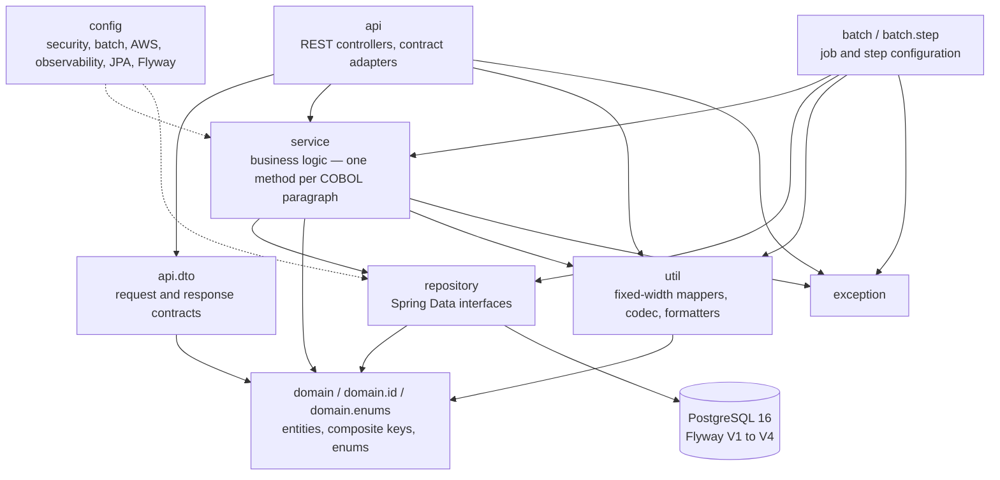
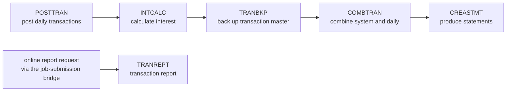
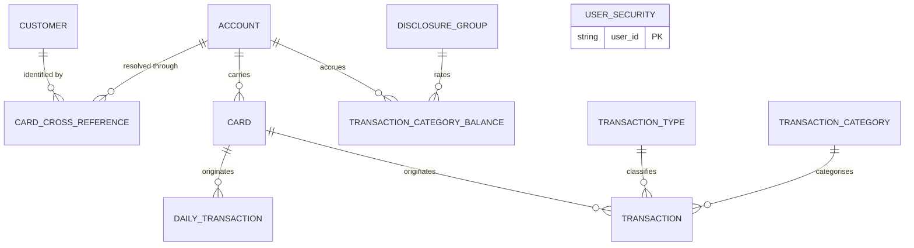

# Architecture

This page is the structural reference for the Java module that reproduces the AWS CardDemo mainframe
estate. It describes the layers and their permitted dependency directions, the responsibility of every
package, the eleven-entity data model, the batch pipeline and its ordering, the applied design patterns,
and the observability and security posture. It is the vocabulary the other migration pages build on:
[onboarding-guide.md](onboarding-guide.md) assumes it, [gate-evidence.md](gate-evidence.md) evidences the
instrumentation it describes, [decision-log.md](decision-log.md) carries the reasoning behind every
divergence it names, and [traceability-matrix.md](traceability-matrix.md) maps each legacy paragraph to
the classes it inventories.

Where a claim here is a count or a width, it was measured against the analysed checkout rather than
quoted. Where the mechanism in the code differs from what the plan anticipated, this page describes the
code.

## What the module is

A single, self-contained Maven module at `carddemo-java/`, carrying its own build, its own wrapper, its
own container definitions, its own schema migrations, its own configuration and its own test estate, so
that a clean checkout builds and validates it without reference to any mainframe asset.

```text
com.carddemo:carddemo-java:1.0.0
```

The base package is **`com.carddemo`** — two `d`s. Prior delivery documentation under `docs/` carried a
misspelt variant with a letter dropped; that spelling is wrong and is not used anywhere in this module.
Every package, every import and every configuration key uses `com.carddemo`. The `1.0.0` is the module's
own version, not a placeholder for an unresolved third-party coordinate.

Exactly two categories of deliverable sit outside the module boundary, each for a platform reason rather
than a design preference. The continuous-integration definition lives at
`.github/workflows/carddemo-java-ci.yml` because GitHub Actions resolves workflows only from the
repository root, and it scopes itself back into the module with a working-directory default. The
documentation set — this page among it — lives under `docs/` because that is where the documentation site
resolves its content root.

### Provenance

Two identifiers are the durable link between this module and the estate it was derived from, and they are
the only correct answer to "which COBOL did this Java come from?".

| Identifier | Value |
| :--------- | :---- |
| Analysed checkout commit SHA | `7756d895ffeb65f7ea72aaa609e356d9899afcec` |
| Upstream release stamp | `CardDemo_v1.0-15-g27d6c6f-68`, dated 2022-07-19 |

The release stamp is carried in the trailer comment of **78** legacy members, which is how the estate
identifies its own vintage. The repository carries no Git tags, so the checkout SHA is the only precise
anchor for the source side of every mapping.

### The legacy estate is reference, never a dependency

The estate under `app/` is **read-only**. Nothing in this migration modifies, moves, deletes or
reformats it, and it remains byte-identical to the analysed checkout — which is precisely what makes the
traceability matrix verifiable against it.

No COBOL, JCL, BMS, copybook or CICS resource-definition **source text** is copied into the module, and
none is copied into this documentation. Traceability is by citation: member names, paragraph names, line
numbers, record widths, byte offsets, key lengths and offsets, and picture-clause shapes are metadata and
appear here freely; source lines do not appear at all.

### The estate being reproduced

| Legacy artifact | Count | Notes |
| :-------------- | ----: | :---- |
| COBOL programs | 28 | 19,254 source lines — 17 CICS online transactions, 10 batch programs, 1 shared date-validation subprogram |
| Copybooks | 28 | data layouts, validation-lookup tables, 2 procedural copybooks, 1 macro copybook |
| BMS mapsets | 17 | the 24×80 screen-layout authority |
| Generated symbolic-map copybooks | 17 | the field-level screen contract |
| JCL members | 29 | batch job definitions and dataset provisioning |
| Cataloged procedures | 2 | the reporting procedure and the copy procedure |
| CICS resource definition | 1 | 18 transaction definitions, 18 program definitions, 17 mapsets, 1 transient data queue |
| Utility control cards | 1 | the copy-utility control statements |
| Catalog listing | 1 | dataset attributes, consulted for key offsets and record sizes |
| Sample datasets | 21 | 9 ASCII fixtures + 12 EBCDIC sequential datasets |
| **Legacy estate under `app/`** | **145** | the sum of every row above |
| **Traceable paragraph units** | **544** | 528 program paragraphs + 16 procedural-copybook paragraphs — 14 in `CSUTLDPY`, 2 in `CSSTRPFY` |

The estate sits inside a larger checkout. At the analysed commit the repository tracked 172 files, three
of which are empty directory placeholders, giving **169 substantive files**: the 145 estate artifacts
above plus 24 others — 6 diagrams, 8 emulator samples, 3 documentation pages and 7 root metadata and
licence files. Both totals are measurable rather than asserted:

```bash
git ls-tree -r --name-only 7756d895ffeb65f7ea72aaa609e356d9899afcec | grep -vc gitkeep       # 169
git ls-tree -r --name-only 7756d895ffeb65f7ea72aaa609e356d9899afcec app/ | grep -vc gitkeep  # 145
```

The 28 programs divide as **17 online CICS transactions, 10 batch programs and 1 shared subprogram** —
`CSUTLDTC`, the date-validation routine callable from both tiers. That split matters: the shared
subprogram is not an eighteenth interactive program, and describing it as one would misstate both the
online inventory and the injection graph.

## Layers and the dependency direction

The module is layered by package, and the dependency direction is a **hard rule rather than a
convention**: dependencies run downward only, and **nothing depends upward**.



The permitted edges, stated as a rule:

| Package | May depend on | Must not depend on |
| :------ | :------------ | :----------------- |
| `api`, `api.dto` | `service`, `domain`, `domain.enums`, `util`, `exception` | anything — nothing sits above it |
| `batch`, `batch.step` | `service`, `repository`, `domain`, `util`, `exception`, `config` | `api`, `api.dto` |
| `service` | `repository`, `domain`, `util`, `exception` | `api`, `api.dto`, `batch` |
| `repository` | `domain` **only** | `service`, `api`, `batch`, `util` |
| `domain`, `domain.id`, `domain.enums` | itself | every package above it, and every Spring type beyond persistence annotations |
| `util`, `exception` | `domain` (`util` only) | everything above them |
| `config` | the layers it wires | — |

### The rule is verified, not merely asserted

An import census over the whole main source tree confirms every edge above and finds no upward
dependency anywhere:

```bash
cd carddemo-java/src/main/java/com/carddemo

# service never imports api — prints nothing
grep -rc 'import com.carddemo.api' service/ | grep -v ':0'

# repository reaches only the domain and its composite-key subpackage
grep -rhoE 'import com\.carddemo\.[a-z.]+' repository/ | sort -u

# domain imports no Spring type at all — prints nothing
grep -rc 'import org.springframework' domain/ | grep -v ':0'

# the transport contracts reach only the domain enums
grep -rhoE 'import com\.carddemo\.[a-z.]+' api/dto/ | sort -u

# no javax.* import and no wildcard import anywhere — both print nothing
grep -rc 'import javax\.' . | grep -v ':0'
grep -rcE 'import [a-z].*\*;' . | grep -v ':0'
```

That `service` imports nothing from `api` is not an accident of tidiness; it is the reason the `api`
package contains contract adapters. The service tier declares its **own** turn-result types — its own
navigation record, its own page metadata, its own field-error marks — and the adapters in `api` map those
onto the published transport contract. Without that seam, either the service layer would have to import
the transport DTOs, inverting the dependency, or the transport contract would leak into business logic.
The adapters are the price of the rule, and the rule is what keeps the service tier independently
testable.

### Two structural isolations that give the rule meaning

**Fixed-width record knowledge is confined to `util`.** Byte offsets, field widths, and the
overpunched-sign convention by which a zoned-decimal field carries its sign in its final byte are
knowledge of the legacy record image, not of the business rules. All twelve record mappers, together with
`FixedWidthFieldReader` and `ZonedDecimalCodec`, live in `util`. No service and no controller performs
offset arithmetic, and no service applies its own scaling — which is what prevents an inconsistent
rounding policy from creeping in through a single careless call site.

**Persistence and validation annotations are `jakarta.*` exclusively.** No `javax.*` import appears
anywhere in the module, which is mandatory on this framework generation. Every import is explicit, with
no wildcard imports at all, so an auditor can establish what a file actually depends on by reading it
rather than by resolving it.

### Injection and immutability, without code generation

Collaborators are supplied by **constructor injection** throughout. This is what replaces the estate's
**27** static inter-program call sites — 13 from the statement generator into its data-access helper, 9
to the Language Environment abort routine, 4 to the shared date-validation subprogram, and 1 to the
Language Environment date routine. Transport and turn-result types are records or final classes.

No Lombok, MapStruct or AutoValue is used, and **no code-generating annotation processor participates in
the build**. Two forces make that a requirement rather than a preference: the module compiles under
`-Xlint:all -Werror`, where processor-generated sources are a live origin of build-failing diagnostics,
and the unsafe-code audit holds reflection at zero, which forbids annotation-driven or convention-based
object mapping outright. Boilerplate is therefore written explicitly. The single annotation-bearing
coordinate in the build is a test-scoped, **annotation-only** companion required to read a third-party
library's published signatures under `-Xlint:all`; the processor-bearing artifact of that same library is
deliberately excluded.

## Package responsibilities

Twelve packages sit under `com.carddemo`, plus the `CardDemoApplication` entry point. The counts below
are of the source files actually present in the module.

| Package | Files | Responsibility | Legacy antecedent |
| :------ | ----: | :------------- | :---------------- |
| `config` | 16 | Wiring: security, JWT, batch, AWS clients, observability, JPA auditing, schema migration, the menu catalog, the published interface description | the CICS resource definition's transaction and program tables; the sign-on program's role split |
| `api` | 22 | REST controllers, the global error surface, and the contract adapters that map service turn results onto the transport contract | the 17 3270 screen transactions |
| `api.dto` | 32 | Request and response contracts, navigation context, page metadata, the field-error contract | the 17 generated symbolic maps |
| `domain` | 12 | The 11 JPA entities, plus the shared natural-key and stored-amount shape rules | the 11 verified record layouts |
| `domain.id` | 3 | The three composite primary keys | the three multi-field cluster keys |
| `domain.enums` | 9 | Typed state: account and card status, user type, transaction source, key action, file status, reject reason, date format, report period | the 508 level-88 condition names |
| `repository` | 18 | 11 entity-facing Spring Data interfaces, plus 4 batch scan projections and the insert and write seams | the 10 VSAM base clusters plus the daily-transaction sequential input |
| `service` | 71 | 26 service classes carrying the 528 program paragraphs and 16 procedural-copybook paragraphs as named methods, plus their command, outcome and turn-result types | the 28 programs and 2 procedural copybooks |
| `batch` | 15 | 9 job configurations, the shared parameter contract, the launch coordinator, staging and completion notification | the 9 application job steps |
| `batch.step` | 11 | The step template, the item processors, the reject writer, the reader factory and the publication locks | the batch programs' read-process-write skeletons |
| `util` | 35 | 12 fixed-width record mappers, the zoned-decimal codec, the field reader, the COBOL string primitives, the key translator, the job-card builder, the statement and report formatters | the record layouts, the string verbs, the function-key copybook |
| `exception` | 6 | Abend, file status, record-not-found, validation, optimistic-lock conflict, job submission | the abend paths and the file-status error branches |

### `config`

`SecurityConfig` derives its route-to-role table from the resource definition's **18** transaction
definitions and their program bindings, so the authorisation surface is a translation of the legacy
transaction table rather than a fresh invention. `JwtTokenProvider` and `JwtProperties` replace the
common-area state carriage described under [Security posture](#security-posture). `BatchConfig` supplies
the job infrastructure; `AwsConfig` and `AwsProperties` the object-store and queue clients, with an
endpoint override so the local emulator can stand in for the real services; `ObservabilityConfig` the
metric registry and trace wiring; `JpaAuditConfig` the clock and auditing that replace a per-program
current-date work area included by all 17 online programs; `FlywayConfig` the migration posture described
under [Schema evolution](#schema-evolution); `MenuOptionCatalog` the 10 user options and 4 administrative
options; `OpenApiConfig` and `WebMvcConfig` the published contract and web layer. Four further classes
enforce configuration safety at startup: an AWS resource health check, a fixed-locale message
interpolator, a production configuration validator, and a callback that refuses a production start
against a seeded database.

### `api` and `api.dto`

Controllers replace the screen transactions one feature at a time: sign-on, the user and administrative
menus, account view and update, card list, detail and update, transaction list, view and add, report
request, bill payment, administrative user management, and batch job launch and status.

Navigation is the load-bearing change. The estate performs **25** program-to-program transfer-control
dispatches and re-arms itself for the next terminal interaction with **19** return-with-transaction-id
statements, across 17 programs. It contains **zero** program-link calls — every dispatch is a transfer,
never a call-and-return. Both constructs become **route constants returned in the response body**: the
server forwards nothing, and the client drives the next call. That is what makes each endpoint
independently testable, and it is why a route is data rather than control flow.

Each symbolic map's input group becomes a request contract and its redefined output group becomes a
response contract, with field names, lengths and numeric typing preserved. Three contracts carry semantics
worth naming:

- `NavigationContext` replaces the common area that all 17 online programs included textually.
- `ErrorResponse` carries a per-field state of **`MISSING`** or **`INVALID`**, not a single boolean. The
  legacy field decorator distinguishes a flag that is blank — for which it writes a marker character —
  from a flag that is merely not-OK, for which it only changes the field's colour, and it fires **only on
  re-submission**. Two states are therefore the minimum faithful contract.
- `PageMetadata` carries the browse cursor and direction, because page fill order is behavioural: the
  three paginated screens use page sizes of 7, 10 and 10, and backward paging fills its rows in the
  reverse order of forward paging.

### `repository`

Eleven entity-facing Spring Data interfaces replace the ten VSAM base clusters plus the daily-transaction
sequential input. Ten extend the standard JPA repository; the user-security interface deliberately extends
the bare repository marker and declares exactly the operations the module performs, inheriting nothing
else — an interface is a capability grant, and a narrower grant is a smaller attack surface. Four
additional scan interfaces exist for the batch tier's keyset-ordered projections, alongside the insert and
record-write seams.

The browse triad — start-browse, read-next, read-previous, end-browse — becomes `Pageable`, **with
direction preserved**. A backward page must present its rows in the same order the legacy screen did, so
direction is part of the contract rather than a presentation detail.

### `service`

Twenty-six service classes carry the business logic. The mapping unit is the paragraph: each of the 528
program paragraphs and 16 procedural-copybook paragraphs becomes a named method, which is what makes a
544-row traceability matrix possible in the first place. The remaining files in the package are the service
tier's own command, outcome, browse-window and turn-result types — the types the `api` adapters map from,
and the reason `service` never imports `api`.

### The file-status model needs two levels, not one enum

The batch programs never branch on the raw two-byte file status. They normalise it first — success becomes
an OK result, end-of-file becomes an EOF result, and everything else becomes an ERROR result — and then
branch on that coarser value. The normalised value, not the raw code, is what the read loops actually
test.

The module therefore carries **both**: a raw `FileStatus` enum for the two-byte code, **plus** a tri-state
I/O outcome of OK, EOF and ERROR, **plus** the terminal abend path. Collapsing the two levels into one
enum would erase the end-of-file-versus-error distinction that every batch read loop depends on, and a
reader that cannot tell "the file ended" from "the read failed" is not a faithful translation.

The literal vocabulary actually compared in status-test context across the estate is narrow, which is why
the raw enum is small and honest: `'00'` **73** times, `'10'` **7** times, and `'23'` **exactly once** —
the disclosure-group default-group fallback. Codes that appear in prior documentation but are compared
nowhere in the source may exist as documented values, but no code path depends on them; the discrepancy is
recorded in [decision-log.md](decision-log.md).

## The batch tier

### Nine job classes, not one per step — the finding that shapes the tier

Of the **78** program-execution steps across the 29 JCL members and 2 cataloged procedures, **only nine
invoke an application COBOL program**. The remaining **69** invoke system utilities:

| Utility | Steps | What those steps do |
| :------ | ----: | :------------------ |
| `IDCAMS` | 52 | define, delete and copy datasets |
| `SDSF` | 8 | inspect spool output |
| `SORT` | 5 | external ordering |
| `IEFBR14` | 3 | allocate, and toggle CICS file availability |
| `IEBGENER` | 1 | copy the in-stream user-security records |
| `DFHCSDUP` | 1 | drive the CICS resource-definition utility |

**Those steps do not become Spring Batch steps at all.** Dataset definition and deletion is absorbed by
the Flyway migrations, dataset staging by the container service definitions and the object store, spool
inspection by the job repository and the metrics surface, and copy operations by ordinary read-and-write
steps inside the job that needs them. That absorption is the entire reason the batch tier has **nine job
configuration classes rather than seventy-eight step classes**.

A direct count at this checkout returns 79 program-execution steps rather than 78 — 76 in the JCL members
and 3 in the procedures — of which 9 are application programs and 70 are utilities, and the utility
breakdown tabled above is itself the 70. The specification's 78-and-69 framing is therefore internally
inconsistent by a single step. This page uses the specification's framing for consistency with the module
README, and the measured 79-9-70 figures and the one-step discrepancy are recorded as a documented
specification defect in [decision-log.md](decision-log.md). The load-bearing claim — nine job
configuration classes rather than one per step — is true under either count, because the count of
application steps is 9 in both.

### There is no master orchestrator, and the pipeline order is an operational convention

**No in-repository master orchestrator exists.** The batch pipeline order is an **operational convention
documented in the root `README.md`, not a coded dependency.** This reproduces the prior specification's
finding and was independently re-proven at this checkout: across all 29 JCL members and both cataloged
procedures there are **zero** internal-reader job submissions, **zero** job-to-job invocations, and the
only procedure invocation targets the cataloged copy procedure. Nothing in the estate encodes "run
interest calculation after posting"; the ordering lives in prose.

The module reproduces that faithfully. Each job is independently launchable, the launch surface exposes
them individually, and **no master-orchestrator class exists** — there is deliberately no single class that
chains the pipeline, because the estate has no such artifact to translate. An operator or scheduler
composes the sequence, exactly as the mainframe operator did.

### The pipeline order



The core application sequence the specification frames is **POSTTRAN, then INTCALC, then COMBTRAN, then
statement creation and reporting**. The root README's run list — the only in-repository authority — agrees
on that spine and differs from it in two respects that are documented here rather than smoothed away:

- The README places **`TRANBKP`**, the transaction-master backup, **between `INTCALC` and `COMBTRAN`**. It
  also lists `TRANBKP` a second time much earlier, where the same member is used to create the transaction
  master rather than to back it up.
- The README **does not list `TRANREPT` in the run sequence at all**, and its job-and-program table omits
  it too. That is consistent rather than an oversight: the transaction report is reached from the **online
  report request** through the job-submission bridge, not from the daily pipeline. `PRTCATBL`, the
  category-balance listing, is likewise absent from both README tables.

Neither difference is a defect and neither is invented away. The diagram above shows both the README spine
and the online path by which reporting is actually triggered. **Because the ordering is a convention, the
diagram is documentation of intent, not a dependency the code enforces.**

### The nine job configurations

| Job configuration | Job name | Legacy antecedent |
| :---------------- | :------- | :---------------- |
| `PostTransactionJobConfig` | `postTransactionJob` | `app/jcl/POSTTRAN.jcl` — daily transaction posting |
| `InterestCalculationJobConfig` | `interestCalculationJob` | `app/jcl/INTCALC.jcl` — disclosure-group driven interest |
| `CombineTransactionsJobConfig` | `combineTransactionsJob` | `app/jcl/COMBTRAN.jcl` — two concatenated inputs merged and ordered |
| `CreateStatementJobConfig` | `createStatementJob` | `app/jcl/CREASTMT.JCL` — four steps, three condition-code gates |
| `TransactionReportJobConfig` | `transactionReportJob` | `app/jcl/TRANREPT.jcl` with `app/proc/TRANREPT.prc` |
| `BackupTransactionJobConfig` | `backupTransactionJob` | `app/jcl/TRANBKP.jcl` — one condition-code gated step |
| `CategoryBalanceReportJobConfig` | `categoryBalanceReportJob` | `app/jcl/PRTCATBL.jcl` — category-balance listing |
| `FileProbeJobConfig` | `fileProbeJob` | `READACCT`, `READCARD`, `READCUST` and `READXREF` collapsed into one parameterized job |
| `DailyTransactionReadJobConfig` | `dailyTransactionReadJob` | `app/cbl/CBTRN01C.cbl` — **defined but not wired**; see below |

`JobParameterValidators` is the tenth entry in that inventory — not a job, but the shared parameter
contract across all nine, deriving its validation from the in-stream date-parameter conventions the
reporting procedure and the statement job declare. Of the nine job configurations, **eight are wired into
the pipeline and one is not**; the exception is the subject of the next section.

### The tenth job is deliberately unwired

`DailyTransactionReadJobConfig` is a fully defined Spring Batch job that is **excluded from the default
pipeline and exercised only by tests**. Its program, `CBTRN01C`, is a complete **491-line, 18-paragraph**
batch program that **no JCL member, no cataloged procedure and no CICS definition invokes**. It is
migrated deliberately, not accidentally: leaving it out would make the estate coverage incomplete, and
wiring it in would invent a pipeline stage the mainframe never ran. Defined-but-unwired means unwired, not
untranslated — and its absence from the pipeline is a faithful reproduction of the legacy wiring.

### Condition-code gates

Condition-code logic in this estate is sparse and precisely located. **Exactly four steps** carry a
step-level condition code:

| Member | Step | Condition | Meaning |
| :----- | :--- | :-------- | :------ |
| `app/jcl/CREASTMT.JCL` | `STEP020` | `COND=(0,NE)` | run only if every prior step returned zero |
| `app/jcl/CREASTMT.JCL` | `STEP030` | `COND=(0,NE)` | run only if every prior step returned zero |
| `app/jcl/CREASTMT.JCL` | `STEP040` | `COND=(0,NE)` | run only if every prior step returned zero |
| `app/jcl/TRANBKP.jcl` | `STEP10` | `COND=(4,LT)` | run unless a prior step returned more than 4 |

Both forms become step transitions that end the job on failure. The distinction between them is preserved
rather than flattened: the statement job's three gates demand a clean zero from everything before them,
while the backup job's single gate tolerates a warning-level return and bypasses only on a genuine error.
Two further condition tokens appear in the estate — in the reporting job and its procedure — but those are
sort record-selection conditions that filter which records enter the sort, not step gates, and they become
a repository date-range predicate rather than a job transition.

### Ordering is external, and the comparators are per-job

The estate contains **zero** internal COBOL sort statements and **zero** merge statements. All ordering is
external, in three distinct specifications, which is why the comparators are **per-job rather than
shared**:

- The combine job orders two concatenated inputs by transaction identifier, ascending, then writes them as
  one dataset.
- The reporting procedure declares its sort symbols with the transaction card-number field typed as **zoned
  decimal** at offset 263 for 16 bytes and the processing-date field as **character** at offset 305 for 10
  bytes, and applies an inclusive date-range record-selection condition.
- The statement job sorts on the card number **typed as character**, then on the record's leading key, and
  reprojects the result.

The same field is typed zoned decimal in one job and character in another. A single shared comparator would
have to pick one typing and would silently reorder the other job's output, so each job owns its own.

### The statement generator is a state machine, not a loop

`CBSTM03A` is not a read loop with nested calls. It is a **hand-rolled dispatcher**: a work field holding a
data-definition name selects the next phase, each phase sets that field and jumps **backward** to the
dispatcher, and the dispatcher re-branches on the new value. `StatementGenerationService` therefore uses an
explicit **state enum driven by a `while` loop over a `switch`**.

Nested method calls cannot reproduce re-entry into a dispatcher after a state change, which makes this the
**single most consequential structural decision in the batch tier**. The surrounding measurements explain
why it is isolated to one service: of **134** unconditional jumps estate-wide, **125** jump forward to an
exit label and become a plain `return`, and only **9** jump backward and form loops — and **6 of those 9
belong to `CBSTM03A`**.

### Three JCL members are intentionally not migrated

| Member | What it does | Why there is no target |
| :----- | :----------- | :--------------------- |
| `app/jcl/CLOSEFIL.jcl` | disables CICS file availability | no runtime equivalent once VSAM is replaced |
| `app/jcl/OPENFIL.jcl` | re-enables CICS file availability | no runtime equivalent once VSAM is replaced |
| `app/jcl/CBADMCDJ.jcl` | drives the CICS resource-definition utility | the resource definition itself has no target runtime |

These are **documented as intentionally unmigrated, not dropped**. Connection availability in the target is
a pooled-datasource concern with no job to toggle it, and there is no resource-definition catalogue to
update. The reasoning is recorded in [decision-log.md](decision-log.md).

## The data model

Eleven entities reproduce eleven verified record layouts. Every width below was corroborated twice: once
from the copybook that declares the layout, and once from the `RECORDSIZE` clause of the cluster definition
that allocates it.

| Entity | Legacy copybook | Record width | Notes |
| :----- | :-------------- | -----------: | :---- |
| `Account` | `CVACT01Y` | 300 | five two-decimal money fields; version-controlled |
| `Card` | `CVACT02Y` | 150 | card number is the primary key; version-controlled |
| `Customer` | `CVCUS01Y` | 500 | national identifier encrypted at rest |
| `CardCrossReference` | `CVACT03Y` | 50 | 36 data bytes plus a 14-byte filler |
| `Transaction` | `CVTRA05Y` | 350 | origin timestamp at offset 278, processing timestamp at offset 304 |
| `DailyTransaction` | `CVTRA06Y` | 350 | byte-identical to `Transaction`, different field prefix |
| `TransactionCategoryBalance` | `CVTRA01Y` | 50 | composite key |
| `DisclosureGroup` | `CVTRA02Y` | 50 | composite key; carries the interest rate |
| `TransactionType` | `CVTRA03Y` | 60 | reference data |
| `TransactionCategory` | `CVTRA04Y` | 60 | composite key; reference data |
| `UserSecurity` | `CSUSR01Y` | 80 | credential stored as a hash, never as the legacy plaintext |

A twelfth type in the `domain` package is **not** an entity: it holds the shape rules every natural key and
every stored amount must satisfy before reaching the database, so that the invariants live beside the
entities they constrain rather than inside a service.



### Composite keys, and why every key is a business key

Three keys are composite and live in `domain.id`: `TransactionCategoryBalanceId`, `DisclosureGroupId` and
`TransactionCategoryId`.

**The JPA identifier is always the business key and never a generated surrogate.** The legacy file
description declares the key as the *leading substring of the record image* — the record is the key
concatenated with the remainder — so the key is already the natural identity of the row. Introducing a
surrogate would break the record-image-to-table-row correspondence that byte-level output comparison
depends on, and would leave two competing identities for the same row. No surrogate identifier exists
anywhere in the schema.

### Decimal representation

Every persisted monetary and rate field in the estate is **zoned decimal**, declared with display usage,
and every one becomes a `BigDecimal` whose scale matches its picture clause exactly: five `PIC S9(10)V99`
fields on the account record, `PIC S9(09)V99` amounts on the transaction, daily-transaction and
category-balance records, and one `PIC S9(04)V99` interest rate on the disclosure group.

All conversion in both directions passes through a single seam, `ZonedDecimalCodec`, which applies **scale
2 and `RoundingMode.DOWN`** uniformly. Because there is exactly one seam, no service can introduce a
different rounding policy, and no call site can quietly disagree with another. *Why* the mode is `DOWN`
rather than the conventional half-even is a translation decision with a specific legacy justification, and
it is recorded in [decision-log.md](decision-log.md) rather than re-argued here.

**No packed-decimal decoder is required.** Packed usage does appear in the estate — nine sites — but every
one of them is a working-storage scratch field, and **not one persisted monetary or rate field uses it**.
What the module needs instead is the zoned-decimal codec's handling of the overpunched sign, in which the
final byte of the field encodes both its low-order digit and the sign of the whole value.

### `DailyTransaction` is a separate entity on purpose

The daily-transaction layout is byte-for-byte identical to the transaction layout, distinguished only by a
different field-name prefix. It is nonetheless a **separate entity with its own table**, because it is a
distinct dataset with a distinct lifecycle: it is the input the posting job consumes and rejects from,
while the transaction master is the durable record the posting job appends to. Folding them together would
merge two lifecycles into one table and destroy the reject path's meaning.

### Optimistic locking

`@Version` on `Account` and `Card` replaces the legacy before-and-after image comparison, in which a
program re-read a record and compared it field by field to detect a concurrent change. The estate's
**single** rollback statement becomes a transactional rollback raising `OptimisticLockConflictException`.

### What the data-model diagram deliberately omits

`diagrams/CARDDEMO-DataModel.drawio` holds two pages. The first, `ER Diagram`, is the entity-relationship
view of the estate this schema reproduces. The second page carries three further entities — **product, fee
and feature** — and **those are not implemented.**

They are illustrative future-state entities with no corresponding copybook, no program that reads or writes
them, and no dataset that holds them anywhere in the estate. Implementing them would be feature expansion,
which is out of scope. A reader comparing the diagram file against the schema will find those three
entities absent from the eleven tables, and that absence is intentional rather than an oversight.

## The three alternate indexes

The estate defines three VSAM alternate indexes, all non-unique and all maintained synchronously with their
base cluster.

| Legacy alternate index | Base cluster | Key (length, offset) | Target |
| :--------------------- | :----------- | :------------------- | :----- |
| `CARDAIX` | card master | `CARD-ACCT-ID` — `KEYS(11 16)` | `CardRepository.findByCardAcctId` |
| `CXACAIX` | card cross-reference | `XREF-ACCT-ID` — `KEYS(11 25)` | `CardCrossReferenceRepository.findByXrefAcctId` |
| transaction timestamp index | transaction master | `TRAN-PROC-TS` — `KEYS(26 304)` | a date-range query for the reporting job |

**All three also become B-tree indexes in `V2__create_indexes.sql`** — `idx_card_card_acct_id`,
`idx_card_cross_reference_xref_acct_id` and `idx_transaction_tran_proc_ts`. The third is included even
though **no online endpoint depends on it**, because the reporting job's date-range record selection would
otherwise scan the whole transaction table. That asymmetry is visible in the estate itself: only the two
card-related indexes are registered to CICS as file paths and therefore back online access, while the
timestamp index exists for batch alone.

The key offset of 304 also corroborates the transaction layout independently — the processing timestamp
sits at offset 304 and the origin timestamp at 278, which is exactly what the sort specifications address.

## Schema evolution

Schema evolution is **versioned and forward-only**, in four migrations under
`carddemo-java/src/main/resources/db/migration/`:

| Migration | Contents |
| :-------- | :------- |
| `V1__create_schema.sql` | the 11 tables, one per verified record layout |
| `V2__create_indexes.sql` | the three alternate-index equivalents, plus primary and foreign keys |
| `V3__seed_reference_data.sql` | the nine reference and sample datasets |
| `V4__seed_user_security.sql` | the ten known sign-on identities, credentials hashed |

### The two seeds can never reach production

The seeds are excluded from production by a **per-profile migration version ceiling**, not by a separate
migration directory. There is one migration location, `classpath:db/migration`, and every profile resolves
exactly that location — there is no `local/`, `test/` or `prod/` child directory to get wrong. What differs
per profile is the **target version**: production migrates to version 2 and stops, so it receives the
schema and the indexes and never applies a seed, while only the local and test overlays lift the ceiling to
the latest version and apply `V3` and `V4`.

Two properties make that robust rather than merely configured. The production ceiling is declared both in
the shared baseline and again in the production overlay, so a profile silent about migrations inherits the
production posture rather than the permissive one — the safe value is the default. And a startup callback
independently **refuses a production start** against a database whose migration history records a seed or
whose tables still hold seeded rows, so a production instance cannot be pointed at a seeded database even
by mistake.

### Seed volumes

Measured from the ASCII fixtures they derive from:

| Seeded data | Rows |
| :---------- | ---: |
| Accounts | 50 |
| Cards | 50 |
| Card cross-references | 50 |
| Customers | 50 |
| Daily transactions | 300 |
| Disclosure-group rows | 51 |
| Transaction category balances | 50 |
| Transaction categories | 18 |
| Transaction types | 7 |
| Sign-on identities | 10 |

Two of those volumes are load-bearing for test coverage rather than merely illustrative. The 300 daily
transactions comprise point-of-sale purchases and operator-originated returns, so both signed directions
exercise the balance computation. The 51 disclosure-group rows form three complete seventeen-row groups
under distinct group keys, one of which is the default group — which makes both the direct rate lookup and
the default-group fallback in the interest program reachable from seed data alone, with no synthetic
fixture required.

## Applied design patterns

Each pattern below is named for the legacy construct it replaces, not for its own sake.

| Pattern | Realized by | Legacy construct replaced |
| :------ | :---------- | :------------------------ |
| Repository | 11 Spring Data interfaces | 10 VSAM base clusters plus the daily-transaction sequential input; the browse triad becomes `Pageable` with direction preserved |
| Service Layer | 26 service classes | 528 program paragraphs plus 16 procedural-copybook paragraphs, each a named method |
| Template Method | `AbstractCobolStep` | the open, read-loop, status-check, close and abend skeleton shared by all ten batch programs |
| Strategy | `switch` over `domain.enums` | 111 multi-way selections, with clause order preserved |
| Adapter | `JobSubmissionService` | the single transient-data-queue write — the estate's only online-to-batch bridge |
| Factory | `FixedWidthFlatFileReaderFactory`, `JclCardImageBuilder` | a configured reader per record layout; the job-submission card image |
| State Machine | `StatementGenerationService` | the statement generator's backward-jumping dispatcher |
| Optimistic Locking | `@Version` on `Account` and `Card` | the before-and-after record image comparison |
| Field-error decoration | `FieldErrorDecorator.mark` | 39 expansions of a parameterized validation macro |
| Dependency injection | constructor parameters | 27 static inter-program call sites, and 68 textual copybook inclusions |

### Service Layer — where the mass actually sits

The paragraph count is not evenly distributed. `COACTUPC`, the account-update program, contributes **85**
paragraphs on its own — **16.1%** of the estate's 528 — and becomes `AccountUpdateService`. It is also the
only program that includes the validation-lookup, macro, date-validation and date-work copybooks, which
means the entire validation surface is reachable through the account-update feature and its tests must be
correspondingly thorough.

### Strategy — clause order is the contract

The 111 multi-way selections become `switch` constructs **with clause order preserved**, because the legacy
construct evaluates its clauses top-down and stops at the first match. Whenever two conditions can both be
true, reordering them changes behaviour, so order is preserved literally rather than normalised. The
catch-all clause becomes the default branch. The 508 level-88 condition names become enum constants with
predicate methods, and the assignments that set those flags become enum assignments — which turns
string-flag comparison into type-checked state.

### Adapter — the one bridge from online to batch

The estate contains **exactly one** transient-data-queue write, and it is the sole path by which an online
transaction causes batch work to happen. `JobSubmissionService` adapts it onto an **SQS FIFO queue**,
preserving three properties the CICS resource definition specifies:

| Queue attribute | Preserved as |
| :-------------- | :----------- |
| `RECORDSIZE(80)` with `RECORDFORMAT(FIXED)` | one 80-character fixed-width payload per message |
| `DISPOSITION(MOD)` | append semantics, expressed as message-group ordering |
| `ERROROPTION(IGNORE)` | a non-blocking publish whose failure path **logs and continues** rather than aborting the caller |

The third is the one most easily lost. The legacy queue was defined to ignore write errors, so a failed
submission produced a screen message and the transaction carried on. Raising an exception to the caller
would be a behavioural regression dressed as an improvement.

### Factory — the job-submission card image

`JclCardImageBuilder` produces the **seventeen** fixed 80-column card images with **four** date substitution
slots, and it emits the terminating end-of-file card, because the legacy program transmits that card rather
than merely holding it in storage. A consumer that never receives it would see a truncated submission.

### Field-error decoration — the largest single de-duplication

A parameterized macro copybook is expanded **39** times in the account-update program, once per validated
field, generating roughly 234 lines. All 39 expansions collapse into a single method,
`FieldErrorDecorator.mark(field, bmsFieldId, flagState)`, invoked 39 times — replacing those lines with 39
call sites and one small helper. This is the largest single de-duplication in the refactor, and it is
possible only because the macro's three substitution tokens are exactly the method's three parameters.

### Dependency injection — what disappears

Beyond the 27 static call sites, four copybooks were each included textually by **all 17** online programs:
the common area, the screen-title constants, the current-date work fields and the common-message catalogue.
Those **68 textual inclusions collapse into four injected collaborators** — a navigation context, a message
catalogue, a clock, and screen metadata — because their content is shared state and shared constants rather
than per-program data. A service that would have carried four copybook inclusions now declares constructor
parameters instead.

## Observability

The legacy system's **only** diagnostic channel was the console display statement, of which the estate
contains **215** — measured as statement-initial occurrences. There is no metric, no trace, no structured
log and no health check anywhere in it. The module replaces that with five instrumentation surfaces.

| Surface | Realization |
| :------ | :---------- |
| Health, info and metrics | Spring Boot Actuator, exposing exactly four endpoints: health, info, metrics and prometheus |
| Metrics collection | Micrometer timers on every REST endpoint and every batch step |
| Metrics exposition | the Prometheus registry, published at `/actuator/prometheus` |
| Distributed tracing | the Micrometer tracing bridge with OTLP export, propagating traces across the REST-to-batch boundary |
| Logging | `logback-spring.xml` with a JSON encoder and correlation identifiers carried in the diagnostic context |

The collection configuration lives beside the code rather than in an operations repository:

| Artifact | Purpose |
| :------- | :------ |
| `carddemo-java/config/prometheus/prometheus.yml` | scrape configuration, targeting `/actuator/prometheus` |
| `carddemo-java/config/grafana/provisioning/datasources/datasource.yml` | datasource provisioning |
| `carddemo-java/config/grafana/provisioning/dashboards/dashboard.yml` | dashboard provisioning |
| `carddemo-java/config/grafana/dashboards/carddemo-overview.json` | the dashboard itself, with per-endpoint and per-step panels |

`ObservabilityConfig` owns the registry through a registry customizer and **declares no exporter bean of its
own**, leaving export to the framework's auto-configuration so that two classes cannot both claim the same
capability.

### This page states no performance figure, deliberately

The timers above are the mechanism from which the performance baseline is read, and the recorded figures
live in [gate-evidence.md](gate-evidence.md).

**No latency, throughput, records-per-second, capacity or availability number appears on this page, and no
service level is asserted anywhere in this migration.** The reason is documented rather than assumed: no
numeric performance target exists anywhere in the legacy estate — not in the COBOL, not in the JCL, not in
the CICS resource definition. There is therefore nothing to compare against, and the performance gate
**establishes** the first baseline rather than testing a threshold. Describing the measurement mechanism is
correct; asserting a number here would be fabrication. `ObservabilityConfig` makes the same point in its own
documentation: it asserts nothing about performance, and that is a requirement.

## Security posture

| Concern | Legacy | Target |
| :------ | :----- | :----- |
| Authentication | plaintext comparison against an 8-character stored password | Spring Security with **BCrypt-hashed** credentials |
| Authorization | the CICS transaction and program tables | a route-to-role table derived from the resource definition's 18 transaction definitions |
| Session state | the common area, carried across pseudo-conversational turns | stateless JWT claims plus an explicit `NavigationContext` echoed by the client |
| Isolation | uncommitted reads, no recovery, no journalling | PostgreSQL read-committed plus JPA `@Version` |

### Authorization is a translation, not a redesign

The route-to-role table is derived from the resource definition's transaction and program bindings rather
than invented. Five routes are administrator-gated: the four user-management transactions and the
administrative menu. The batch launch and status surface is administrator-gated on the same authority, and
the management endpoints sit behind a separate management authority, so an operator credential cannot be
reused as an application credential. The anonymous metrics-scrape relaxation exists **only** in the local
and test overlays.

### Isolation is stronger than the baseline, and that is deliberate

Every file definition in the CICS resource definition specifies uncommitted-read integrity, no recovery and
no journalling, with correctness resting on record-level locking plus each program's own before-and-after
image comparison. PostgreSQL read-committed isolation combined with JPA `@Version` is **strictly stronger
than that baseline**.

This is stated explicitly so that a reviewer does not mistake the stronger isolation for a behavioural
regression: it is an **improvement, not a divergence to be corrected**. The full argument, including why a
stronger guarantee cannot alter any output the legacy system produced, is in
[decision-log.md](decision-log.md).

### Secrets

No credential, password, token, signing secret or access key value appears in this document, in the source,
or in any committed configuration file.

The production profile resolves **every** secret — the signing secret, the database password and the cloud
credentials — from an environment variable **with no fallback default**, so a missing secret **fails
startup** rather than silently binding a placeholder. A defaulted secret is a hardcoded secret with extra
steps, which is why the absence of defaults is as much a requirement as the absence of literals. A
production configuration validator enforces that at startup.

The ten seeded sign-on identities exist only in the local and test profiles, and their credentials are
stored as BCrypt hashes rather than as the legacy plaintext. The legacy demonstration credentials that
appear in the root `README.md` describe the **mainframe** system and are not restated here.

## What this architecture deliberately does not contain

Absences here are decisions. Each one is listed so that a reviewer can tell a deliberate omission from a
gap.

### No user interface

The legacy presentation layer is a 3270 terminal contract. Under a no-feature-expansion constraint the
correct translation of a terminal contract is a **machine contract**, so the 17 mapsets become REST request
and response contracts, exercised by integration and end-to-end tests. **No browser or single-page
application is built.** The target stack names no frontend technology and no component library, so there is
**no design system, no component library and no styling layer** anywhere in this architecture.

What is preserved from the screen layer is contract detail — field names, lengths, numeric typing, page
sizes, required-field flags, message text, and the two-state field-error semantics — not appearance.

### No infrastructure or performance engineering beyond parity

| Not present | Why |
| :---------- | :-- |
| Any cache layer | the legacy system has no application cache; adding one would change consistency and timing characteristics that the performance baseline measures |
| Certificate issuance and ingress provisioning | the production profile *consumes* externally supplied keystore material, but issuing certificates and provisioning ingress is infrastructure work outside this migration's authority; every validation runs locally |
| Connection-pool tuning | no legacy baseline exists to tune against, so defaults are retained deliberately |
| Table partitioning, read replicas, object-lifecycle policies | durability and scale engineering beyond parity, with nothing to calibrate against |
| Load, chaos and cross-browser testing | required by no gate and not derivable from the legacy system |

### Three non-implementations a reader will otherwise flag as bugs

All three are faithful, and all three are recorded in [decision-log.md](decision-log.md):

- **An empty fee-computation paragraph is preserved as a documented no-op.** The legacy paragraph contains a
  comment stating the logic is to be implemented, followed by an exit — and it is **genuinely invoked** from
  the interest-calculation driver. The Java method exists, is called, and does nothing. **No fee logic may be
  invented to fill it**, because doing so would be feature expansion and would change interest-run output.
- **Two account-update fields are decorated for error display but never validated.** The legacy source states
  in comments that no edits are coded for the middle-name and second-address-line fields. Their contracts
  therefore carry **no validation constraints**; adding any would reject input the legacy system accepts.
- **One copybook is consciously excluded as dead code.** It has zero inclusion references anywhere in the
  estate, so translating it would create dead Java. It is the single artifact deliberately not migrated, and
  it is recorded as a decision rather than left as a gap.

## The local validation stack

Everything the architecture depends on at runtime is provisioned locally by
`carddemo-java/docker-compose.yml`, so no gate requires a production environment, a staging environment or a
running mainframe.

| Service | Role |
| :------ | :--- |
| PostgreSQL 16 | the relational store the eleven tables live in |
| LocalStack Community | object storage, the FIFO queue and the notification topic; **Community edition only, no licence token** |
| Jaeger | the OTLP trace collector and its query interface |
| Prometheus | scrapes `/actuator/prometheus` |
| Grafana | renders the provisioned overview dashboard |
| the application image | the module itself, built from `carddemo-java/Dockerfile` |

All images are pinned by digest, and every published port binds to the loopback interface by default.
`carddemo-java/localstack/init/01-create-aws-resources.sh` bootstraps the staging bucket, the FIFO queue and
the topic on startup. Bring-up and gate-execution instructions are in
[onboarding-guide.md](onboarding-guide.md) and in the module's own README.

## Reference diagrams

The estate ships its own diagrams. They are **read-only reference and corroborative only** — every screen
and entity fact used on this page was read from the map definitions, the copybooks and the program source,
with the images serving as a cross-check rather than as a specification. None of them is modified by this
migration.

| Asset | What it corroborates |
| :---- | :------------------- |
| [`../diagrams/CARDDEMO-DataModel.drawio`](../diagrams/CARDDEMO-DataModel.drawio) | the entity-relationship view behind the eleven-table schema; its second page is the unimplemented product, fee and feature set |
| [`../diagrams/Application-Flow-User.png`](../diagrams/Application-Flow-User.png) | the standard-user navigation flow that the route constants reproduce |
| [`../diagrams/Application-Flow-Admin.png`](../diagrams/Application-Flow-Admin.png) | the administrative navigation flow and its gated entry points |
| [`../diagrams/Signon-Screen.png`](../diagrams/Signon-Screen.png) | the sign-on field and message inventory |
| [`../diagrams/Main-Menu.png`](../diagrams/Main-Menu.png) | the ten standard-user menu options |
| [`../diagrams/Admin-Menu.png`](../diagrams/Admin-Menu.png) | the four administrative menu options |

## Standards this architecture is held to

**No user-specified rules were provided for this engagement.** The project's rules document was read in
full and states exactly that. This is a **verified absence rather than an incomplete read**, and it is
consequential in one direction only: no file enters scope because a rule demanded it, and no rule conflicts
with another or with the requirements.

The absence is **not licence to lower the standard of the work**. In place of project rules, the migration
is held to a set of substituted enterprise standards. Five of them are discharged by the architecture this
page describes:

| Standard | Discharged by |
| :------- | :------------ |
| Layered separation of concerns | the strict downward dependency direction, verified by import census, and the confinement of fixed-width record knowledge to `util` |
| Constructor injection and immutability without code generation | constructor injection throughout, records and final classes for transport types, and no code-generating annotation processor in the build |
| Secrets never in source and never defaulted | the production profile's no-fallback secret resolution, hashed seeded credentials, and no secret value anywhere on this page |
| Versioned, forward-only schema evolution | four Flyway migrations with a per-profile version ceiling and a startup callback that refuses a seeded production database |
| Observability as a first-class concern | Actuator, Micrometer timers on every endpoint and step, Prometheus and Grafana provisioning, OTLP tracing, and structured JSON logging |

Two further bodies of mandatory content govern this migration and are **not** rules, so they are named
correctly here rather than mislabelled. The construct-mapping table that pairs each COBOL construct with its
Java equivalent and its preservation requirement is a **requirement** of the refactoring. The eight
validation gates are **acceptance criteria**, evidenced in [gate-evidence.md](gate-evidence.md). Neither
originates in the rules document, and neither should be sought there.

### The tie-break that decides the hard cases

Where faithful translation and idiomatic Java conflict, **faithful wins**, and the divergence is recorded in
[decision-log.md](decision-log.md) rather than resolved by taste. That single rule is what decides every
difficult case on this page: truncating rather than rounding, preserving a paragraph that does nothing,
keeping two byte-identical layouts as separate entities, reproducing a condition-code form rather than
normalising it, and declining to validate two fields the legacy system decorates but never checks.
