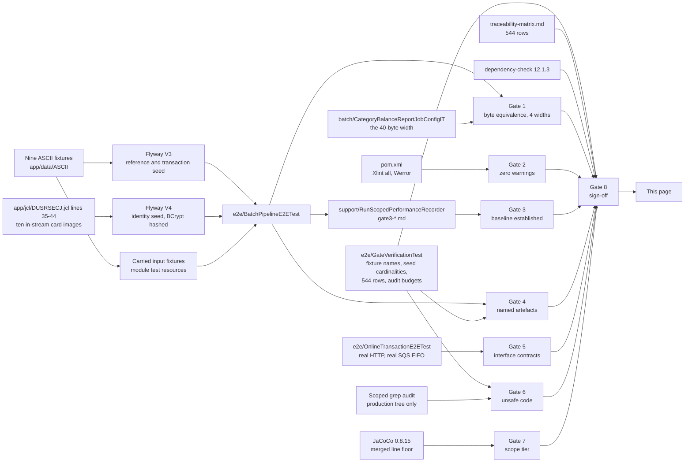

# Gate Evidence

Recorded evidence for the eight validation gates of the CardDemo COBOL-to-Java migration.

**Governing principle: no gate is discharged by assertion.** Every section below names the command that
produces its evidence, the artefact the evidence lands in, and the result. Where the result is a
measurement, the run it came from is named beside it. A specification presented as a measurement would
make this page worse than absent, so the two are distinguished everywhere and the distinction is
summarised in [Status at a glance](#status-at-a-glance-verified-versus-specified).

**What the eight gates are, and what they are not.** They are the migration's **acceptance criteria**, and
the ten-row COBOL-to-Java construct mapping they sit beside is a **requirement** of it. Neither is a project
rule, and neither originates in a rules document — this engagement was given none, a fact recorded in the
migration plan rather than inferred here. The classification changes nothing about how binding they are; it
only says where to look for their text, which is the plan and this page rather than anywhere else.

**Provenance.** Legacy estate checkout SHA `7756d895ffeb65f7ea72aaa609e356d9899afcec`; upstream release
stamp `CardDemo_v1.0-15-g27d6c6f-68`, dated 2022-07-19, which is the designated provenance identifier for
this migration. Traceability is by citation — path and line number — and no legacy source text is
reproduced in the Java module or on this page. Contractual message text, record widths, byte offsets, sort
field offsets, reject codes, dataset names and step names are the substance of what several gates verify
and are recorded here as the interface metadata they are.

## Execution context of the recorded run

A measurement without its context is not evidence, and **a measurement without the tree it was taken over is
not evidence either**. Every measured figure on this page comes from the run described here, taken over the
revision that carries this page, unless the row says otherwise. No commit identifier is quoted anywhere on
this page, and the omission is deliberate: a page cannot name the commit that contains it, and a page that
names a different one sends a reader to a revision they cannot check out. What is quoted instead is the
**command**, the **tree the command ran over** — the one this page ships in — and the **figures a re-run has
to reproduce.**

The repeated runs are not redundancy for its own sake; they are what separates the two kinds of figure this
page carries. **Every standing result was identical across every one of those runs** — the same zero compiler
diagnostics over the same production and test source counts, the same merged coverage to the line, the
same test counts with no failure, the same byte-for-byte comparison outcomes, and the same vulnerability
outcome. **Only the per-run timings moved**, and they moved substantially: the same 300-record posting job
took 2,286 ms in one run and 3,713 ms in another, on the same host and over the same input. That is the whole
argument for recording elapsed time in a dated table and recording everything else as a property of the code.
The *Measured runs* table under Gate 3 carries the recorded run's three measurements together with the dated
rows of earlier runs; nothing is transcribed twice, because runs of the same job at the same volume on the
same host already make the point the table exists to make.

**Where a standing figure moves, it moves because the tree moved, and the older figure is not kept beside
it.** Earlier runs of earlier revisions measured smaller source, test, line and branch totals, because the
remediations of this checkpoint added production code and the tests that cover it. Those earlier figures are
not reconciled with this page and are not meant to be: **every standing figure here is the recorded run's**,
and the earlier runs survive only as dated rows in the Gate 3 table, which is where a per-run measurement
belongs. The one thing that never moves is the shape of the claim — zero compiler diagnostics, no failing
test, byte-equal goldens, merged line coverage above the floor, and nothing unsuppressed at or above the
vulnerability threshold.

| Property | Value |
| --- | --- |
| Date, in UTC | 2026-08-10, build finished 18:39:35Z |
| Command | `./mvnw -B clean verify`, run from the module directory |
| Result | `BUILD SUCCESS`, total time 11:35 min |
| Reproduced by | repeated full `./mvnw -B clean verify` runs on the same machine, each `BUILD SUCCESS`; every run over this tree produced identical standing results — the same 245 and 549 source counts, the same single `[WARNING]` block and it the scanner's rather than the compiler's, the same 26,962 and 1,645 test cases with no failure, the same 23,236 of 24,193 lines and 7,755 of 8,664 branches across the same 493 analysed classes, the same five byte-equal Gate 1 comparisons, and the same 168 dependencies with one below-threshold finding and one written determination. Only the timings differed, which is the distinction this table exists to draw |
| JDK | Eclipse Temurin 25.0.3+9 — `OpenJDK Runtime Environment Temurin-25.0.3+9 (build 25.0.3+9-LTS)` |
| Build tool | Apache Maven 3.9.16, resolved by the committed wrapper rather than from the host |
| Operating system, kernel | Ubuntu 25.10 container, Linux 6.12.85+ x86_64 |
| Processor, memory | Intel Xeon @ 2.60GHz, 4 effective vCPU by cgroup quota, 3,842 MB |
| Container runtime | Docker 29.7.0 with Compose v5.3.1 |
| Database under test | PostgreSQL 16 through Testcontainers for the integration tier |
| AWS emulation | LocalStack Community, no authentication token of any kind |
| Module coordinate | `com.carddemo:carddemo-java:1.0.0` |
| Sources compiled | **245** production and **549** test, each as `javac [debug parameters release 25]` under `-Xlint:all -Werror`, with no warning and no error |

**Why the two class counts differ from the two source counts, stated rather than smoothed over.** The
compiler compiled **549** test sources; the runners wrote **449** unit and **76** integration report files.
Three populations, not one, and each is correct for its own question. Twenty of the 549 declare no test at
all — the `support` helpers, the fixture builders and the census utilities — so no runner claims them. Four
more are the abstract container base classes `AbstractPostgresIT`, `AbstractLocalStackIT`,
`AbstractPostgresAndLocalStackIT` and `AbstractSignOnSourceAttributionIT`, which hold lifecycle for their
subclasses, declare no test of their own and therefore produce no report file: the integration tier's **80**
sources become 76 report files for that reason and no other. The unit tier has no such base class, which is
why its source count and its report count are both 449 — and why that equality is what tells
`e2e/GateVerificationTest` a run was unscoped rather than narrowed.

**Where any other figure in this repository comes from.** A repository-setup narrative recorded a different
pair of test counts from a run at an earlier revision on different container availability. It is not
reconciled with this page and is not meant to be: **the authoritative source for a test count is the report
directory of a named run at a named revision**, which is what the tables below quote and cite. Where a figure
elsewhere disagrees, prefer the one carrying a revision.

## How to read this page

Each gate names **the command that produces its evidence**, **the artefact the evidence lands in**, and
**the standing result** — the part of the outcome that is a property of the code rather than of the
machine that ran it. A zero warning count is a property of the code. A records-per-second figure is not:
it belongs to one run on one machine, so those are recorded in the *measured runs* table with the date
and the machine named beside them, and a reader is expected to re-measure rather than to trust a number
recorded here.

**No gate on this page requires a production environment, a staging environment, or a running COBOL
system.** Every command runs against the local Docker Compose stack or against Testcontainers.

Status is recorded in exactly three states, and a checkmark is never used because it can be read either
way:

| Status | Meaning |
| --- | --- |
| **PASS (measured)** | The check ran in the recorded run — `./mvnw -B clean verify` over this tree, described in full under *Execution context* above — and produced the result shown. The result is quoted, or the artefact that holds it is named. Every **PASS (measured)** on this page means that revision and that command; where a figure comes from somewhere else, the row says so. |
| **PENDING (not yet executed)** | No run has produced the result. The command that will produce it is named, and no figure is offered in its place. |
| **FAIL (measured)** | The check ran and did not hold. |

Two conventions are load-bearing and are stated once here rather than repeated per gate.

- **A measurement is never a threshold.** No numeric latency, throughput, availability or capacity figure
  exists anywhere in the legacy estate — not in the COBOL, not in the job streams, not in the CICS
  resource definitions. Gate 3 therefore *establishes* the first Java baseline; it does not test one. No
  figure on this page may become an assertion, and none is.
- **An absent figure is recorded as absent.** Where a gate's evidence is a procedure that has not been run
  on a given machine, this page says so rather than carrying a number of unknown origin.

### Where the durable copy of each report lives

The module's `.gitignore` excludes `/target/`, which is correct — a build directory is not a deliverable —
and it means **none of the reports quoted below is committed**. On a developer machine they survive until
the next `clean`.

**State this plainly, because it is the honest limit of this page: the run quoted above has no durable
artefact identifier, and none is invented here.** It was executed locally, so its reports lived in
`carddemo-java/target/` on one machine and are reproducible from the named revision rather than
retrievable from a URL. **No run of the CI workflow exists for this branch yet**, so there is no workflow
run number, no run identifier and no artefact download to cite, and this page cites none. What is
durable about the figures is the pairing of the **tree** with the **command**: anyone who has this page has
the tree it was measured over, so they can re-run `./mvnw -B clean verify` from `carddemo-java/` and compare,
which is the reproduction path this page asks a reader to take instead of trusting a number.

The mechanism for durability is in place and is what a future run will populate. The **CardDemo Java CI**
workflow at `.github/workflows/carddemo-java-ci.yml` — which scopes itself into the module with
`defaults.run.working-directory: carddemo-java` — uploads the artefact set below on every run. Once a run
exists, the citation to add here is its **workflow run identifier together with the commit SHA the run
checked out**, and the artefact names are already fixed:

| Uploaded artefact | Holds | Gate it is the durable record for |
| --- | --- | --- |
| `gate-evidence` | `gate1-byte-equivalence.md`, `gate3-pipeline-baseline.md`, `gate3-interest-calculation.md` and `gate8-sign-off.md` — the files the run itself authors | 1, 3, 8 |
| `jacoco-coverage-reports` | the unit, integration and merged JaCoCo reports and their `.exec` data | 7 |
| `owasp-dependency-check-report` | `dependency-check-report.html`, `.json` and `.xml` | 8 |
| `test-reports` | the Surefire and Failsafe result XML | 1, 4, 5, 7 |
| `container-vulnerability-scan-reports` | the image and stack scan output | 8 |
| `carddemo-java-jar` | the verified executable artefact | 2 |

Each is retained for 30 days and is fetched from the workflow run's own artefact list. Anything older than
that is re-measured rather than quoted, which is the same rule the Gate 3 table applies to itself.

The first row is the one the run authors rather than a tool, and it was the one row that did not exist.
The three producing gates each wrote their file into `target/gate-evidence/`, no step uploaded it, and the
reproducibility gate then rebuilds from a clean `target` — so every recorded run destroyed its own evidence,
and the figures quoted further down this page named a producing artefact that no longer existed anywhere. It
is now uploaded **before** that clean, for the same reason the other five are, and the step that does it
differs from the other uploads in two deliberate ways: it carries no `always()` condition, because reaching
it means the integration tier ran and therefore that the files exist, and its no-files-found behaviour is
**error** rather than warn, because an absent file at that point is a defect in the tier that writes it
rather than a skippable condition. A bundle is verified by name before it is uploaded, so a missing Gate 3
baseline and a missing Gate 8 sign-off are reported as the different defects they are.

**Every generated file names the build and the run that produced it.** Each begins with a
`Build provenance:` line carrying the commit the build was told it was packaging — the same
`build.revision` value the generated build information records, handed to the integration tier as a system
property, so the artefact and the evidence measured against it name one commit — together with the
repository, the workflow run number, the attempt, the checked-out commit, the UTC instant and the machine.
A local build has no trustworthy commit context and the line says `not-supplied` and `local` rather than
inventing either. The workflow additionally refuses to upload a bundle whose files do not name that run's
own revision, so a stale file left in the build directory cannot be published as this run's evidence.
Recorded in [decision-log.md](decision-log.md) DL-315.

## Status at a glance: verified versus specified

This section is the honest boundary of the page, and it is deliberately placed before the gates rather
than after them.

**At analysis time**, when the migration was planned, the toolchain was available and container tooling was
not. Gate 2 and the full dependency resolution behind Gate 8 **were executed and passed** — a probe project
using the identical compiler configuration, the identical JDK and the whole production dependency set
resolved **231 artefacts** and compiled with no warning and no error. The container-dependent portions of
Gates 1, 3, 4, 5 and 7 were **specified but not executed**, because Docker and Docker Compose were absent
from that sandbox. That was disclosed rather than concealed, and it is recorded here so a reader can tell
what was designed from what was demonstrated.

**In the recorded run**, container tooling is present and every gate has been executed. The analysis-time
position above is history; the column below is the result.

| Gate | Recorded status | Evidence quoted on this page | Command |
| --- | :---: | --- | --- |
| 1 — End-to-end boundary verification | **PASS (measured)** | four contracts compared byte for byte, expected equal to actual on every record and byte count; the fifth width compared by its own job test | `./mvnw -B clean verify` |
| 2 — Zero-warning build | **PASS (measured)** | `BUILD SUCCESS`; zero compiler warnings across 245 production and 549 test sources under `-Werror`; zero warning suppressions across both trees | `./mvnw -B clean verify` |
| 3 — Performance baseline | **PASS (measured)** | eighteen dated rows, three of them from the recorded run and the rest from earlier runs of earlier revisions, each beside its fixture volumes; no threshold anywhere | `./mvnw -B clean verify` |
| 4 — Named validation artefacts | **PASS (measured)** | nine ASCII fixtures at their measured byte counts, twelve encoded datasets by name, ten seeded identities, five lookup cardinalities | `./mvnw -B clean verify` |
| 5 — Interface contract verification | **PASS (measured)** | seven message texts over real HTTP, routing for both delivered types, seventeen cards drained from a real queue | `./mvnw -B clean verify` |
| 6 — Unsafe and low-level code audit | **PASS (measured)** | every count zero, with the raw output of the scoped audit published | the grep list below |
| 7 — Scope matching | **PASS (measured)** | merged line coverage 95.60% against a build-failing floor of 80% | `./mvnw -B clean verify` |
| 8 — Integration sign-off | **PASS (measured)** | zero unsuppressed critical or high findings, dated; 544 traceability rows asserted; ten final-boundary criteria each held by an executed suite | `./mvnw -B clean verify` |

No gate is PENDING and none is FAIL. Where a figure below is a property of one run rather than of the
code, it says so in the row that carries it.

**What a PASS in this column is, and is not.** It is the recorded result of the command in the row, on the
run named in the artefact that produced it. It is not a standing property of the repository, and it is not a
statement that no defect exists at a boundary the gate does not examine: a review of the external-integration
and observability boundary raised thirty-one findings against a state in which all eight of these gates
passed, which is the plainest available evidence that a gate's PASS is bounded by what that gate asks. Gate 8
now asks about the final boundary as well, through the tenth checklist row below, precisely so that a class
of failure the sign-off previously could not state can turn it MISSING. Read the column together with that
row, and re-run the command rather than quoting the column.

### Gate traceability



Gate 8 is the convergence point by construction: it is the only gate whose checklist is composed of the
other seven, which is why a failure anywhere above surfaces there as well.

## Commands

```bash
cd carddemo-java

# Gates 1, 2, 4, 5, 7 and 8, in one pass. This is the command the recorded run used.
./mvnw -B clean verify

# Gate 8's CVE scan on its own, when only the supply chain needs re-checking.
./mvnw -B dependency-check:check

# Gates 3 and 4 have a corroborating view in the local stack, which this brings up. The image
# records the version, revision and commit timestamp it was built from, and its build refuses the
# all-zero sentinel, so the three provenance values are exported before it is built:
export APP_VERSION="$(./mvnw -q -DforceStdout help:evaluate -Dexpression=project.version)"
export SOURCE_REVISION="$(git rev-parse HEAD)"
export SOURCE_DATE_EPOCH="$(git log -1 --format=%ct)"
docker compose up -d --build

# Once that image exists, a later start needs neither the exports nor a rebuild:
docker compose up -d
```

**The wrapper supplies Maven, not a JDK.** The version is pinned in
`carddemo-java/.mvn/wrapper/maven-wrapper.properties` and the launcher downloads, **verifies** and caches
that distribution, so a clean checkout needs no preinstalled Maven. It resolves no JDK, and nothing in this
module does: **JDK 25 is a prerequisite**, and the wrapper only locates the one already installed, through
`JAVA_HOME` first and then `PATH`. So `JAVA_HOME` needs no export on a machine whose `java` is already a
Java 25 runtime, and it does need one otherwise. On the recorded run that toolchain was Temurin 25.0.3+9 at
`/usr/lib/jvm/temurin-25`; if a host's default `java` is older or is a JRE, install a Java 25 JDK and point
`JAVA_HOME` at it — never lower `<release>`, which would change what the module is.

**Every Compose service starts with the stack, because no service is behind a Compose profile.** An
earlier revision of this page brought the stack up with `--profile observability`. No service in
`docker-compose.yml` declares `profiles:`, so that flag selected nothing and Prometheus, Grafana and
Jaeger started either way — the command worked, but for a reason other than the one it stated. The flag is
removed rather than implemented: putting the observability services behind a real profile would mean a
reader who ran the short command got a stack with no scrape target and no dashboard, and would discover it
only when a Gate 3 corroboration produced nothing.

Three notes on running these, all recorded so a reader is not surprised by them:

- **Do not scope a run and read its coverage.** The coverage gate is bound to `verify`, which is the
  phase a Failsafe run has to reach, so `-Dit.test=…` or `-Dtest=…` measures a fraction of the suite
  against the whole module's floor and fails for a reason unrelated to the tests being run. Add
  `-Pscoped-tests` for a diagnostic run; the profile relaxes only the two coverage properties and is
  reachable only by name, so the unscoped build above is unaffected. A green scoped run is not a green
  build — the figures on this page come only from a full `verify`. See DL-206.
- **The Compose database is a developer convenience, not the seed baseline.** Its schema does not
  drift and Flyway `validate` against it is meaningful, but its data does drift as soon as anything is
  exercised against it. Anything asserting seeded content migrates a fresh container, which is what
  the integration suite does. Amending a seed migration changes its checksum, at which point the
  shared server fails `validate` until `docker compose stop postgres && docker compose rm -f postgres
  && docker volume rm carddemo_postgres-data && docker compose up -d postgres` recreates it — that is
  the mechanism working, and it is the correct response rather than a Flyway repair. See DL-205.
- **The first CVE scan on a cold machine is slow and the rest are not.** `dependency-check` builds a
  local copy of the vulnerability data before it can evaluate anything; the recorded run reused a warm
  copy. The scan is bound to `verify`, so a cold first build spends that time once.

---

## Gate 1 — End-to-end boundary verification

| | |
| --- | --- |
| **Requirement** | At least one production-representative input processed end to end locally, producing byte-equivalent output against the documented COBOL baseline. Mocked I/O does not satisfy this gate. |
| **Command** | `./mvnw -B clean verify` |
| **Evidence artefact** | `target/gate-evidence/gate1-byte-equivalence.md`, written by the run that made the comparison; `target/failsafe-reports/`; the golden fixtures under `src/test/resources/fixtures/expected/` |
| **Recorded status** | **PASS (measured).** Four contracts compared byte for byte with expected equal to actual on every record count and every byte count, and a fifth fixed width compared the same way by its own job's integration test. |

### The comparison report

One row per compared output, as the run itself emitted it. Nothing here is transcribed by hand except the
column headings: the file this is copied from is generated by `e2e/BatchPipelineE2ETest` while it drives the
pipeline, so a row cannot exist without a comparison having been made.

| Contract | Input | Expected output | Width | Expected records | Actual records | Expected bytes | Actual bytes | Status |
| --- | --- | --- | ---: | ---: | ---: | ---: | ---: | :---: |
| `AWS.M2.CARDDEMO.DALYREJS` | `fixtures/input/dailytran.txt` | `fixtures/expected/daily-reject.txt` | 430 | 38 | 38 | 16,340 | 16,340 | **PASS** |
| `AWS.M2.CARDDEMO.TRANREPT` | `fixtures/input/dailytran.txt` | `fixtures/expected/transaction-report.txt` | 133 | 519 | 519 | 69,027 | 69,027 | **PASS** |
| `AWS.M2.CARDDEMO.STATEMNT.PS` | `fixtures/input/dailytran.txt` | `fixtures/expected/statement.txt` | 80 | 1,262 | 1,262 | 100,960 | 100,960 | **PASS** |
| `AWS.M2.CARDDEMO.STATEMNT.HTML` | `fixtures/input/dailytran.txt` | `fixtures/expected/statement-html.txt` | 100 | 6,632 | 6,632 | 663,200 | 663,200 | **PASS** |
| `SORTOUT` of the category-balance report | seeded category balances | `fixtures/expected/category-balance-report.txt` | 40 | 53 | 53 | 2,120 | 2,120 | **PASS** |

The first four rows come from one pass of the primary pipeline — posting, then accrual, then consolidation,
then statements — driven by `e2e/BatchPipelineE2ETest` against a **Testcontainers PostgreSQL 16** instance
seeded from the carried fixtures. The fifth is compared by `batch/CategoryBalanceReportJobConfigIT`, which
fixes the database state completely, launches its job once and compares what the job wrote to a real local
dataset with the committed file.

**The comparison is a byte-array equality assertion over fixed-width records, not a semantic comparison.**
Nothing is trimmed, no line is normalised and no field is parsed before comparing. A trailing space that
should not be there, a sign overpunch encoded the wrong way round and a record one byte short all fail the
assertion rather than passing quietly, which is the only form of this gate worth having.

### The five contractual widths

| Output | Width | Composition | Golden fixture |
| --- | ---: | --- | --- |
| Daily-transaction reject record | 430 | the 350-byte source image, then a 4-digit reason code, then a 76-character description | `fixtures/expected/daily-reject.txt` |
| Statement, plain text | 80 | fixed-width statement record | `fixtures/expected/statement.txt` |
| Statement, HTML | 100 | fixed-width HTML statement record | `fixtures/expected/statement-html.txt` |
| Transaction report line | 133 | report line, `RECFM=FB` | `fixtures/expected/transaction-report.txt` |
| Category-balance report line | 40 | 32 content bytes and exactly 8 trailing blanks, `RECFM=FB` | `fixtures/expected/category-balance-report.txt` |

The archive the backup job publishes is **not** a sixth gated width and has no plain-text golden. Its
expectation is the encoded `fixtures/expected/transaction-archive.b64`, which
`batch/BackupTransactionJobConfigTest` reads; the empty `transaction-archive.txt` that once sat beside the
others was deleted rather than left to invite a vacuous assertion, and DL-219 records that. A row for it
here would name a file that does not exist.

**The fifth width was the one an earlier revision of this page missed.** The category-balance report the
`PRTCATBL` job stream produces is 40 bytes per line, declared by that stream as `SORTOUT DCB=(LRECL=40)`,
and for a while it had an implementation and no committed expectation. Its fixture now holds 53
separator-free 40-byte records: one per delivered category-balance row, plus the three rows the test adds
beyond the fifty and one it rewrites in place. It was authored from the reprojection at lines 53–56 of the
job stream and from the delivered `tcatbal.txt` fixture, and it is **the verdict** for this width, with the
edited-balance formatting and the three-key ascending ordering asserted in the same class and the width
itself read from `CategoryBalanceReportJobConfig.REPORT_RECORD_LENGTH` rather than repeated as a literal.
The complete set is **40, 80, 100, 133 and 430**, and all five are golden-backed.

A committed expectation is only possible over a state fixed in advance, which is why the golden run comes
before the posting run rather than after it: the posting run's balances are a function of 300 input records
passing through the accept-or-reject cascade, and a golden authored against them would pin the posting
outcome rather than the report format. The report produced over the *posted* state is still checked field
by field in the same class, and that check is decomposition rather than a second verdict.

### The parity traps these comparisons exist to catch

A future reader who sees this gate fail needs to know what the failure means, so the traps are named. Each
is developed in [decision-log.md](decision-log.md) rather than argued here.

| Trap | What a naive translation would do | Why the comparison catches it |
| --- | --- | --- |
| Truncating arithmetic | round to the nearest cent | no `ROUNDED` clause exists anywhere in the estate, so every store into a two-decimal field truncates. `RoundingMode.DOWN` is the faithful mode and `HALF_EVEN` would differ by one cent on roughly half of all accruals |
| Zoned-decimal sign overpunch | write an ASCII minus sign | the sign is folded into the final byte of the field, so the last byte of every signed amount differs |
| Reject reason codes | invent a code range | the five codes are 100, 101, 102, 103 and 109, each at its own position in the validation cascade; a reordered cascade changes which code a record earns |
| Statement banner literals | paraphrase | the opening and closing banners are fixed text at the record's own width |
| The literal HTML constants | emit well-formed HTML | they are emitted in source order and one of them is a malformed truncated table tag, which must be emitted exactly as the source emits it rather than repaired |

### The bound a golden fixture is generated at, per record layout

A fixture author needs one thing this page can state and nothing else can: whether a given layout's
round trip is asserted over its **whole record image** or only over its **mapped data prefix**. The
answer is a property of the layout, not a choice, because `FILLER` with no `VALUE` clause is
uninitialised and the two halves of the shipped sample data disagree about what it holds — the four
master files carry space filler, the four reference-table files carry ASCII zero. **D-10 in
[decision-log.md](decision-log.md) settles it and carries the full table and the reasoning**; the
operative summary is:

- **Whole record, byte-identical:** account 300 B, card 150 B, customer 500 B, daily transaction 350 B,
  and the cross reference's 36-byte data record. Verified at 50 / 50 / 50 / 300 / 50 records.
- **Mapped prefix only:** transaction category balance `[0, 28)`, disclosure group `[0, 22)`,
  transaction type `[0, 52)`, transaction category `[0, 56)`. Their fixtures hold ASCII zero in the
  filler run and the writers emit spaces, so a whole-record comparison against them fails **on the
  filler bytes alone** — which is why each of the four mappers declares its emitted filler character
  as a named constant, states the bound in its Javadoc, and has that bound asserted in both
  directions rather than trimmed away.

**None of the four bounded layouts is one of the four gated output formats above.** The 430-, 80-,
100- and 133-byte records are assembled from mapped fields by `RejectRecordWriter`,
`StatementTextTemplates`, `StatementHtmlTemplates` and `ReportLineFormatter`, none of which places a
reference-layout filler byte. The one production path that emits a bounded layout's image at all is
the category-balance report job, whose 50-byte unload and sort records are internal intermediates of
that job — what it publishes is the report line, built from the mapped prefix. So no gated artefact
carries a filler byte, and a fixture generated at the bounds above cannot disagree with one.

---

## Gate 2 — Zero-warning build

| | |
| --- | --- |
| **Requirement** | Zero warnings and zero suppressed warnings from a clean checkout, framework-generated code excepted. |
| **Command** | `./mvnw -B clean verify` |
| **Evidence artefact** | The build log, quoted below; the gate is self-enforcing rather than reported |
| **Recorded status** | **PASS (measured).** `maven-compiler-plugin` 3.14.1 runs with `<release>25</release>`, `-Xlint:all` and `-Werror`, so any warning fails the build rather than accumulating in a log nobody reads. The zero-suppression half of the requirement is measured over **both** source trees: `@SuppressWarnings` is declared nowhere in `src/main/java` and nowhere in `src/test/java`. |

The lines that matter, quoted from the recorded run rather than paraphrased. Every line below comes from the **same** `./mvnw -B clean verify` — the compile counts, the coverage check and the outcome are one run's, not a composite assembled from several:

```text
[INFO] --- compiler:3.14.1:compile (default-compile) @ carddemo-java ---
[INFO] Compiling 245 source files with javac [debug parameters release 25] to target/classes
[INFO] --- compiler:3.14.1:testCompile (default-testCompile) @ carddemo-java ---
[INFO] Compiling 549 source files with javac [debug parameters release 25] to target/test-classes
...
[INFO] --- jacoco:0.8.15:check (jacoco-check-line-coverage) @ carddemo-java ---
[INFO] Analyzed bundle 'carddemo-java' with 493 classes
[INFO] All coverage checks have been met.
[INFO] ------------------------------------------------------------------------
[INFO] BUILD SUCCESS
[INFO] ------------------------------------------------------------------------
[INFO] Total time:  11:35 min
[INFO] Finished at: 2026-08-10T18:39:35Z
```

**Warning accounting, stated precisely rather than rounded off.** 245 production sources and 549 test
sources compiled and emitted **no compiler diagnostic of any kind** — no warning, no note, no error, and
that part is a standing property because `-Werror` would have failed the build otherwise. Every
`[WARNING]` line the log carries comes from the vulnerability scanner rather than the compiler. The run
quoted above carried exactly **one**, and it is the `dependency-check` plugin reporting the single
below-threshold finding recorded under Gate 8. A run on a machine with no NVD API key configured carries a
second, advising that an update without a key is slow. How many such lines appear is therefore a property
of the machine rather than of the code, which is why the standing claim made here is about compiler
diagnostics and the scanner's lines are attributed rather than counted. They are named rather than netted
out, because "zero warnings" is the sort of claim that is worth only as much as the care taken over its
exceptions.

**Every repeat full `verify` reproduced this exactly**: the same 245 and 549 source counts, no compiler
diagnostic of any kind, the same attributed scanner advisories, and `BUILD SUCCESS`. A warning count that
is a property of the code should not move between runs of the same code, and across repeated runs it did
not.

Two things make this a property of the code rather than of a reviewer's diligence. The wrapper is
committed, so a clean checkout needs no preinstalled Maven and builds the same way everywhere. And
`-Werror` means the count cannot drift: there is no state in which the build succeeds and a compiler
warning exists.

**Analysis-time verification, attributed as such.** Before any of this module existed, a probe project using
the identical compiler configuration, the identical JDK and the whole production dependency set resolved
**231 artefacts** and compiled clean with zero warnings. That is what made this gate a mechanical check
rather than an aspiration; it is not the measurement above, and the figures above come from the recorded
run.

**Suppressed warnings: measured over both source trees, and the measured count is zero.** This paragraph
used to say the figure was "counted under Gate 6", and that was the wrong place to look. Gate 6's audit is
scoped to `carddemo-java/src/main/java/**`, and that scoping is deliberate and correct *for Gate 6* — but
Gate 2 is a different requirement with a different reach. It asks for a build that emits no warning **and
hides none**, and `@SuppressWarnings` hides one identically wherever it is written: a test source is
compiled by the same compiler under the same `-Xlint:all -Werror`. Pointing Gate 2 at a production-only
count left the larger of the two trees unexamined by the one gate that forbids the construct.

Two suppressions were in fact sitting in the test tree the whole time that production-only count read zero
— `@SuppressWarnings("unchecked")` on a raw generic mock in a batch job test, and another on a cast that a
correctly declared `Map<String, Set<String>>` made unnecessary in a controller test. Neither carried the
inline justification this gate requires, and neither needed to exist. The mock became a typed fake reader,
the map was declared as the type it always was, and both suppressions were deleted rather than documented.

The count is now taken over **both** trees, and it is taken over code rather than over text. A line-
containment grep cannot tell a real annotation from a discussion of one, and the module names the
annotation in twelve comments and string literals — including the assertions that audit it and the
paragraph you are reading about. So the measurement blanks every comment, string literal, text block and
character literal first, preserving line numbers, and reports the file and line of anything it finds:

| Scope | Sources | Suppressions in code | Mentions in comments or literals |
| --- | ---: | ---: | ---: |
| `src/main/java` | 245 | **0** | 0 |
| `src/test/java` | 549 | **0** | 12 |
| Whole source | 794 | **0** (budget 3) | 12 |

The two columns are published to different standards, and the difference is worth stating. **The
suppressions-in-code column is gated**: `GateVerificationTest` reads this table, measures both trees, and
fails if the published figure and the measured one disagree — so a suppression cannot be added without
either failing the build or being written down here. **The mentions column is descriptive**, measured at the
run recorded above; only its non-emptiness is asserted, because the number moves whenever anyone writes the
annotation's name in prose, and a gated figure that moves for a reason unrelated to the property being
gated is a false alarm waiting to happen.

Non-emptiness is asserted rather than ignored for a reason of its own: a scan that silently matched nothing
— a broken pattern, a mistyped path, a walk that read no files — would report zero suppressions and read as
a pass. Non-empty mentions prove the scan reached text carrying the name, which is what makes the empty code
column mean something.

**Nothing is excluded, and the requirement's own carve-out is empty.** This gate excepts framework-generated
code, and the audit honours that exception by covering every Java source the module actually contains: 245
under `src/main/java` and 549 under `src/test/java`, which is every `.java` file in the module outside
`target/`. The exception turns out to have nothing to apply to. Maven creates
`target/generated-sources/` and `target/generated-test-sources/` on every build, and in this module both are
**empty** — no annotation processor is on the compiler path at all, which is the same decision that keeps
the reflection count at zero under [Gate 6](#gate-6--unsafe-and-low-level-code-audit) (no Lombok, no
MapStruct, no Immutables, no AutoValue). So the excluded set is empty because there is nothing generated to
exclude, rather than because an exclusion was declared and then quietly widened.

Any suppression added later has to carry an inline justification naming the framework construct that forces
it, plus an entry in [decision-log.md](decision-log.md); a suppression with neither is indistinguishable
from a warning swept under the carpet. The audit lives in `GateVerificationTest`
(`noWarningSuppressionExistsInEitherSourceTree`), so a suppression added to either tree fails the build
that adds it rather than waiting for a reader to notice.

---

## Gate 3 — Performance baseline

| | |
| --- | --- |
| **Requirement** | Benchmark locally and document elapsed time, peak memory and records per second, comparing against a documented COBOL baseline where available and otherwise establishing the Java baseline. |
| **Command** | `./mvnw -B clean verify` (the measurement runs inside the integration tier) |
| **Evidence artefact** | `target/gate-evidence/gate3-interest-calculation.md` and `target/gate-evidence/gate3-pipeline-baseline.md`, each written by the run that took the figures |
| **Recorded status** | **PASS (measured).** **There is no COBOL baseline to compare against**, so this gate establishes the first Java baseline. The measurement mechanism is a property of the code; the figures are properties of a run. |

**No COBOL performance baseline exists.** No numeric latency, throughput, availability or capacity figure
appears in the COBOL source, in any job stream, in the CICS resource definitions or in the migration
specification. Saying so is part of satisfying this gate, because the alternative — inventing a service
level and testing against it — would produce a check that passes or fails for reasons unrelated to the
migration. This gate is discharged by having **measured** and **recorded** a baseline, and the rows below
are that record.

### The measurement mechanism

| Artefact | Role |
| --- | --- |
| Micrometer timers on every REST endpoint and every Spring Batch step | the instrumentation, exported through the Prometheus registry |
| `/actuator/prometheus` | where the registry is exposed. A scrape of the running local stack carries the framework's own series — `http_server_requests_seconds`, `spring_batch_job_launch_count_total` and the `jvm_memory_*` family — alongside this module's own, which are named `carddemo_*`: `carddemo_batch_posting_record_seconds`, `carddemo_online_signon_turn_seconds`, and, once a batch endpoint has served a request, `carddemo_batch_joblaunch_request_seconds` and `carddemo_batch_jobstatus_request_seconds` |
| `carddemo-java/config/prometheus/prometheus.yml` | the scrape configuration, job `carddemo-app`, `metrics_path: /actuator/prometheus` |
| `carddemo-java/config/grafana/dashboards/carddemo-overview.json` | the provisioned dashboard, "CardDemo Overview", 46 panels with per-endpoint and per-step views. The figure counts the whole panel array, row panels included, because that is what a reader opening the file counts; it is derived by `config/DocumentedSourceCountsTest` rather than transcribed, so the next panel updates this sentence or breaks the build (DL-340) |
| `support/RunScopedPerformanceRecorder` | the run-scoped measurement that produces the quotable figures |

**Two kinds of meter live at that endpoint, and confusing them reads as a missing meter.** The framework's
meters are registered when the context starts and are therefore in the very first scrape, at zero:
`spring_batch_job_launch_count_total` is Spring Batch's own `spring.batch.job.launch.count`, published with
`# HELP spring_batch_job_launch_count_total Job launch count`, and a scrape of a freshly started stack that
has launched nothing shows it as `spring_batch_job_launch_count_total{application="carddemo"} 0.0`. This
module's own timers are built at their call site and **registered on first use**, so each one is absent
from the endpoint until the code path that records it has run once. That was confirmed rather than assumed:
`carddemo_batch_jobstatus_request_seconds` was absent from a scrape, and after a single authenticated
`GET /api/batch/jobs/executions/999999999` — which answers 404 — the same scrape carried
`carddemo_batch_jobstatus_request_seconds_count{application="carddemo",job="unrecognised",outcome="absent"} 1`.
`carddemo.batch.joblaunch.request`, declared in `api/BatchJobController` and registered in that class's
launch-recording method, behaves identically after a launch request. So "the endpoint carries *X*" is a
statement about a scrape taken at a moment, and for a `carddemo_*` timer the moment has to be after the
request that creates it — which is why the row above separates the two families instead of listing them
together.

A review of this page read the framework counter as a name no meter carries and asked for it to be replaced
by the module's launch timer. The scrape quoted above shows both exist, so neither is removed: the counter
is attributed to Spring Batch, the module's timer is named beside it with the condition under which it
appears, and the distinction the review was reaching for is now the point of the paragraph.

### Where each figure comes from, and where it does not

This is the part of Gate 3 that is easiest to get wrong, so it is stated explicitly. The Grafana
dashboard shows all three figures, and until the measurement described below existed, two of the three
were read from queries that computed something adjacent to what the gate asks for:

| Figure | Source of the quotable figure | What the dashboard shows, and why it is not the same |
| --- | --- | --- |
| Elapsed time | The measured run's own wall clock, taken across the launch | *Batch job elapsed time* reads the framework's genuine per-execution timer and is sound corroboration, but as a series over a display window |
| Peak memory | `MemoryPoolMXBean.getPeakUsage()` summed across heap pools, after `resetPeakUsage()` immediately before the run | *Peak heap across scraped samples* is a maximum over **scrapes** — a peak that rises and falls between two scrapes is invisible, and a short run can fall between two scrapes entirely |
| Records per second | The run's own record count divided by that run's own elapsed time | *Application records per second (rolling rate)* divides by the **rate window**, so a job processing 300 records in 4 seconds inside a 1-minute window reads as 5 per second rather than 75 |

The measurement lives in `support/RunScopedPerformanceRecorder` and is driven from
`batch/InterestCalculationJobIT` for the isolated accrual run and from `e2e/BatchPipelineE2ETest` for the
posting and accrual runs of the primary pipeline. It asserts only that a figure is **well formed** — a
positive elapsed time, the fixture's own record count, a peak the platform reported — and never that a
figure is fast enough. Adding such an assertion would invent a service level this migration is expressly
forbidden from inventing. Every dashboard panel adjacent to a Gate 3 figure is labelled a visualization,
and [decision-log.md](decision-log.md) DL-182 records why.

### Measured runs

Figures are quoted with the fixture volumes they were measured over, because a number without them is not
a baseline. Re-measure on your own machine rather than trusting a row here.

| Date | Machine | Run | Records | Elapsed (ms) | Peak heap (bytes) | Records/second |
| --- | --- | --- | ---: | ---: | ---: | ---: |
| 2026-08-10 | Intel Xeon @ 2.60GHz, 4 vCPU, Ubuntu 25.10 container on Linux 6.12.85+ x86_64, Temurin 25.0.3+9, PostgreSQL 16.14 via Testcontainers, recorded run finishing 18:39:35Z | `postTransactionJob` | 300 | 3091 | 284161880 | 97.03 |
| 2026-08-10 | Intel Xeon @ 2.60GHz, 4 vCPU, Ubuntu 25.10 container on Linux 6.12.85+ x86_64, Temurin 25.0.3+9, PostgreSQL 16.14 via Testcontainers, recorded run finishing 18:39:35Z | `interestCalculationJob` | 100 | 377 | 140319384 | 265.00 |
| 2026-08-10 | Intel Xeon @ 2.60GHz, 4 vCPU, Ubuntu 25.10 container on Linux 6.12.85+ x86_64, Temurin 25.0.3+9, PostgreSQL 16.14 via Testcontainers, recorded run finishing 18:39:35Z | `interestCalculationJob` | 3 | 21 | 430584504 | 140.84 |
| 2026-08-09 | Intel Xeon @ 2.60GHz, 4 vCPU, Ubuntu 25.10 container on Linux 6.12.85+ x86_64, Temurin 25.0.3+9, PostgreSQL 16.14 via Testcontainers, earlier revision, run finishing 15:45:40Z | `postTransactionJob` | 300 | 2577 | 237471008 | 116.39 |
| 2026-08-09 | Intel Xeon @ 2.60GHz, 4 vCPU, Ubuntu 25.10 container on Linux 6.12.85+ x86_64, Temurin 25.0.3+9, PostgreSQL 16.14 via Testcontainers, earlier revision, run finishing 15:45:40Z | `interestCalculationJob` | 100 | 408 | 266912400 | 244.68 |
| 2026-08-09 | Intel Xeon @ 2.60GHz, 4 vCPU, Ubuntu 25.10 container on Linux 6.12.85+ x86_64, Temurin 25.0.3+9, PostgreSQL 16.14 via Testcontainers, earlier revision, run finishing 15:45:40Z | `interestCalculationJob` | 3 | 84 | 347133808 | 35.67 |
| 2026-08-09 | Intel Xeon @ 2.60GHz, 4 vCPU, Ubuntu 25.10 container on Linux 6.12.85+ x86_64, Temurin 25.0.3+9, PostgreSQL 16 via Testcontainers, earlier run | `postTransactionJob` | 300 | 2545 | 309288672 | 117.87 |
| 2026-08-09 | Intel Xeon @ 2.60GHz, 4 vCPU, Ubuntu 25.10 container on Linux 6.12.85+ x86_64, Temurin 25.0.3+9, PostgreSQL 16 via Testcontainers, earlier run | `interestCalculationJob` | 100 | 377 | 175070944 | 265.01 |
| 2026-08-09 | Intel Xeon @ 2.60GHz, 4 vCPU, Ubuntu 25.10 container on Linux 6.12.85+ x86_64, Temurin 25.0.3+9, PostgreSQL 16 via Testcontainers, earlier run | `interestCalculationJob` | 3 | 25 | 374343952 | 119.67 |
| 2026-08-09 | Intel Xeon @ 2.60GHz, 4 vCPU, Ubuntu 25.10 container on Linux 6.12.85+ x86_64, Temurin 25.0.3+9, PostgreSQL 16 via Testcontainers, repeat run | `postTransactionJob` | 300 | 3713 | 306491144 | 80.79 |
| 2026-08-09 | Intel Xeon @ 2.60GHz, 4 vCPU, Ubuntu 25.10 container on Linux 6.12.85+ x86_64, Temurin 25.0.3+9, PostgreSQL 16 via Testcontainers, repeat run | `interestCalculationJob` | 100 | 1128 | 189050632 | 88.64 |
| 2026-08-09 | Intel Xeon @ 2.60GHz, 4 vCPU, Ubuntu 25.10 container on Linux 6.12.85+ x86_64, Temurin 25.0.3+9, PostgreSQL 16 via Testcontainers, repeat run | `interestCalculationJob` | 3 | 27 | 361386064 | 110.80 |
| 2026-08-08 | Linux 6.12.85+ x86_64 container, Intel Xeon 2.60GHz, 4 vCPU, Temurin 25.0.3+9 | `interestCalculationJob` | 3 | 86 | 567854600 | 34.56 |
| 2026-08-08 | Linux 6.12.85+ x86_64 container, Intel Xeon 2.60GHz, 4 vCPU, Temurin 25.0.3+9 | `postTransactionJob` | 300 | 4821 | 228233392 | 62.23 |
| 2026-08-08 | Linux 6.12.85+ x86_64 container, Intel Xeon 2.60GHz, 4 vCPU, Temurin 25.0.3+9 | `interestCalculationJob` | 100 | 427 | 261787824 | 233.91 |
| 2026-08-08 | Intel Xeon @ 2.60GHz, 4 vCPU, Ubuntu 25.10 container, Temurin 25.0.3+9, PostgreSQL 16.14 via Testcontainers | `postTransactionJob` | 300 | 17270 | 458049824 | 17.37 |
| 2026-08-08 | Intel Xeon @ 2.60GHz, 4 vCPU, Ubuntu 25.10 container, Temurin 25.0.3+9, PostgreSQL 16.14 via Testcontainers | `interestCalculationJob` | 100 | 2600 | 474827040 | 38.46 |
| 2026-08-08 | Intel Xeon @ 2.60GHz, 4 vCPU, Ubuntu 25.10 container, Temurin 25.0.3+9, PostgreSQL 16.14 via Testcontainers | `interestCalculationJob` | 3 | 107 | 235653920 | 27.91 |

**Eighteen rows, and the machine column is what tells them apart rather than the date.** The count is not
transcribed here: `config/DocumentedSourceCountsTest` derives it from this table and holds the module
manual's published figure to it, so the next measured run updates the prose or breaks the build (DL-340).
Rows 1 to 3 are the recorded run this page carries, taken on 2026-08-10 and finishing 18:39:35Z, and
their five figures are the ones the generated baselines of that run carry; rows 4 to 12 are three further full runs taken on
2026-08-09 and separated by the run label inside the machine column — "earlier revision", "earlier run" and
"repeat run"; rows 13 to 18 are two earlier runs on 2026-08-08 whose machine descriptions differ. An earlier
revision of this page grouped "the first nine rows" as one day's work, which was true of the table it was
written against and is false of this one — the first nine rows now span two dates. The date alone therefore
does not identify a run, and the label beside the host is what does.

The 2026-08-09 group is the clearest illustration on this page of what these figures are and are not: the
same job at the same volume on the same machine posted the same 300 records in **2,577 ms, 2,545 ms and
3,713 ms**, and the three-record accrual run took **84 ms, 25 ms and 27 ms**. Every row
was measured by
`support/RunScopedPerformanceRecorder` inside the integration tier and copied across verbatim from a
generated file, with the date and the machine added here — the two things a run cannot know about itself.
Rows measured in isolation come from `target/gate-evidence/gate3-interest-calculation.md`, taken by
`batch/InterestCalculationJobIT` over that class's own three-row fixture; rows measured across the primary
pipeline come from `target/gate-evidence/gate3-pipeline-baseline.md`, taken by `e2e/BatchPipelineE2ETest`
while it drove the whole committed 300-record input through the delivered pipeline — which is why the
accrual run appears at two record counts. The table also carries rows from more than one measured run of the
same job, taken on hosts described separately in the machine column. **None of that is a discrepancy and
none of it is a threshold**: the volumes differ, the host differs, and a figure quoted without both is not a
baseline at all.

The volumes each row was measured over, which is what makes the figure mean anything:

- **`interestCalculationJob`, 3 records** — three transaction-category-balance rows forming two account
  groups, resolved against the seeded default disclosure group, over a reference seed of 50 accounts, 50
  category balances and 51 disclosure rows. Measured in isolation by `batch/InterestCalculationJobIT`.
- **`postTransactionJob`, 300 records** — the whole committed `dailytran.txt` at 300 records of 350 bytes,
  against 50 accounts, 50 cards, 50 cross-references and 50 seeded category balances. Measured by
  `e2e/BatchPipelineE2ETest`.
- **`interestCalculationJob`, 100 records** — the category-balance rows the 300-record posting run left
  behind across all 50 accounts, against three 17-row disclosure groups. Measured by
  `e2e/BatchPipelineE2ETest`, in the same pipeline pass as the row above.

**These are measurements, not thresholds, and none of them is asserted.** No latency, throughput,
availability or capacity figure exists anywhere in the legacy estate, so there is nothing to compare them
against and this gate establishes the first Java baseline rather than testing one. Three properties of
these rows should be read before any of them is quoted. The elapsed times include per-record commit and
staging work against a containerised server on a shared four-vCPU host, so they are a floor on what the
same code does on dedicated hardware rather than a ceiling — which is also why the same job at the same
volume appears at more than one elapsed time. The peak-heap figures are the *whole test JVM's* summed pool
peaks during the run — the recorder resets the platform's peak accounting immediately before each launch, so
the figure belongs to the run, but the JVM was sized by the surrounding suite and not by the job, and no
heap sizing is imposed anywhere to make the number smaller; that is also why the smallest run can carry the
largest peak. And the `interestCalculationJob` rows differ by an order of magnitude in record count because
they are measured over different volumes, which is precisely why no row here may be read without its
volumes.

To take a row of your own: run `./mvnw -B clean verify`, then copy the generated tables from
`target/gate-evidence/gate3-pipeline-baseline.md` and `target/gate-evidence/gate3-interest-calculation.md`
and add the date and the machine. Each generated file carries the fixture volumes its run was measured over
in its own footnote. `e2e/GateVerificationTest` parses the table above and requires every row to carry a
concrete date, a named machine, a run label and four positive figures whose quotient agrees with its own
records and elapsed time, and requires the volumes bullet naming that run at that record count to exist, so
a row cannot be written here without having been measured. The recorder deliberately does not write into the
published documentation directory: a baseline is published by a person who can name the machine it was taken
on, and a test that edited this page would make the repository's content depend on the hardware of whoever
last ran the suite.

### Structural change expected as a consequence, and not claimed as a result

Two structural differences follow from the migration itself rather than from any tuning, and both are
stated below with the boundary of where they apply, because the unqualified form of either would be an
overclaim. **No numeric improvement is claimed, because there is nothing to compare against** — the legacy
system published no figure at any volume, so an improvement could only be asserted, not measured.

**Set-based SQL replaces record-at-a-time reads on the paths where the legacy work was a scan, and not
everywhere.** Where it does apply, it applies because the legacy read a whole file and the target reads a
set: the reference-table resolutions in the reporting service preload the two genuinely bounded tables —
seven transaction types and eighteen categories — in one statement each, and the unbounded cross-reference
resolution is batched over a bounded look-ahead rather than resolved key by key.

Where the legacy work was a **keyed** read, the target is keyed too, and deliberately so — a keyed read is
the faithful translation of a keyed read, and turning one into a set operation would change the record the
program acts on. These paths remain per-key by design and are not covered by the sentence above:

- Every online single-record read: an account, a card, a customer or a cross-reference fetched by its
  business key, which is what the legacy `EXEC CICS READ` did.
- The interest run's per-group account and cross-reference reads, and its per-category rate probe.
- The batch read loops built on the shared step template, which read forward one record at a time because
  the legacy `READ NEXT` loops did.
- The three paginated browse screens, which read one bounded page per turn rather than a whole cluster.
  Neither the transaction-list nor the card-list browse issues **any** additional read on a turn that marks
  a row: the marked slot resolves against the sealed snapshot of the page that was sent, published by the
  response and echoed by the submission, so the identifier a transfer carries is the one that stood in that
  slot when the operator marked it rather than whatever a second read would find there now.

**B-tree indexes replace alternate-index path traversal.** All three alternate indexes have a B-tree
equivalent in `V2`, and each is demonstrably reached by an index scan. Which call paths reach them is a
separate question, and it is answered exactly rather than implied under Gate 7 below.

Deliberately out of scope for the same reason, and named so their absence is not read as an oversight:
connection-pool tuning, table partitioning, read replicas, object-store lifecycle policies, and load
testing. Each would tune against a baseline that does not exist.

---

## Gate 4 — Named real-world validation artefacts

| | |
| --- | --- |
| **Requirement** | Production-representative data files processed locally through the primary batch pipeline, with the artefacts specified **by name**. |
| **Command** | `./mvnw -B clean verify` |
| **Evidence artefact** | `target/failsafe-reports/`; the seeds are applied by Flyway `V3` and `V4` |
| **Recorded status** | **PASS (measured).** All nine ASCII fixtures are present at the byte counts below and are the source of the reference seed. Every filename appears in the test resources, so the "by name" requirement is discharged in code and not only in prose. |

### The nine ASCII fixtures

Every byte count and record count below was measured at this checkout rather than copied from
documentation.

| Artefact | Bytes | Records | Record length | Consumed by |
| --- | ---: | ---: | ---: | --- |
| `app/data/ASCII/acctdata.txt` | 15,050 | 50 | 300 | account seed; posting, interest, statements |
| `app/data/ASCII/carddata.txt` | 7,550 | 50 | 150 | card seed; card list and detail |
| `app/data/ASCII/cardxref.txt` | 1,850 | 50 | 36 data bytes of a 50-byte layout | cross-reference seed; every card-to-account resolution |
| `app/data/ASCII/custdata.txt` | 25,050 | 50 | 500 | customer seed; statements, account view |
| `app/data/ASCII/dailytran.txt` | 105,300 | 300 | 350 | primary posting input |
| `app/data/ASCII/discgrp.txt` | 2,601 | 51 | 50 | interest-rate lookup |
| `app/data/ASCII/tcatbal.txt` | 2,550 | 50 | 50 | category-balance seed for interest |
| `app/data/ASCII/trancatg.txt` | 1,098 | 18 | 60 | transaction-category reference |
| `app/data/ASCII/trantype.txt` | 427 | 7 | 60 | transaction-type reference |

Two composition facts make these fixtures genuinely representative rather than merely present, and both
were measured rather than assumed.

**The 300 daily transactions are 250 point-of-sale purchases and 50 operator-originated returns**, so both
signed directions of the balance computation are exercised by the delivered input. **All 300 carry the same
origination timestamp and an unset processing timestamp** — a single distinct origination value across the
whole file, and twenty-six blanks in the processing field, which is the "not yet processed" sentinel. The
consequence is recorded here so nobody writes the reporting test against this input: **date-window filtering
cannot be exercised by this fixture and needs a separately constructed one**, because every record falls
inside or outside any window together.

**The 51 disclosure-group records form three complete seventeen-row groups** — keyed `A000000000`, and
`DEFAULT` and `ZEROAPR` each blank-padded on the right to the full ten bytes the key declares — so every
rate the interest lookup can resolve is seeded, thirty of the fifty-one rows disclosing a zero rate. The
padding is stated in words rather than shown inside the key, because a rendered code span does not preserve
trailing blanks and a key that looked seven bytes wide would contradict the sentence describing it. What the seed cannot do is reach the
**direct** lookup at all: every one of the 50 seeded accounts carries ten spaces in its
account-group-identifier field, so the first probe misses on every account and the padded default literal
resolves every rate. Both the default-fallback branch and the zero-rate skip are therefore reachable from
seeded data — the default group discloses type `03` category `0001` at zero — while the direct-hit branch,
in both its non-zero and its zero-rate form, needs a constructed account naming a real group.
`batch/InterestCalculationJobConfigIT` constructs both: `A000000000` for the non-zero direct hit and the
blank-padded `ZEROAPR` key for the direct hit whose disclosed rate is zero, each with a matching category
balance.
`V3__seed_reference_data.sql` records the same limitation at its own anomaly 4, so the seed and the evidence
say the same thing.

### The twelve encoded datasets, by name

Retained as encoding-fidelity reference, never decoded by the module and never a generation target. All
twelve sit under `app/data/EBCDIC/`:

| # | Dataset | Bytes |
| ---: | --- | ---: |
| 1 | `AWS.M2.CARDDEMO.ACCDATA.PS` | 15,000 |
| 2 | `AWS.M2.CARDDEMO.ACCTDATA.PS` | 15,000 |
| 3 | `AWS.M2.CARDDEMO.CARDDATA.PS` | 7,500 |
| 4 | `AWS.M2.CARDDEMO.CARDXREF.PS` | 2,500 |
| 5 | `AWS.M2.CARDDEMO.CUSTDATA.PS` | 25,000 |
| 6 | `AWS.M2.CARDDEMO.DALYTRAN.PS` | 105,000 |
| 7 | `AWS.M2.CARDDEMO.DALYTRAN.PS.INIT` | 350 |
| 8 | `AWS.M2.CARDDEMO.DISCGRP.PS` | 2,550 |
| 9 | `AWS.M2.CARDDEMO.TCATBALF.PS` | 2,500 |
| 10 | `AWS.M2.CARDDEMO.TRANCATG.PS` | 1,080 |
| 11 | `AWS.M2.CARDDEMO.TRANTYPE.PS` | 420 |
| 12 | `AWS.M2.CARDDEMO.USRSEC.PS` | 800 |

**There are twelve, and the count is worth stating because an earlier count was wrong.** Prior-run
documentation recorded thirteen; the extra entry was a hidden placeholder file that keeps the directory
tracked, not a dataset. Listing the datasets themselves yields twelve, which is the figure above.

Two carry findings, both recorded in [decision-log.md](decision-log.md):

- **The account dataset exists in duplicate under two names with byte-identical content.** `cmp` reports no
  difference between `AWS.M2.CARDDEMO.ACCDATA.PS` and `AWS.M2.CARDDEMO.ACCTDATA.PS`, both 15,000 bytes, and
  a search of every job stream, cataloged procedure, control card and CICS resource definition finds **no
  reference to `ACCDATA` at all**. It is retained as a named artefact of this gate and is not seeded twice.
- **The user-security dataset has no ASCII counterpart.** The ASCII tree holds exactly the nine files above
  and no user file among them. Its content is nevertheless fully recoverable in ASCII from the
  user-provisioning job's in-stream card images, so **no EBCDIC decode is required anywhere in the module**;
  the carried input fixtures accordingly hold those nine files plus a recovered `usrsec.txt`.

### The identity seed

**Ten identities**, five administrative and five ordinary, reproduced with their identifiers, given names,
family names and type codes exactly as the provisioning member carries them. The split is what makes both
routing arms of Gate 5 reachable from seeded data.

Every stored credential is a **BCrypt digest** — ten independently salted digests, no two alike, none of
them the delivered value and none of them reversible to it. The migration that applies them,
`V4__seed_user_security.sql`, ships from `db/migration/seed/` and is **profile-scoped to local and test
only** — production resolves `db/migration/schema/` alone, so a production deployment migrates schema and
indexes without the seed script being resolved at all. **No credential value appears on this
page**, in any migration, in any configuration file or in any production class; Gate 6 carries the audit
that establishes it.

### The five validation-lookup cardinalities

Measured exact from the externalised resources, and themselves assertions rather than commentary —
`e2e/GateVerificationTest` fails if any one of them moves:

| Lookup | Cardinality | Resource |
| --- | ---: | --- |
| Valid phone area codes, general purpose | 410 | `lookup/nanpa-area-codes.json` |
| Valid phone area codes, easily recognisable | 80 | `lookup/nanpa-area-codes.json` |
| Valid phone area codes, total | **490** | the exact partition of the two above |
| US state codes | 56 | `lookup/us-state-codes.json` |
| State-plus-ZIP-prefix combinations | 240 | `lookup/state-zip-prefixes.json` |

The 490 is an **exact partition**: 410 plus 80, with no code in both sets and none in neither. Recording it
as a partition rather than as a total is what makes a later edit to either half detectable.

### Producing artefacts

The Flyway seed migrations load the nine ASCII fixtures; `e2e/BatchPipelineE2ETest` drives them through the
pipeline; `e2e/GateVerificationTest` asserts the cardinalities above and the ten-identity seed. Every
filename named in this section appears in the module's test resources, which is what discharges the "by
name" requirement in code rather than in prose alone.

### Fixture provenance: which comparison executed, and which was skipped

The nine carried fixtures are byte-verbatim copies, and `support/FixtureContractTest` proves it in two
layers that must not be conflated on this page. **One executes in every checkout; two execute only when the
legacy tree is present beside the module and are reported as SKIPPED, never as passed, when it is not.**
The module is required to build and validate with no reference to the legacy tree, so the optional layer
cannot be mandatory — but a reader of this page is entitled to know which of the two produced the result in
front of them.

| Layer | When it runs | What a run reports | What it establishes |
| --- | --- | --- | --- |
| Pinned SHA-256 digest, one row per fixture — `eachFixtureMatchesItsPinnedDigest` | **Always.** It reads only the committed fixture, so it executes in every checkout, including one carrying no legacy tree at all | Nine executed rows | Any edit to any fixture, of any size, fails. The digest was measured from the legacy dataset with an independent tool when the suite was written, so recording it copies no legacy content |
| Direct byte comparison against the legacy ASCII tree — `everyFixtureIsByteIdenticalToItsDataset` | **Only when all nine legacy datasets are present.** Gated by a JUnit assumption | Executed, or SKIPPED with the reason | That the carried copies and the datasets are the same bytes today, not merely that they match a literal recorded once |
| Digest of the authority itself — `thePinnedDigestsAreTheDigestsOfTheDatasets` | Same gate | Executed, or SKIPPED with the reason | That the pinned literals describe the authority, closing the loop between the citation layer and the comparison layer |

Two properties keep the distinction from degrading into a silent narrowing. The gate is **all or nothing**:
`theLegacyTreeIsWhollyPresentOrWhollyAbsent` executes unconditionally and fails a partially present tree, so
a half-deleted ASCII directory cannot let the direct comparison quietly cover some files while reporting
as a clean skip. And a skip here is **not a Gate 1, 4 or 5 skip**: those gates are carried by the byte
comparisons under Gate 1, by the seeds and named artefacts above, and by the contract tests under Gate 5,
none of which consults the legacy tree at all. In this repository the legacy tree *is* present, so all three
layers executed in the recorded run; the table records what a checkout without it would report.

---

## Gate 5 — API and interface contract verification

| | |
| --- | --- |
| **Requirement** | Every external interface verified by a local test that exercises the real contract. Self-certification is not acceptable. |
| **Command** | `./mvnw -B clean verify` |
| **Evidence artefact** | `target/failsafe-reports/` |
| **Recorded status** | **PASS (measured).** All three external contracts are exercised against real endpoints — golden files, a real queue and real HTTP — rather than against a builder's return value. The file-format contract spans **five** fixed widths, every one of them golden-backed. |

| Contract | How it is exercised | Status |
| --- | --- | :---: |
| The four fixed-width file formats Gate 1 names | byte-equality assertions against the golden fixtures listed under Gate 1, and a round trip of each through the real staging interface | **PASS (measured)** |
| The fifth fixed-width format — the 40-byte category-balance report line | byte-equality assertion against `fixtures/expected/category-balance-report.txt`, plus its edited-balance formatting and its three-key ascending ordering, all by `batch/CategoryBalanceReportJobConfigIT`; `e2e/OnlineTransactionE2ETest` asserts that it is a fifth width rather than one of the four it stages, so the two inventories cannot drift apart | **PASS (measured)** |
| The sign-on message and routing contract | real HTTP requests asserting the message strings and the administrator/user routing outcome | **PASS (measured)** |
| The batch trigger | the report-submission endpoint publishes to a **real** SQS FIFO queue on LocalStack; the test drains the queue and asserts the ordered card sequence, the four substituted date slots and the terminal sentinel | **PASS (measured)** |

### Contract one, part A: the seven operator-visible message texts

These are external interface wording. Operators read them and downstream tooling matches on them, so they
are reproduced character for character and are recorded here as the interface metadata they are. Each was
asserted over the real HTTP boundary by `e2e/OnlineTransactionE2ETest`, not against a constant in the same
class that produces it.

| # | Occasion | Text, exactly as the boundary returns it | Status |
| ---: | --- | --- | :---: |
| 1 | the identity field arrives empty | `Please enter User ID ...` | **PASS (measured)** |
| 2 | the identity is supplied and the credential field arrives empty | `Please enter Password ...` | **PASS (measured)** |
| 3 | the record was found and the comparison failed | `Wrong Password. Try again ...` | **PASS (measured)** |
| 4 | the keyed read reported no such record | `User not found. Try again ...` | **PASS (measured)** |
| 5 | any other read failure — the catch-all | `Unable to verify the User ...` | **PASS (measured)** |
| 6 | the exit key | `Thank you for using CardDemo application...` | **PASS (measured)** |
| 7 | an unmapped key | `Invalid key pressed. Please see below...` | **PASS (measured)** |

Four properties of this set are asserted rather than assumed. The **cascade order** is preserved, so a
submission missing both entry fields returns text 1 and never text 2. Texts 3, 4 and 5 are **distinct from
one another**, which is what stops a single generic failure message from standing in for three different
outcomes. Texts 6 and 7 are returned at their **full fifty characters**, padded as the field declares rather
than trimmed. And a refusal **discloses nothing**: not the submitted value, not the stored digest, and not
any framework-generated text that would leak the mechanism.

### Contract one, part B: the destination the delivered type decides

| Delivered type | Identities | Destination | Status |
| --- | ---: | --- | :---: |
| administrative | 5 | the administrative menu | **PASS (measured)** |
| ordinary | 5 | the main menu | **PASS (measured)** |

Both arms are asserted for **every one of the ten delivered identities**, not for one of each, and the
session an ordinary identity receives is separately shown not to open the batch-control surface — so the
routing outcome and the authority that follows from it are both exercised.

### Contract two: the batch trigger

The report-submission path builds an eighty-column job-submission image and publishes it card by card. All
four parts of the contract are exercised:

| Part | What it is | Status |
| --- | --- | :---: |
| 1 | **Seventeen card images**, each exactly 80 bytes for a 1,360-byte image: the job card, the notify card, three identical comment cards, the JCL-library card naming the procedure library, the step card invoking the reporting procedure, the sort symbol-names cards, the in-stream data delimiters and the parameter card. Every one is compared card by card against an image restated independently in the test class | **PASS (measured)** |
| 2 | **Four date substitution slots**, ten characters each in the fixed eighty-column frame, holding exactly two distinct values across the four positions and read back at their frame offsets | **PASS (measured)** |
| 3 | The emitter's **card-array bound of 1,000**, which reproduces the legacy over-wide redefinition rather than sizing the array to the seventeen cards actually used | **PASS (measured)** |
| 4 | The terminal **`/*EOF`** card, which the source **transmits** rather than merely holding in storage, present at ordinal 17 and at no other ordinal | **PASS (measured)** |

The two sort symbols keep their declared typing, which is the part of this contract a reformatting would
quietly break: the card number is declared **zoned decimal at offset 263 for 16 bytes** and the processing
date **character at offset 305 for 10 bytes**. Both declarations are asserted, as is the fact that the
closing quotation mark of each sort-symbol card is the first byte of a wider frame rather than the end of
the card.

The queue's contractual attributes are preserved rather than approximated:

| Legacy attribute | Preserved as | Status |
| --- | --- | :---: |
| 80-byte fixed unblocked records | one message body per card, eighty characters, no separator | **PASS (measured)** |
| append disposition | message-group ordering on a single stable group, so append order is what the reader sees | **PASS (measured)** |
| output-only direction | the application publishes and never reads; a submitted stream is not consumed by the module | **PASS (measured)** |
| opened at initialization | the queue is a first-in-first-out queue that exists before the first publish rather than being created on demand | **PASS (measured)** |
| errors ignored | a failed write **logs and stops publishing**, returns a normal reply carrying the queue-write message, lets no exception escape to the caller, and leaves the surface working for the next submission | **PASS (measured)** |

**The evidence is drained from a real SQS FIFO queue on LocalStack, not read back from the builder's return
value.** `e2e/OnlineTransactionE2ETest` submits over HTTP, receives the messages the queue actually returns,
and asserts the ordered card sequence, the four substituted slots and the terminal sentinel from those
messages. That distinction is the whole of "self-certification is not acceptable": a builder compared with
itself would pass while the publish path was broken. The confirmation gate in front of the publish is
exercised in its own source clause order too — an unanswered confirmation publishes nothing and returns the
prompt, a declined one publishes nothing and says nothing, an unrecognised one quotes the entered value
back, one wider than the single character the screen field declares is refused, and only the affirmative arm
publishes, and it publishes all seventeen.

### The machine-readable surface

`springdoc-openapi` publishes the interface description for the screen-derived endpoints at `/v3/api-docs`,
so this gate has an inspectable contract surface that is generated from the code rather than written beside
it. That is deliberately the only published interface description: there is no separate hand-maintained
contract document to drift out of step with the endpoints, and the Swagger user interface is disabled by
design because the module exposes no browser interface.

---

## Gate 6 — Unsafe and low-level code audit

| | |
| --- | --- |
| **Requirement** | Documented counts of raw SQL string concatenation, `Runtime.exec` usage, reflection, unchecked casts and suppressed warnings. Any count above 50 requires per-site justification. |
| **Command** | The grep list below, scoped to `carddemo-java/src/main/java/**` — except the suppression line, which is measured over both source trees because [Gate 2](#gate-2--zero-warning-build) forbids the construct outright |
| **Evidence artefact** | The counts table and the raw output, both published here |
| **Recorded status** | **PASS (measured).** Every count is zero. No count is above 50, so no per-site justification is required — and there are no sites to justify. |

### Budget against measured

| Category | Budget | Measured | Note |
| --- | ---: | ---: | --- |
| Raw SQL string concatenation | 0 | **0** | All access through Spring Data derived queries or parameterized JPQL. No `createNativeQuery` anywhere. **Four** advisory-lock statements are issued through a JDBC callback rather than a repository — `PostgresJobSubmissionCoordinator`, `AdvisoryGenerationPublicationLock`, `BatchLaunchCoordinator` and `TransactionInsertRepositoryImpl` — and each is a compile-time constant with its only variable bound as a parameter, as are the fixed statements the Flyway callbacks issue. An earlier revision of this row said "the one advisory-lock statement", which undercounted the sites while stating the same true property of each; the corrected count is asserted rather than transcribed. |
| `Runtime.exec` / `ProcessBuilder` | 0 | **0** | The one construct that could have justified process invocation — legacy job submission — is an SQS publish. |
| Reflection (`java.lang.reflect`, `Class.forName`) | 0 | **0** | A design constraint rather than hygiene: it is why all **twelve** record mapper classes are hand-written with explicit offsets and why no annotation processor appears in the dependency set. Twelve classes cover eleven persisted layouts; the twelfth maps the statement job's transient work record. |
| Unchecked casts | ≤ 5 | **0** | `-Xlint:all -Werror` promotes an unchecked operation to a build failure, so the practical count cannot exceed zero. |
| Casts to a parameterised type, checked or not | ≤ 5 | **5** | The wider measure, published beside the narrower one so the two cannot be confused. All five are enumerated below; all five are checked. |
| Suppressed warnings | ≤ 3 | **0** | Same mechanism. Where an unchecked generic interaction with a framework API arose, the type was carried through a typed helper rather than suppressed. **This is the one row measured over both trees rather than over production alone** — 0 in `src/main/java`, 0 in `src/test/java`, 0 whole-source — because a suppression in a test source hides a warning just as effectively. Two were found in the test tree while this figure was production-scoped, and both were removed; see [Gate 2](#gate-2--zero-warning-build). |
| Wildcard imports | 0 | **0** | Every import is explicit, so this audit can be performed by inspection rather than by resolution. |
| `javax.*` imports | 0 | **0** | Every persistence, validation, servlet and transaction annotation imports from `jakarta.*`. **Ten** fully-qualified uses of the JDK's own `javax.crypto` exist across **one** class — `SensitiveFieldCodec` — and are not imports; that package was never part of the Jakarta rename and has no `jakarta` counterpart. That class states the reasoning at its use sites. The figure has moved twice, which is the argument for measuring it rather than transcribing it: ten uses in one class, then thirteen across two once a retry-token hash arrived in `util`, and ten in one again now that the retry-token protocol has been withdrawn and that class deleted. |

Every figure in the table above is now **measured against `src/main/java` on each build** by
`config/DocumentedSourceCountsTest` rather than transcribed here. That change was prompted by the one
invariant in the table that nothing had been enforcing: the zero-`javax`-import posture was published as an
audited result, and a later class acquired two such imports without any assertion noticing. The imports were
withdrawn in favour of fully-qualified references, matching the convention the sibling class already
documented, and the audit is now a build-breaking check rather than a claim. Recorded in
[decision-log.md](decision-log.md) DL-316.


### The fixed JDBC statements, enumerated

Zero concatenation is a claim about how a statement is built, not a claim that no statement exists. A
handful of statement constants execute over JDBC rather than through Spring Data — four advisory locks and
the statements of the two migration callbacks — every one of them a `static final` literal of its own class,
and every variable in one bound as a parameter:

```text
service/PostgresJobSubmissionCoordinator.ACQUIRE_LOCK_SQL      SELECT pg_advisory_xact_lock(?, ?)
batch/step/AdvisoryGenerationPublicationLock.ACQUIRE_LOCK_SQL  SELECT pg_advisory_xact_lock(hashtextextended(?, 0))
batch/BatchLaunchCoordinator.TRY_LOCK_SQL                      SELECT pg_try_advisory_xact_lock(hashtextextended(?, 0))
repository/TransactionInsertRepositoryImpl (inline constant)    SELECT pg_advisory_xact_lock(?)
service/SeededIdentifierSealingCallback.SELECT_CUSTOMER_IDENTITIES
                                                               SELECT cust_id, cust_ssn, govt_issued_id FROM customer
service/SeededIdentifierSealingCallback.UPDATE_CUSTOMER_IDENTITIES
                                                               UPDATE customer SET cust_ssn = ?, govt_issued_id = ? WHERE cust_id = ?
config/ProductionSeedRejectionCallback.TABLE_EXISTS             SELECT count(*) FROM information_schema.tables ... (name bound)
config/ProductionSeedRejectionCallback.SELECT_APPLIED_VERSIONS SELECT version FROM flyway_schema_history WHERE success = TRUE ...
config/ProductionSeedRejectionCallback.COUNT_SEEDED_SIGN_ON_IDENTITIES
                                                               SELECT count(*) FROM user_security WHERE sec_usr_id IN (...)
config/ProductionSeedRejectionCallback.SEEDED_VOLUMES          five SELECT count(*) FROM <table> constants, one per seeded table
```

Four of them are advisory locks, which is why the earlier wording said "the one advisory-lock statement" —
there are four, in four classes, and they differ: two hash a text key, one takes a namespace and a key, one
takes a single key. The rest belong to the two migration callbacks, which run before any repository exists
and therefore cannot use one. Several execute through `Statement.executeQuery(sql)` rather than a prepared
statement, and that is safe for the same reason as the rest and for one more: the `sql` argument is always
one of the calling class's own constants, never a value that reached it from configuration, a job parameter
or a request.

### The audit command, verbatim

**Five commands, not one, and two of them ask the same question at two strengths.** A single
forbidden-token grep cannot answer three of the five categories: a
cast is a *shape* rather than a token, and "SQL built from strings" is a question about how a literal is
*joined* rather than about whether a literal exists. Earlier revisions of this page published a cast check
narrowed to `List`, `Map`, `Set` and `Collection` targets, which returns nothing here — not because no cast
to a parameterised type exists, but because the five that do exist target `ConnectionCallback` and
`PreparedStatementCallback`. A check that cannot see the sites the same page enumerates is not a check, so
it is replaced:

```bash
cd carddemo-java

# 1 - the forbidden constructs of Gate 6's own scope. Expect no output at all.
grep -rnE 'Runtime\.getRuntime|ProcessBuilder|java\.lang\.reflect|Class\.forName|createNativeQuery' src/main/java/

# 2 - every cast whose target is a parameterised type. Expect exactly the five sites named below.
grep -rnP '\(\s*[A-Za-z_$][\w.$]*\s*<[^<>()]*>\s*\)\s*[A-Za-z_$(]' src/main/java/

# 3 - a statement verb inside a literal, joined to something that is not a literal. Expect EXACTLY ONE
#     line: service/MenuService.java's 3270 screen prompt "SELECT OPTION ", which is not SQL. The line is
#     published verbatim below and the paragraph after it explains why a verb-only pattern cannot avoid it.
grep -rnP '(?i)"[^"]*\b(select|insert|update|delete|merge|truncate|drop|alter|create)\b[^"]*"\s*\+\s*[^"[:space:]]' src/main/java/

# 3b - the same question asked the way the authoritative census asks it: a statement verb AND a clause
#      keyword in one literal, joined to a non-literal. This is the command whose expectation is genuinely
#      no output, and it is the one that reproduces the gated figure of zero.
grep -rnP '(?i)"[^"]*\b(select|insert|update|delete|merge|truncate|drop|alter|create)\b[^"]*\b(from|into|set|values|where|table|join|index|sequence)\b[^"]*"\s*\+\s*[^"[:space:]]' src/main/java/

# 4 - warning suppression, over BOTH trees: Gate 2's scope is not Gate 6's. Expect EXACTLY TWELVE lines,
#     every one of them in src/test/java and every one of them a MENTION - a comment, a string literal or
#     an assertion argument - rather than an annotation. The annotation count is zero and is measured over
#     blanked source rather than by this grep, for the reason given immediately below.
grep -rn '@SuppressWarnings' src/main/java/ src/test/java/
```

The suppression line is deliberately the only one that reaches `src/test/java/`. It is also the only one
whose published figure is not taken from `grep` alone: a grep counts a line that mentions the annotation as
readily as a line that carries it, and this module mentions it in twelve comments and literals. The figure
in the table is measured over code with comments, string literals and text blocks blanked, which is what
`GateVerificationTest.noWarningSuppressionExistsInEitherSourceTree` asserts. The `grep` above is published
so a reader can reproduce the raw population; the lines it returns are counted as mentions under
[Gate 2](#gate-2--zero-warning-build), and none of them is an annotation.

### The raw output

Published rather than summarised, because a count without its output is an assertion. Taken over the
**245** production sources of the tree this page ships with, so a reader can re-run each line and compare:

```text
$ grep -rnE 'Runtime\.getRuntime|ProcessBuilder|java\.lang\.reflect|Class\.forName|createNativeQuery' src/main/java/
$ echo $?
1

$ grep -rnP '\(\s*[A-Za-z_$][\w.$]*\s*<[^<>()]*>\s*\)\s*[A-Za-z_$(]' src/main/java/ | wc -l
5

$ grep -rnP '(?i)"[^"]*\b(select|insert|update|delete|merge|truncate|drop|alter|create)\b[^"]*"\s*\+\s*[^"[:space:]]' src/main/java/
src/main/java/com/carddemo/service/MenuService.java:527:                "SELECT OPTION " + optionNumber,

$ grep -rnP '(?i)"[^"]*\b(select|insert|update|delete|merge|truncate|drop|alter|create)\b[^"]*\b(from|into|set|values|where|table|join|index|sequence)\b[^"]*"\s*\+\s*[^"[:space:]]' src/main/java/
$ echo $?
1

$ grep -rn '@SuppressWarnings' src/main/java/ src/test/java/ | wc -l
12

$ grep -rn '@SuppressWarnings' src/main/java/ | wc -l
0
```

Command 1 produces **no output at all**; an exit status of 1 from `grep` is the no-match status, which is the
result this gate wants. Command 2 produces exactly five lines, which is the budget rather than a coincidence,
and they are enumerated below. Command 3b produces **no output**, and command 4 produces **twelve** lines
over both trees and **none** over the production tree alone — the two figures that together say what the
twelve are. Each stated expectation above is the output reproduced here; an earlier revision of this page
told a reader to expect no output from commands 3 and 4 while publishing, a few lines further down, the one
line and the twelve lines they actually return. The comment beside a command and the output beneath it are
the same claim made twice, and a reader who tries the command reads the comment first.

**Command 3 produces exactly one line, and publishing it is the point.** The line is not SQL: it is the
legacy menu prompt `SELECT OPTION` joined to the option number the user typed, reproduced from the 3270
screen text in `service/MenuService`. Nothing about it reaches a database. It is exactly the false positive a
keyword grep cannot avoid, and it is why the authoritative census requires a **clause** keyword — `FROM`,
`INTO`, `SET`, `WHERE`, `TABLE`, `VALUES`, `INDEX` or `SEQUENCE` — in addition to a leading statement verb: a
prompt reading `SELECT OPTION` has the verb and no clause, so the census does not count it as a query at all
and there is nothing for it to have assembled. The gated figure is the census's, and it is **zero**; this
line is published rather than filtered out of the command, because a grep whose output is edited to agree
with a claim is no longer evidence for it.

**Why commands 2 and 3 are written narrowly, since a looser pattern looks more thorough and is worse.**
Making the type argument optional, so that a cast to a bare type or a type variable is admitted as well —
`grep -rnP '\(\s*[A-Za-z_$][\w.$]*\s*(<[^<>()]*>)?\s*\)\s*[A-Za-z_$(]' src/main/java/` — matches **163**
lines, and **83** of them carry no cast at all: they are comment text and message strings in which a
parenthesised word happens to precede an identifier. Command 3 is already the loose form of its own
question, and the single line it returns is the screen prompt above rather than a query; loosening it
further, to any literal joined to a value, matches **1,441** lines, which is a census of string formatting.
`e2e/GateVerificationTest` resolves both properly — it blanks comments and string literals before matching a
cast, and it measures a query by its own shape rather than by the words it contains — which is why its
figures are the authoritative ones and these commands are the reproducible approximation of them.

**The SQL census behind command 3.** The same test counts a query-string literal when it opens with a
statement verb *and* carries a clause keyword. The production tree holds **17** such literals: seven JPQL
`@Query` declarations — two on `AccountRepository`, two on `TransactionRepository`, and one each on
`CustomerRepository`, `TransactionCategoryBalanceRepository` and `UserSecurityRepository` — and ten
native-SQL constants, eight in `config/ProductionSeedRejectionCallback` and two in
`service/SeededIdentifierSealingCallback`. **Zero of the 17 is joined to a non-literal on either side.**
Every variable reaches a statement as a bound `?` placeholder or a named JPQL parameter, which is what makes
the raw-concatenation count zero rather than merely small.

Per-pattern counts, for a reader who prefers a number to an absence:

```text
java\.lang\.reflect    0
Class\.forName         0
Runtime\.getRuntime    0
ProcessBuilder         0
createNativeQuery      0
import ....*;          0     # wildcard imports
import javax\.         0
```

The suppression figure is reported separately because its scope and its method both differ. Over
`src/main/java` and `src/test/java` together — 794 sources — the raw `grep` returns **twelve** lines and the
code-only measurement returns **zero**:

```text
@SuppressWarnings   raw grep, both trees       12     # every one a comment or an asserted-on literal
@SuppressWarnings   code only, both trees       0     # budget 3, and this is the gated figure
```

### The five casts to a parameterised type

The narrow measure and the wide measure disagree, and the honest thing is to publish both. **Unchecked casts
are zero** — `-Werror` guarantees it, since an unchecked operation is a build failure. **Casts to a
parameterised type are five**, and a reader who runs a cast census will find those five, so they are named
here rather than left to look like a contradiction:

```text
service/PostgresJobSubmissionCoordinator.java:226     (ConnectionCallback<Void>)
batch/step/AdvisoryGenerationPublicationLock.java:135 (ConnectionCallback<Void>)
batch/BatchLaunchCoordinator.java:711                 (ConnectionCallback<JobExecution>)
repository/TransactionInsertRepositoryImpl.java:94    (PreparedStatementCallback<Void>)
config/FlywayConfig.java:726                          (ConnectionCallback<Void>)
```

The file-and-line of each is derived by `config/DocumentedSourceCountsTest` from the production tree rather
than transcribed, because a published line number is the most perishable figure on this page: two of the five
above moved when their enclosing classes gained code, and a stale line number sends a reader to the wrong
statement while every count on the page stays correct. DL-340.

Every one is a lambda cast to a functional interface, present only to select between overloads of the same
`execute` method. Each is checked at compile time, none narrows a wildcard or a type variable, and none
emits a diagnostic — which is exactly why the unchecked count is zero while this count is five. The budget
of five is met with nothing to spare, so a sixth would be a decision rather than an accident.

### The scoping rule, and why it changes the answer

**The audit is scoped to `carddemo-java/src/main/java/**` and nothing else.** That is not a convenience; it
is what makes the raw-SQL count correct. The Flyway migrations under `src/main/resources/db/migration/` are
`.sql` schema artefacts, and an unscoped grep for SQL text over the module reports **four phantom raw-SQL
"violations"** that are in fact the versioned schema definition the design requires:

```bash
# What an UNSCOPED audit would report, and why each hit is a false positive.
grep -rlE '(CREATE|INSERT|SELECT|ALTER|UPDATE)[[:space:]]' src/main/resources/db/migration/
```

```text
src/main/resources/db/migration/schema/V1__create_schema.sql
src/main/resources/db/migration/schema/V2__create_indexes.sql
src/main/resources/db/migration/seed/V3__seed_reference_data.sql
src/main/resources/db/migration/seed/V4__seed_user_security.sql
```

Four files, four phantom violations, and not one of them is application code assembling a statement at run
time. Test sources are excluded on the same principle: an assertion helper legitimately uses constructs
production code does not, and counting them would report the test suite's freedom as the module's risk.

**The one exception, and why it is an exception rather than an inconsistency.** The warning suppression is
audited over both trees. The other categories measure what the shipped code does at run time, and a test
source ships nothing — a helper that opens a process or loads a class by name is exercising the module, not
exposing it. A suppression is not like that. It changes what the compiler is willing to accept, it does so
in whichever compilation unit carries it, and both trees are compiled by the same compiler under the same
`-Xlint:all -Werror`. So the same reasoning that excludes test sources from five of these categories
*requires* including them in the sixth, and the scope label on the row says which is which. Reading one
scope for the other draws the wrong conclusion in either direction: a reader who assumes the suppression
figure is production-only understates what was checked, and a reader who assumes the reflection figure
covers the test tree overstates it.

### Why the zero reflection count is a design constraint

It is not a hygiene target that happened to come out at zero. It is a decision taken before the first line
was written, and it propagates:

- **All eleven record layouts are mapped by hand**, with explicit offset arithmetic over the verified widths,
  because an annotation-driven or convention-based mapper reintroduces reflection at run time.
- **No annotation processor appears in the dependency set at all** — no Lombok, no MapStruct, no Immutables,
  no AutoValue. Under `-Werror`, processor-generated code is also a live source of build-failing
  diagnostics, so the same decision serves Gate 2.

Both consequences are developed in [architecture.md](architecture.md), and the decision itself with its
trade-offs is recorded in [decision-log.md](decision-log.md).

### Credential-literal audit — the legacy sign-on value

| | |
| --- | --- |
| **Requirement** | The eight-character cleartext credential the legacy provisioning member carries for all ten sign-on identities must not be a stored or compared value anywhere in the module. |
| **Command** | The scan below, over the module's production sources, resources and tests, its `Dockerfile`, its Compose file, its build file, both README files, its LocalStack and observability configuration, the workflow directory and the published documentation |
| **Evidence artefact** | This subsection |
| **Recorded status** | **PASS (measured).** No column stores it and no code path compares it. Every stored credential is a BCrypt digest, and verification goes through the encoder rather than an equality test. |

The value is recovered at run time, by offset, from the read-only reference tree — the credential window
of the ten fixed-width card images the provisioning member supplies in stream — and is never printed by
the scan:

```bash
cd "$(git rev-parse --show-toplevel)"
python3 - <<'PY'
import pathlib
cards = pathlib.Path('app/jcl/DUSRSECJ.jcl').read_text().splitlines()[34:44]
window = {c[48:56] for c in cards}          # the credential window, 1-based columns 49-56
assert len(window) == 1                     # all ten records share one value
secret = window.pop()
roots = ['carddemo-java/src/main/java', 'carddemo-java/src/main/resources', 'carddemo-java/src/test',
         'carddemo-java/Dockerfile', 'carddemo-java/docker-compose.yml', 'carddemo-java/pom.xml',
         'carddemo-java/README.md', 'carddemo-java/localstack', 'carddemo-java/config',
         'README.md', '.github', 'docs']
for r in roots:
    p = pathlib.Path(r)
    for q in ([p] if p.is_file() else [f for f in p.rglob('*') if f.is_file()]):
        n = q.read_text(errors='replace').count(secret)
        if n:
            print(f'{n:4d}  {q}')            # the path and the count only, never the value
PY
```

**Why a raw hit count is the wrong measure here, and what was measured instead.** The legacy value is an
ordinary eight-letter English word. It is therefore also a substring of the framework's own vocabulary and
of this project's own identifiers — the datasource and key-store credential settings, the container
environment variables, the field-name and hashing-strength constants, and the sign-on decision constants for
a missing and a wrong credential. A case-insensitive scan returns well over a hundred such matches and none
of them is a credential. Each exact-case hit was therefore classified by hand, and every one falls into one
of four categories:

| Category | What it is | Why it is not an exposure |
| --- | --- | --- |
| Setting and variable names | the datasource credential property, the TLS key-store credential property, the container environment variables | A name, not a value. Production binds each to a bare environment reference with no fallback, which is what `application-prod.yml` and `ProductionConfigurationValidator` enforce. |
| Constant and enum names | the sign-on field identifier, the length and hashing-strength constants, and the two sign-on decision constants for a missing and a wrong credential | A name, not a value. Removing the word would obscure the field and decision each identifies. |
| Negative assertions | the eight domain `*SecurityTest` classes, `GlobalExceptionHandlerTest`, `OpenApiConfigBaselineTest`, `ConfigurationProfileBaselineTest`, `SeedMigrationIT` | These hold the literal in order to assert it is **absent** from a rendering, a published interface description, a configuration file or a migrated row. Removing it would delete the assertion that protects the value. |
| Sign-on and administration input fixtures | `AuthenticationServiceTest`, `AuthControllerTest`, `UserCommandTest`, `UserContractAdapterTest`, `AdminUserControllerTest`, the `UserRequest`/`UserResponse` tests, the two `UserSecurityRecordMapper` tests | A submitted value on the way in, which is what a sign-on test must submit. None of them stores it: the digest service hashes before the persistence boundary, and the entity refuses any value that is not digest-shaped. |

**What the audit found in no category at all.** No `.sql` migration carries it — `V4__seed_user_security.sql`
inserts ten independently salted 60-character digests and no cleartext. No configuration file carries it as
a value. No production class carries it as a value. And no repository publishes a finder that could match on
it: a salted digest cannot be compared by equality, so `findBySecUsrIdAndSecUsrPwd`,
`existsBySecUsrIdAndSecUsrPwd` and `findBySecUsrPwd` do not exist and cannot be added by convention, which
`repository/UserSecurityRepositoryIT.java` asserts through its frozen-contract nest.

**Where the value does appear, measured mechanically rather than classified by hand.** The distinction that
matters in documentation is whether the token stands alone — which is a value — or is welded into a longer
identifier such as a datasource, key-store, container or shell variable name — which is a name. That is a
rule a machine can apply, so it is applied rather than asserted. Run this over the published set and compare
it with the table beneath:

```bash
cd "$(git rev-parse --show-toplevel)"
python3 - <<'PY'
import pathlib, re
cards = pathlib.Path('app/jcl/DUSRSECJ.jcl').read_text().splitlines()[34:44]
secret = {c[48:56] for c in cards}.pop()          # never printed
standalone = re.compile(r'(?<![A-Za-z0-9_])' + re.escape(secret) + r'(?![A-Za-z0-9_])')
published = ['README.md', 'carddemo-java/README.md', 'docs/onboarding-guide.md',
             'docs/project-guide.md', 'docs/architecture.md', 'docs/decision-log.md',
             'docs/gate-evidence.md', 'docs/index.md', 'docs/traceability-matrix.md',
             'docs/presentation/index.html', '.github/workflows/carddemo-java-ci.yml']
for name in published:
    path = pathlib.Path(name)
    if not path.is_file():
        continue
    text = path.read_text(errors='replace')
    raw = text.count(secret)
    if raw:
        print(f'{name:46s} raw={raw:3d}  as a value={len(standalone.findall(text))}')
PY
```

What it reports, over the whole published set, in the recorded run:

| File | Raw hits | **Occurrences as a value** | What the raw hits are |
| --- | ---: | ---: | --- |
| the estate `README.md` at the repository root | 5 | **2** | The two values are the legacy sign-on instructions for the administrator and the standard identity, which is what that README is the authority for. The other three are the `SEED_…` shell variable of a sign-on example that reads the credential interactively and unsets it afterwards |
| the prior delivery's `project-guide.md` | 2 | **1** | One sample sign-on request in that delivery's own walkthrough. The other hit is a container variable name |
| `carddemo-java/README.md` | 10 | **0** | Every hit is a variable name — the datasource, dashboard-admin, key-store, wrapper-authentication and `SEED_…` variables. Its two sign-on examples read the credential interactively and the second unsets it afterwards |
| [onboarding-guide.md](onboarding-guide.md) | 2 | **0** | Both are setting names, the datasource and key-store credentials. Its sign-on example reads the credential into a shell variable that is never echoed |
| [architecture.md](architecture.md) | 2 | **0** | Setting names in the production-secret inventory |
| [decision-log.md](decision-log.md) | 4 | **0** | A datasource setting name, a hashing-strength constant name, and two mentions of the wrapper-authentication variable an entry explains the scoping of |
| `.github/workflows/carddemo-java-ci.yml` | 1 | **0** | A container variable name, and the value it is given is the throwaway local one, not this |
| **this page**, and every other published page | 0 | **0** | Not present in any form |

**Three value occurrences in total, across two files.** An earlier revision of this section reported three as
well but distributed them differently — two of the three were attributed to pages that carry only setting
names, and one of the estate README's two was missed. Both errors came from counting raw hits and reasoning
about them in prose, which is precisely why the classification is now a script whose output is printed above.

All three describe the sample login of a demonstration application whose ten identities are published in the
upstream project, and none of them is a stored secret of this module: what the module stores is ten salted
digests, and what production reads is an environment reference with no fallback. **This page prints no
credential value of any kind** — both scripts here are written so that they cannot, and both report zero
hits in this file.

---

## Gate 7 — Scope matching

| | |
| --- | --- |
| **Requirement** | The extended specification tier: multi-subsystem batch processing, file I/O, inter-program calls, JCL orchestration and AWS service integration, with at least 80% line coverage. |
| **Command** | `./mvnw -B clean verify` |
| **Evidence artefact** | `target/site/jacoco-merged/index.html` — the report over the merged unit and integration data, which is the data the failing check measures. `target/site/jacoco/index.html` and `target/site/jacoco-it/index.html` are the per-tier reports and are informational: either alone understates the figure. A report produced by a scoped run is not this artefact and cannot occupy its path — the `scoped-tests` profile writes under `target/scoped-site/` (DL-284) — so a figure quoted from here always comes from a full unscoped `verify`. |
| **Recorded status** | **PASS (measured).** Merged line coverage 96.04% against a build-failing floor of 80%. |

### The acceptance criterion, stated precisely

**JaCoCo 0.8.15** enforces a minimum of **80% line coverage** over the merged unit and integration data,
configured as a **build-failing check rather than a report**: the `check` goal is bound to `verify` with a
`LINE`/`COVEREDRATIO` minimum of `0.80` and a `CLASS`/`MISSEDCOUNT` maximum of `0`, and it halts the build
when either is violated. **Line coverage is the gated metric. Branch, method and instruction coverage are
reported for information and are not gated** — no figure below other than line coverage is a condition of
anything, and none should be read as one.

The recorded run's figures, read from the merged report:

| Metric | Covered | Total | Percentage | Gated |
| --- | ---: | ---: | ---: | :---: |
| **Line** | 23,236 | 24,193 | **96.04%** | **yes, floor 80%** |
| Branch | 7,755 | 8,664 | 89.51% | no |
| Instruction | 100,822 | 104,689 | 96.31% | no |
| Method | 4,427 | 4,480 | 98.82% | no |

The build's own confirmation, quoted: `Analyzed bundle 'carddemo-java' with 493 classes` followed by
`All coverage checks have been met.` **Every repeat run over one tree measured these figures to the line** —
23,236 covered of 24,193 in each — which is what a coverage figure should do when the code has not changed.
The figures move when the tree does, which is the ordinary case rather than an exception: they are read from
the merged report of the run that carries this page, and the workflow's *Reconcile the published coverage
counters with the merged report* step fails the build whenever this table and that report disagree, so the
pair here is the pair the report states.

Per tier, which is why the merged report and not either component is the gated artefact:

| Report | Line | Branch |
| --- | ---: | ---: |
| Unit only — `target/site/jacoco/` | 94.57% | 88.62% |
| Integration only — `target/site/jacoco-it/` | 74.96% | 59.33% |
| **Merged — `target/site/jacoco-merged/`** | **96.04%** | **89.51%** |

**Every counter above is reconciled against the merged report by CI, and three of them were wrong before it
was.** The four covered-and-total pairs in the metric table are read out of
`target/site/jacoco-merged/jacoco.xml`, and until the *Reconcile the published coverage counters with the
merged report* step existed nothing compared the two: the line pair was out by three, the instruction pair by
two hundred, and the method pair by two, while every gate in the pipeline stayed green. That is the shape of
the problem rather than an accident of care — the coverage **gate** reads the report and passes, so a page
transcribing the same report can say anything at all and no gate notices. The step now fails the build on any
mismatch and prints both figures, so a stale pair is a build failure with the correction in the log. It runs
after `verify` because no test in this module can read the report of its own build: the merged report is
written at `post-integration-test` and every test runs earlier than that. Recorded as
[decision-log.md](decision-log.md) DL-340.

One asymmetry in that table is worth stating rather than leaving for a reader to trip over. The unit row and
the merged row reproduce **to the line** on every run; the integration row moves by a tenth of a point or so
between runs, because that tier's own coverage depends on container-backed execution and on which of two
equivalent paths a real service takes. It is the merged figure that is gated and the merged figure that is
stable, so the small movement below it is a property of measuring one tier in isolation rather than a change
in the code. Per [decision-log.md](decision-log.md) DL-316 these are dated evidence from a run rather than
asserted properties of the tree, which is why no test pins them.

The integration tier alone sits below the floor, which is expected and is not a finding: it exercises wiring
and boundaries, not every branch of every validator. Quoting it as the module's figure would understate the
suite by more than twenty points, and quoting the unit tier alone would omit everything only a real container
reaches.

### How this document counts tests, and why nothing else restates the figure

This is the **only** place in the documentation set that publishes a current test figure. Every other
document points here, because a count restated in a second file has no way of hearing that the first one
changed — the failure mode recorded in [decision-log.md](decision-log.md) DL-316.

**The two tiers are the build's inclusion rules, not a naming convention.** The unit tier is everything
matching `**/*Test.java` except `**/*IT.java`, `**/*E2ETest.java` and anything beneath `**/e2e/**`; the
integration tier is exactly those three. A class in the `e2e` package whose name ends `Test` therefore
belongs to the **integration** tier in spite of its name, so counting by filename suffix gives a different
answer than the build gives.

**One test is one test *execution*, as the surefire and failsafe reports count it.** A parameterised or
repeated method contributes one per invocation rather than one per method. That is the whole explanation for
figures in the tens of thousands against a few hundred classes, and it is why a class count and a test count
cannot be compared with one another — or with the prior delivery's figures below, which were taken under a
different convention.

**Class counts are asserted; execution counts are dated.** A class count is a property of this source tree,
so `config/DocumentedSourceCountsTest` measures it against the tree under the two rules above and fails the
build on a disagreement. An execution count is a property of a run: only a run can know it, and a test that
re-ran the tier in order to count it would be counting itself. Execution counts are therefore recorded here
as measured evidence rather than as standing fact, and the revision that produced them is the one stamped
into the evidence bundle that same run wrote — see [DL-315](decision-log.md) and the durable-artefact table.

The figures below are **read out of the runners' own XML**, not counted by hand. That distinction is the
point of this subsection: an earlier revision published 26,235 unit and 1,601 integration tests, and by the
time it was read the tree had moved underneath it — the numbers were a transcription of a run nobody could
still identify. Each row now names the directory it was derived from, and two mechanisms hold it there.

The suite behind those figures is the whole estate rather than a sample: the unit tier runs 26,962 test
executions across 449 classes and the integration and end-to-end tier runs 1,645 across 80 classes,
under the two inclusion rules stated above. Those class counts are the asserted half of the sentence —
`config/DocumentedSourceCountsTest` measures both against this tree and fails the build on a
disagreement — and the execution counts beside them are the dated half, read out of the runners' own
XML on the recorded run.

**Why the integration tier reads 80 above and 76 in the table below, which is not a discrepancy.** The
sentence counts the classes the tier's inclusion rules select **in this source tree**; the table counts the
**report files** a run wrote. They differ by four because a report file is written per top-level class with
nested classes rolled into their outer class's file, and because an abstract support base class is selected by
name and executed as part of its subclasses rather than on its own. The first figure is a property of the tree
and is asserted by `config/DocumentedSourceCountsTest`; the second is a property of a run and is reconciled
against the run's own XML by the workflow. Correcting either one to the other would break both checks, and an
earlier attempt at exactly that is what prompted this paragraph.

| Tier | Report directory | Classes | Tests | Failures | Errors | Skips |
| --- | --- | ---: | ---: | ---: | ---: | ---: |
| Unit | `target/surefire-reports/` | 449 | 26,962 | 0 | 0 | 0 |
| Integration and end-to-end | `target/failsafe-reports/` | 76 | 1,645 | 0 | 0 | 0 |
| **Whole suite** | both directories | **525** | **28,607** | **0** | **0** | **0** |

Derive them for yourself from any completed unscoped run. One report file per top-level class, with nested
classes rolled into their outer class's file, so the file count is the count of classes that **ran**:

```bash
cd carddemo-java
for dir in target/surefire-reports target/failsafe-reports; do
  printf '%-28s classes=%s tests=%s\n' "${dir}" \
    "$(find "${dir}" -maxdepth 1 -name 'TEST-*.xml' | wc -l | tr -d ' ')" \
    "$(find "${dir}" -maxdepth 1 -name 'TEST-*.xml' -exec grep -hoE '<testcase[[:space:]/>]' {} + | wc -l)"
done
```

**Why the integration row's 76 is not the 80 named in the paragraph above, since the two look like the same
number and are not.** The paragraph counts the tier's test *sources* — what the build's include patterns
claim — and the table counts the report files a run *produced*. Four of the 80 are the abstract base classes
`AbstractPostgresIT`, `AbstractLocalStackIT`, `AbstractPostgresAndLocalStackIT` and
`AbstractSignOnSourceAttributionIT`, which hold container lifecycle for their subclasses and declare no test
of their own, so they run as part of every subclass and produce no report file of their own. The unit tier has
no such base class, which is why its two figures are both 449 and why the equality is what tells
`GateVerificationTest` the run was unscoped.

**The count is of `<testcase>` elements, not of the `tests` attribute, and the difference is real.** The
attribute on `<testsuite>` counts *distinct* testcase names, so where two nests of one class each declare a
method of the same name it counts one. Across this suite that undercounts by **150** — 148 in the unit tier
and 2 in the integration tier. The element count is what the runners' own console totals report, so it is the
figure a reader of the build log sees, and it is therefore the figure published above and the figure both
mechanisms below derive.

**Two mechanisms keep the table from drifting again, and they cover different halves of it.**

`e2e/GateVerificationTest` reconciles the **unit** row inside the build. By the time the integration tier
runs, `target/surefire-reports/` is complete, so the class count and the test count are both readable — and
the class count is what tells the test whether the run was unscoped: it is compared against the number of
concrete unit test sources the runner's own include patterns discover. When the two agree the run was
complete and the published row must match exactly; when they do not the run was narrowed with `-Dtest`, and
the row is reported as PENDING rather than failed, because a scoped run measures a subset by design.

The **integration** row cannot be reconciled from inside the same run, and saying so is more useful than
pretending otherwise: `GateVerificationTest` is itself one of the classes in that tier, so its own report
does not exist while it executes and neither do those of the classes after it. That row is therefore
reconciled where both directories are complete — the CI workflow's *Reconcile the published test totals*
step, which runs after `verify`, derives all four figures with the command above and **fails** on any
mismatch. Locally, the same command run after `./mvnw -B clean verify` gives the same answer.

**The prior delivery's measured shape, cited for context and attributed as its own.** The delivery that
preceded this one recorded **888 tests passing — 729 unit plus 159 integration and end-to-end** — at **81.5%
line coverage (4,347 of 5,334 lines)** and **64.0% branch coverage (1,001 of 1,563 branches)**. Those are
that delivery's figures, not this one's, and they are quoted only to show that the gated threshold was
achievable before it was achieved again. The current suite re-achieves the gated line threshold with
substantial margin; its branch figure is recorded above and is **not** gated.

### Coverage dimensions the scope tier requires

| Dimension | Coverage |
| --- | --- |
| Multi-subsystem batch processing | Ten batch programs across five subsystems — extract and print, posting, interest accrual, reporting, statement generation — plus the two-program statement pair that communicates through a shared linkage area |
| File I/O | Eleven record layouts at widths 50, 60, 80, 150, 300, 350 and 500 bytes; sequential, indexed and dynamic access; ten base clusters plus three alternate indexes plus one in-job transient cluster |
| Inter-program calls | Twenty-seven static call sites become injected collaborators — thirteen to the statement helper through a linkage area, four to the date-validation utility, nine to the Language Environment abort service and one to its date service; twenty-five transfer-control transitions and nineteen pseudo-conversational return points across seventeen programs become route constants |
| JCL orchestration | Twenty-nine job members and two cataloged procedures; condition-code dependencies on exactly **four** steps; **four** distinct sort specifications; six generation-data-group bases, one of them carrying a conflicting limit declaration recorded in [decision-log.md](decision-log.md) |
| AWS service integration | Object storage for statement and report output, an **SQS FIFO** queue for the job-submission bridge and **SNS** for operational notification, all exercised against **LocalStack Community** |

**One figure in that table was corrected during implementation and the correction is recorded rather than
absorbed.** The migration plan enumerated **three** external sort specifications. A fourth was found: the
category-balance report job sorts on **three ascending keys** into a 40-byte record, which is a specification
of its own and not a variant of any of the other three. [architecture.md](architecture.md) carries the same
count and names the fourth, and `e2e/GateVerificationTest` asserts that it does, so the two pages cannot
drift apart. The same discovery is what added the fifth golden-backed width under Gate 1.

### The three alternate-index equivalents: which finder declares each, and which call path reaches it

The `File I/O` row above names three alternate indexes. All three have a non-unique B-tree equivalent in
`V2`, and all three have a repository finder that is measured against that index. **None of the three is
reached by a production call path**, and that is stated plainly here because it is the kind of claim a
reader audits and because an earlier revision of this page asserted the opposite for two of them:

| Alternate index | B-tree equivalent in `V2` | Finder that declares it | Reached by a production call path |
| --- | --- | --- | --- |
| `CARDAIX` on `CARD-ACCT-ID`, `KEYS(11 16)` | `idx_card_card_acct_id` | `CardRepository.findByCardAcctIdOrderByCardNumAsc(String, Limit)` | **No.** The card-list screen pages through `Pageable` instead |
| `CXACAIX` on `XREF-ACCT-ID`, `KEYS(11 25)` | `idx_card_cross_reference_xref_acct_id` | `CardCrossReferenceRepository.findByXrefAcctIdOrderByXrefCardNumAsc(String, Limit)` | **No.** Every online path resolves a single cross-reference by its own key |
| The `TRANSACT` timestamp index on `TRAN-PROC-TS`, `KEYS(26 304)` | `idx_transaction_tran_proc_ts` | `TransactionRepository.findByProcessingTimestampWindow(String, String, Limit)` | **No.** The reporting window is applied over the unloaded sequential generation, which is where the legacy `INCLUDE COND` applied it — DL-199, DL-294 |

**Why each finder is kept rather than deleted.** The plan names the three alternate indexes as two derived
finders plus one date-range query, so the finders are the declared translation of a named legacy artefact
and deleting them would drop a mapped item. Each is therefore kept under a constraint that makes an
unbounded or non-deterministic use impossible: both card-side finders **require an explicit `Limit` and
carry a deterministic base-key ordering** in the method name, so no caller can obtain an unordered or
unbounded result, and the date-range finder requires a `Limit` too. Their Javadoc says they have no
production caller. This is recorded in [decision-log.md](decision-log.md) entry DL-296.

**What actually filters the report, and why that is not a contradiction.** The report job does not query the
live table. Its filter-and-order step reads the immutable backup generation the preceding unload step wrote,
applies the inclusive date window to each 350-byte image as it streams past, and orders the admitted images
once — so the archive's row set and the report's row set are the same set even under concurrent writes. That
is the legacy sequencing reproduced: `app/proc/TRANREPT.prc` names the just-written backup generation as its
sort input. DL-294 records it.

**The date-range finder is nevertheless measured, and the measured shape is the indexable one.** On a
purpose-built selective set of 3,000 posted rows spread across 100 processing dates and `ANALYZE`d, **both
bounds are bare column comparisons and both are taken as index conditions**, no function of the column
appears anywhere in the plan, and **no predicate survives as a row filter at all** — the plan carries no
`Filter:` line. `TransactionRepositoryIT.bothBoundsDriveTheShippedIndex` first proves the statement it
explains selects exactly what the shipped query selects, in exactly the same order, so the plan is evidence
about the shipped predicate rather than about a lookalike.

The upper bound is **exclusive and one day after the window's inclusive end date**, which is what makes it
a bare comparison while still admitting an end-date row that carries a time. The day arithmetic lives in one
place, `TransactionRepository.exclusiveUpperBoundOf`, so every caller states the window in the inclusive
terms the legacy inclusion condition states it in. The lower bound is left bare for the same reason, and the
twenty-six-blank "not yet processed" sentinel is excluded by the lower bound alone.

**The superseded form is retained as a measured counter-example, not as documentation of what ships.** An
earlier revision wrapped the upper bound in a ten-character prefix, which cannot be an index condition and
was applied to rows the server had already read.
`TransactionRepositoryIT.theSupersededPrefixFormLeavesItsUpperBoundAsAFilter` reproduces it and shows it
selecting **exactly the same rows in the same order** as the shipped form while leaving a `Filter:` line in
its plan. That equivalence of results is precisely why a review of results rather than of plans passed it,
and it is why the two tests are kept side by side. The defect was never a whole-table scan — the bare lower
bound always reached the index — it was a wider index range than necessary. DL-294 records the change.

---

## Gate 8 — Integration sign-off checklist

| | |
| --- | --- |
| **Requirement** | End-to-end verification, interface contract verification, performance baseline, unsafe-code audit, ≥80% line coverage, an OWASP dependency check with zero critical or high CVEs, and a traceability matrix covering 100% of COBOL paragraphs. |
| **Command** | `./mvnw -B clean verify` |
| **Evidence artefact** | `target/dependency-check-report.html`, `target/site/jacoco-merged/`, `target/gate-evidence/gate8-sign-off.md` and [traceability-matrix.md](traceability-matrix.md). The coverage artefact is the merged report for the same reason Gate 7 names it: the failing check measures the merged unit and integration data, and a per-tier report alone understates the figure. |
| **Recorded status** | **PASS (measured).** Every checklist row below is satisfied by a present artefact, and the sign-off record is emitted by the run rather than composed by hand. |

| Checklist item | Satisfying artefact | Executable check | Recorded status |
| --- | --- | --- | :---: |
| End-to-end verification | golden fixtures at 40, 80, 100, 133 and 430 bytes under `src/test/resources/fixtures/expected/` | `e2e/BatchPipelineE2ETest`, plus `batch/CategoryBalanceReportJobConfigIT` for the 40-byte line | **PASS (measured)** |
| Interface contract verification | seven sign-on message texts; the seventeen-card job image with its four slots and transmitted sentinel; a real SQS FIFO queue | `e2e/OnlineTransactionE2ETest`, plus `service/JobSubmissionServiceIT` | **PASS (measured)** |
| Performance baseline | `support/RunScopedPerformanceRecorder`, whose generated `target/gate-evidence/gate3-*.md` files are where every quotable figure comes from; the Micrometer timers at `/actuator/prometheus` corroborate them. Transcribed into this page's *Measured runs* table | `./mvnw -B clean verify`, then read `target/gate-evidence/gate3-*.md` | **PASS (measured)** — eighteen dated rows, each with its machine and its fixture volumes, the newest three from the recorded run |
| Unsafe code audit | the fixed grep list scoped to `src/main/java/**` | the commands and raw output under Gate 6 | **PASS (measured)** — every count zero |
| Line coverage ≥ 80% | JaCoCo 0.8.15 failing check over `target/jacoco-merged.exec` | `./mvnw -B clean verify` | **PASS (measured)** — 96.04% |
| Zero critical/high CVEs | `dependency-check-maven` 12.1.3 bound to `verify`, threshold 7.0 over compile, runtime and test scope | `./mvnw -B clean verify`; report published below | **PASS (measured)** — zero unsuppressed critical, zero unsuppressed high |
| Traceability 100% | [traceability-matrix.md](traceability-matrix.md) | `e2e/GateVerificationTest` row-count assertion at **544** | **PASS (measured)** |
| Final-boundary criteria, each held by an executed suite | ten criteria covering bounded provider calls and pinned retry, resource trust and proven capability, durable publication integrity under an ambiguous upload, bounded cross-system coordination, trace continuity across the durable and notification boundaries, provider-log containment, truthful terminal and refused-request telemetry, the boundary panel inventory, collector trust and sampling, and durable attributable evidence | `e2e/GateVerificationTest` resolves each criterion to a suite under `src/test/java` and checks that one of the two tiers actually executes it | **PASS (measured)** — 10 of 10 held |

The run also emits its own machine-readable copy of this checklist to
`target/gate-evidence/gate8-sign-off.md`, one row per item with the artefact, the state and the evidence
narrative. A row that named an absent artefact would be emitted as MISSING and would fail the assertion that
writes the table, so the checklist cannot record a pass it did not establish.

**That emitted table is an interim record, it now says so on its own face, and a workflow step is what turns
it into a sign-off.** The table is written by `e2e/GateVerificationTest` at `integration-test`. The
vulnerability report is written at `verify` and the merged coverage report at `post-integration-test` — both
later. So a checklist row whose evidence is either of those *cannot* have its evidence at the moment the
table is written, and the table records it as PENDING. That is honest, and it was being published as though
it were not: the workflow uploaded the interim table as the run's sign-off and no step anywhere rejected a
PENDING row, so a reviewer downloading the bundle received a Gate 8 checklist in which two rows read PENDING
with nothing to say whether they had since passed.

Two things close that. The emitted table now carries a `Sign-off status:` line — `PROVISIONAL` naming each
outstanding row and the artefact that discharges it, or `FINAL` when none is outstanding — so nothing that
picks the file up has to infer its standing. And the workflow gained a *Reconcile the provisional sign-off
into a final one* step, placed after the bundle verification and before the upload, which reads each
outstanding row's artefact now that it exists: no unsuppressed finding at or above CVSS 7.0 in the scan's own
JSON report, at least one run-scoped baseline carrying measured rows, and the merged report's own line
counter at or above the floor. Only then does it write `target/gate-evidence/final-sign-off.md` carrying
`Sign-off status: FINAL` and a row per discharge. If a row cannot be discharged the step fails and no final
sign-off is written at all, so the bundle can never contain a FINAL table that was not earned. The interim
table is published beside the final one rather than replaced by it, so a reader sees both what the build knew
then and what it knows now. `config/BuildAndCiContractTest` holds the workflow to having that step, in that
position, refusing an undischarged row. Recorded as [decision-log.md](decision-log.md) DL-340.

**Why the tenth row exists.** The nine rows above it are the seven items the plan's Gate 8 enumerates plus
the two it adds for the named artefacts and the schema, and not one of them is about the boundary where this
module talks to something outside itself. A review that found every outbound call unbounded, every ambiguous
upload uncompensated, the trace collector unauthenticated and half the boundary telemetry unwatched would
have read this checklist with every row satisfied — a checklist that cannot express a class of failure
reports a pass straight through it. The tenth row does not restate those behaviours: each named suite asserts
them in detail, and duplicating that here would give two places to edit and one of them would drift. What it
holds is the property the checklist could not see — that each criterion has a guard, and that the guard is a
suite the build runs rather than a file the build merely compiles. A deleted suite turns the row MISSING and
names the criterion it belonged to. Recorded in [decision-log.md](decision-log.md) DL-315.

### Dependency vulnerability scan

The executed result, from the recorded run:

| Property | Value |
| --- | --- |
| Scanner | `dependency-check-maven` 12.1.3, bound to `verify` |
| Report | `target/dependency-check-report.html`, with `.json` and `.xml` beside it |
| Tree scanned | the module as it stands in the revision that carries this page; the scan reads `target/` artefacts of that build rather than a named commit |
| Scan completed | **2026-08-10T18:39:33Z**, the report date carried inside `dependency-check-report.json` itself at `projectInfo.reportDate`, in the recorded run, which is where the figures below were read from; every other full verify over this tree scanned the same dependency set against the same data and returned the same outcome |
| Vulnerability data state | NVD API last checked 2026-08-10T03:23:14Z, last modified 2026-08-10T03:16:40Z |
| Dependencies scanned | 168 |
| **Unsuppressed critical** | **0** |
| **Unsuppressed high** | **0** |
| Unsuppressed medium | 1 |
| Unsuppressed low | 0 |
| Suppressed by written determination | 1 |
| Build outcome | `BUILD SUCCESS` — nothing at or above the 7.0 failure threshold went unaddressed |

**The one below-threshold finding, recorded rather than omitted.** `CVE-2026-41178`, CVSS v3 **5.3**
(medium), against `opentelemetry-semconv-1.43.0.jar`, which arrives transitively with the tracing bridge. It
is **reported and not suppressed**: it sits below the 7.0 threshold, so it does not fail the build, and
recording it here is the point — a page that listed only the zeroes would be hiding the one number a reader
would want to check next release. Its disposition is *accepted and disclosed*, to be re-evaluated when a
fixed release of that artefact is published.

**The one suppression, and why it is not a hole.** The gate is zero **unsuppressed critical or high**, and
the qualifier is load-bearing rather than defensive. Above 7.0 the build fails unless the finding is covered
by a written analyst determination in `carddemo-java/owasp-suppressions.xml` — and exactly **one**
determination exists: `CVE-2026-66299` at **7.5**, scoped by package-URL pattern to the three embedded
servlet-container artefacts and to that single identifier, matched in this run on
`tomcat-embed-core-10.1.57.jar`. Fixed releases are published on no line, so there is nothing to upgrade to.
It carries the commands that reproduce its false-match argument, and it is self-expiring because
`failBuildOnUnusedSuppressionRule` fails the build the moment it stops matching. `e2e/GateVerificationTest`
asserts that scope and reads both halves of the report, so a suppressed high-severity finding outside the
determination fails a test rather than passing quietly. The determination is disclosed under Gate 8 of the
module README and recorded in [decision-log.md](decision-log.md) at DL-159.

**A CVE result ages, and this one carries its date for that reason.** The same dependency set can scan clean
one week and not the next because the database changed rather than the code. The figures above are true as of
the scan timestamp in the table and are not a standing property of the module; re-run the scan before any
sign-off and read the report rather than this table:

```bash
cd carddemo-java && ./mvnw -B dependency-check:check
```

### Traceability, and what "covering test" is worth on a row

The matrix carries **exactly 544 data rows**, one per procedure unit — 528 paragraphs in the procedure
divisions of the 28 programs, plus 14 from one procedural copybook and 2 from the other. The count is
asserted by `e2e/GateVerificationTest`, so a matrix of 543 or 545 rows fails the build, and both provenance
anchors appear in the matrix header.

The count is honest because the rows that are not ordinary translations are **marked** rather than counted
silently:

| Marker | Meaning | Rows |
| :-: | --- | ---: |
| *(blank)* | ordinary translation | 506 |
| `†` | **documented non-implementation** — the paragraph is invoked and implements nothing, and the Java method exists, is called and does nothing | 1 |
| `‡` | **source anomaly** — a duplicated or misspelled label, preserved as found rather than corrected | 3 |
| `§` | **unwired member** — the program is complete but no job stream invokes it; its job is defined, exercised by tests and excluded from the default pipeline | 18 |
| `¶` | **deliberately unwired paragraph** — translated, its method present, but no delivered call site reaches it by decision; its covering test therefore reaches it directly | 16 |

506 + 1 + 3 + 18 + 16 = 544. The first three marked categories are exactly the three the sign-off calls
out — the empty-but-invoked fee paragraph, the duplicated exit label in the account-view program, and the
paragraphs of the orphaned extract program — and the fourth is a population the delivery enumerated in full
rather than leaving implicit.

**And one deliberate non-row.** The estate's unreferenced copybook has no `COPY` reference anywhere and
contributes no paragraph, so it produces no matrix row at all. That is a decision, not an omission: it is
recorded in [decision-log.md](decision-log.md) as consciously excluded dead code, so the 544 is a complete
account of the units that exist rather than a count that quietly dropped one.

The row count is the cheaper half of the claim. The half worth checking by hand is the last column, because a
row can name a real test class that never runs the method beside it — and a named test that does not
execute its method is not coverage, however complete the row looks. The case that makes this concrete is
`COACTUPC`, six of whose 85 rows point at methods **no production path calls**: the two alphanumeric
character-class edits, which have no call site in the source at all, and the optional alphabetic edit, whose
one live source call site is on a field the migration directive forbids validating. Those six are complete
translations rather than non-implementations, so they carry the unwired-paragraph marker and not the
non-implementation one; their covering test reaches them **directly**, that being the only way to run them
without the wiring the directive forbids. Read `target/site/jacoco/jacoco.xml` for `AccountUpdateService`
after a unit run and each of the six reports zero missed instructions and zero missed lines — which is the
difference between a citation and a measurement. The matrix's `COACTUPC` section states the arrangement in
prose so a reader does not have to infer it from the coverage report.

### The five prior-delivery open items this work closes

The delivery that preceded this one left five items outstanding. They were its open items, not this run's
findings, and each now has a named artefact:

| # | Prior delivery's open item | Closed by | Status |
| ---: | --- | --- | :---: |
| 1 | continuous integration not started | `.github/workflows/carddemo-java-ci.yml` — the **CardDemo Java CI** workflow, scoped into the module and uploading the five artefacts named earlier | **closed** |
| 2 | the OWASP check pending | executed; the result, its date and its data-feed state are published above | **closed** |
| 3 | hardcoded-credential elimination partial | complete, through no-fallback environment resolution — a missing secret fails startup rather than binding a placeholder | **closed** |
| 4 | no production profile | `application-prod.yml` exists and is validated at startup | **closed** |
| 5 | no transport security | configured in the production profile | **closed** |

---

## What this page deliberately does not contain

- **No threshold, limit or service level of any kind.** Explained under Gate 3 and true throughout. Every
  numeric figure on this page is a measurement of something that happened, never a condition on something
  that must.
- **No performance number presented as a property of the code.** Per-run figures live in the *Measured runs*
  table with a date and a machine beside them, or they are absent.
- **No credential, secret, token or key value.** Gate 6 carries the audit that establishes their absence,
  and the audit itself is written so that it cannot print the value it looks for.
- **No legacy source text.** Traceability is by citation, and [traceability-matrix.md](traceability-matrix.md)
  carries the citations. Contractual message text, record widths, byte offsets, sort field offsets, reject
  codes, dataset names and step names appear here because they are the interface metadata these gates
  verify — not because the source was copied.
- **No figure that was not measured.** Where a run produced a result, the result and its context are
  recorded. Nothing on this page is a specification wearing a measurement's clothes.

For the reasoning behind any translation decision quoted here, read [decision-log.md](decision-log.md); for
the structure the gates are measured over, [architecture.md](architecture.md); to reproduce any of it from a
clean checkout, [onboarding-guide.md](onboarding-guide.md).
