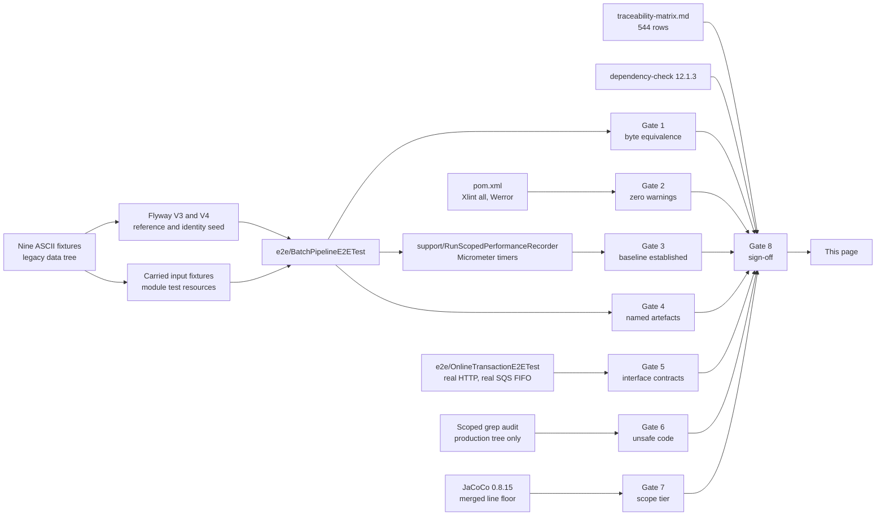

# Gate Evidence

Recorded evidence for the eight validation gates of the CardDemo COBOL-to-Java migration.

**Governing principle: no gate is discharged by assertion.** Every section below names the command that
produces its evidence, the artefact the evidence lands in, and the result. Where the result is a
measurement, the run it came from is named beside it. A specification presented as a measurement would
make this page worse than absent, so the two are distinguished everywhere and the distinction is
summarised in [Status at a glance](#status-at-a-glance-verified-versus-specified).

**What the eight gates are, and what they are not.** They are the migration's **acceptance criteria**, and
the ten-row COBOL-to-Java construct mapping they sit beside is a **requirement** of it. Neither is a project
rule, and neither originates in a rules document — this engagement was given none, a fact recorded in the
migration plan rather than inferred here. The classification changes nothing about how binding they are; it
only says where to look for their text, which is the plan and this page rather than anywhere else.

**Provenance.** Legacy estate checkout SHA `7756d895ffeb65f7ea72aaa609e356d9899afcec`; upstream release
stamp `CardDemo_v1.0-15-g27d6c6f-68`, dated 2022-07-19, which is the designated provenance identifier for
this migration. Traceability is by citation — path and line number — and no legacy source text is
reproduced in the Java module or on this page. Contractual message text, record widths, byte offsets, sort
field offsets, reject codes, dataset names and step names are the substance of what several gates verify
and are recorded here as the interface metadata they are.

## Execution context of the recorded run

A measurement without its context is not evidence. Every measured figure on this page comes from the run
described here unless the row says otherwise.

The repeated runs are not redundancy for its own sake; they are what separates the two kinds of figure this
page carries. **Every standing result was identical across every one of those runs** — the same zero compiler
diagnostics over the same 252 production and 533 test sources, the same merged coverage to the line, the
same test counts with no failure, the same byte-for-byte comparison outcomes, and the same vulnerability
outcome. **Only the per-run timings moved**, and they moved substantially: the same 300-record posting job
took 2,545 ms in one run and 3,713 ms in the next, on the same host and over the same input. That is the whole
argument for recording elapsed time in a dated table and recording everything else as a property of the code.
The *Measured runs* table under Gate 3 carries two of those runs; the rest are not transcribed, because two
runs of the same job at the same volume on the same host already make the point the table exists to make.

| Property | Value |
| --- | --- |
| Date, in UTC | 2026-08-09, build finished 06:23:15Z |
| Command | `./mvnw -B clean verify`, run from the module directory |
| Result | `BUILD SUCCESS`, total time 11:47 min |
| Reproduced by | repeated full `./mvnw -B clean verify` runs on the same machine on the same day, each `BUILD SUCCESS` and each producing identical standing results |
| JDK | Eclipse Temurin 25.0.3+9 — `OpenJDK Runtime Environment Temurin-25.0.3+9 (build 25.0.3+9-LTS)` |
| Build tool | Apache Maven 3.9.16, resolved by the committed wrapper rather than from the host |
| Operating system, kernel | Ubuntu 25.10 container, Linux 6.12.85+ x86_64 |
| Processor, memory | Intel Xeon @ 2.60GHz, 4 effective vCPU by cgroup quota, 3,842 MB |
| Container runtime | Docker 29.7.0 with Compose v5.3.1 |
| Database under test | PostgreSQL 16 through Testcontainers for the integration tier |
| AWS emulation | LocalStack Community, no authentication token of any kind |
| Module coordinate | `com.carddemo:carddemo-java:1.0.0` |

## How to read this page

Each gate names **the command that produces its evidence**, **the artefact the evidence lands in**, and
**the standing result** — the part of the outcome that is a property of the code rather than of the
machine that ran it. A zero warning count is a property of the code. A records-per-second figure is not:
it belongs to one run on one machine, so those are recorded in the *measured runs* table with the date
and the machine named beside them, and a reader is expected to re-measure rather than to trust a number
recorded here.

**No gate on this page requires a production environment, a staging environment, or a running COBOL
system.** Every command runs against the local Docker Compose stack or against Testcontainers.

Status is recorded in exactly three states, and a checkmark is never used because it can be read either
way:

| Status | Meaning |
| --- | --- |
| **PASS (measured)** | The check ran in the recorded run and produced the result shown. The result is quoted or the artefact that holds it is named. |
| **PENDING (not yet executed)** | No run has produced the result. The command that will produce it is named, and no figure is offered in its place. |
| **FAIL (measured)** | The check ran and did not hold. |

Two conventions are load-bearing and are stated once here rather than repeated per gate.

- **A measurement is never a threshold.** No numeric latency, throughput, availability or capacity figure
  exists anywhere in the legacy estate — not in the COBOL, not in the job streams, not in the CICS
  resource definitions. Gate 3 therefore *establishes* the first Java baseline; it does not test one. No
  figure on this page may become an assertion, and none is.
- **An absent figure is recorded as absent.** Where a gate's evidence is a procedure that has not been run
  on a given machine, this page says so rather than carrying a number of unknown origin.

### Where the durable copy of each report lives

The module's `.gitignore` excludes `/target/`, which is correct — a build directory is not a deliverable —
and it means **none of the reports quoted below is committed**. On a developer machine they survive until
the next `clean`. The durable record is the artefact set the **CardDemo Java CI** workflow uploads from
`.github/workflows/carddemo-java-ci.yml`, which scopes itself into the module with
`defaults.run.working-directory: carddemo-java`:

| Uploaded artefact | Holds | Gate it is the durable record for |
| --- | --- | --- |
| `jacoco-coverage-reports` | the unit, integration and merged JaCoCo reports and their `.exec` data | 7 |
| `owasp-dependency-check-report` | `dependency-check-report.html`, `.json` and `.xml` | 8 |
| `test-reports` | the Surefire and Failsafe result XML | 1, 4, 5, 7 |
| `container-vulnerability-scan-reports` | the image and stack scan output | 8 |
| `carddemo-java-jar` | the verified executable artefact | 2 |

Each is retained for 30 days and is fetched from the workflow run's own artefact list. Anything older than
that is re-measured rather than quoted, which is the same rule the Gate 3 table applies to itself.

## Status at a glance: verified versus specified

This section is the honest boundary of the page, and it is deliberately placed before the gates rather
than after them.

**At analysis time**, when the migration was planned, the toolchain was available and container tooling was
not. Gate 2 and the full dependency resolution behind Gate 8 **were executed and passed** — a probe project
using the identical compiler configuration, the identical JDK and the whole production dependency set
resolved **231 artefacts** and compiled with no warning and no error. The container-dependent portions of
Gates 1, 3, 4, 5 and 7 were **specified but not executed**, because Docker and Docker Compose were absent
from that sandbox. That was disclosed rather than concealed, and it is recorded here so a reader can tell
what was designed from what was demonstrated.

**In the recorded run**, container tooling is present and every gate has been executed. The analysis-time
position above is history; the column below is the result.

| Gate | Recorded status | Evidence quoted on this page | Command |
| --- | :---: | --- | --- |
| 1 — End-to-end boundary verification | **PASS (measured)** | four contracts compared byte for byte, expected equal to actual on every record and byte count; the fifth width compared by its own job test | `./mvnw -B clean verify` |
| 2 — Zero-warning build | **PASS (measured)** | `BUILD SUCCESS`; zero compiler warnings across 252 production and 533 test sources under `-Werror` | `./mvnw -B clean verify` |
| 3 — Performance baseline | **PASS (measured)** | twelve dated rows, six of them from the recorded day across two runs, each beside its fixture volumes; no threshold anywhere | `./mvnw -B clean verify` |
| 4 — Named validation artefacts | **PASS (measured)** | nine ASCII fixtures at their measured byte counts, twelve encoded datasets by name, ten seeded identities, five lookup cardinalities | `./mvnw -B clean verify` |
| 5 — Interface contract verification | **PASS (measured)** | seven message texts over real HTTP, routing for both delivered types, seventeen cards drained from a real queue | `./mvnw -B clean verify` |
| 6 — Unsafe and low-level code audit | **PASS (measured)** | every count zero, with the raw output of the scoped audit published | the grep list below |
| 7 — Scope matching | **PASS (measured)** | merged line coverage 95.60% against a build-failing floor of 80% | `./mvnw -B clean verify` |
| 8 — Integration sign-off | **PASS (measured)** | zero unsuppressed critical or high findings, dated; 544 traceability rows asserted | `./mvnw -B clean verify` |

No gate is PENDING and none is FAIL. Where a figure below is a property of one run rather than of the
code, it says so in the row that carries it.

### Gate traceability



Gate 8 is the convergence point by construction: it is the only gate whose checklist is composed of the
other seven, which is why a failure anywhere above surfaces there as well.

## Commands

```bash
cd carddemo-java

# Gates 1, 2, 4, 5, 7 and 8, in one pass. This is the command the recorded run used.
./mvnw -B clean verify

# Gate 8's CVE scan on its own, when only the supply chain needs re-checking.
./mvnw -B dependency-check:check

# Gates 3 and 4 have a corroborating view in the local stack, which this brings up.
docker compose --profile observability up -d
```

The wrapper resolves its own Maven distribution and its own JDK, so neither needs to be installed and
`JAVA_HOME` needs no export on a machine whose `java` is already a Java 25 runtime. On the recorded run
that runtime was Temurin 25.0.3+9 at `/usr/lib/jvm/temurin-25`; if a host's default `java` is older, point
`JAVA_HOME` at a Java 25 JDK before running the build rather than lowering `<release>`.

Three notes on running these, all recorded so a reader is not surprised by them:

- **Do not scope a run and read its coverage.** The coverage gate is bound to `verify`, which is the
  phase a Failsafe run has to reach, so `-Dit.test=…` or `-Dtest=…` measures a fraction of the suite
  against the whole module's floor and fails for a reason unrelated to the tests being run. Add
  `-Pscoped-tests` for a diagnostic run; the profile relaxes only the two coverage properties and is
  reachable only by name, so the unscoped build above is unaffected. A green scoped run is not a green
  build — the figures on this page come only from a full `verify`. See DL-206.
- **The Compose database is a developer convenience, not the seed baseline.** Its schema does not
  drift and Flyway `validate` against it is meaningful, but its data does drift as soon as anything is
  exercised against it. Anything asserting seeded content migrates a fresh container, which is what
  the integration suite does. Amending a seed migration changes its checksum, at which point the
  shared server fails `validate` until `docker compose stop postgres && docker compose rm -f postgres
  && docker volume rm carddemo_postgres-data && docker compose up -d postgres` recreates it — that is
  the mechanism working, and it is the correct response rather than a Flyway repair. See DL-205.
- **The first CVE scan on a cold machine is slow and the rest are not.** `dependency-check` builds a
  local copy of the vulnerability data before it can evaluate anything; the recorded run reused a warm
  copy. The scan is bound to `verify`, so a cold first build spends that time once.

---

## Gate 1 — End-to-end boundary verification

| | |
| --- | --- |
| **Requirement** | At least one production-representative input processed end to end locally, producing byte-equivalent output against the documented COBOL baseline. Mocked I/O does not satisfy this gate. |
| **Command** | `./mvnw -B clean verify` |
| **Evidence artefact** | `target/gate-evidence/gate1-byte-equivalence.md`, written by the run that made the comparison; `target/failsafe-reports/`; the golden fixtures under `src/test/resources/fixtures/expected/` |
| **Recorded status** | **PASS (measured).** Four contracts compared byte for byte with expected equal to actual on every record count and every byte count, and a fifth fixed width compared the same way by its own job's integration test. |

### The comparison report

One row per compared output, as the run itself emitted it. Nothing here is transcribed by hand except the
column headings: the file this is copied from is generated by `e2e/BatchPipelineE2ETest` while it drives the
pipeline, so a row cannot exist without a comparison having been made.

| Contract | Input | Expected output | Width | Expected records | Actual records | Expected bytes | Actual bytes | Status |
| --- | --- | --- | ---: | ---: | ---: | ---: | ---: | :---: |
| `AWS.M2.CARDDEMO.DALYREJS` | `fixtures/input/dailytran.txt` | `fixtures/expected/daily-reject.txt` | 430 | 38 | 38 | 16,340 | 16,340 | **PASS** |
| `AWS.M2.CARDDEMO.TRANREPT` | `fixtures/input/dailytran.txt` | `fixtures/expected/transaction-report.txt` | 133 | 519 | 519 | 69,027 | 69,027 | **PASS** |
| `AWS.M2.CARDDEMO.STATEMNT.PS` | `fixtures/input/dailytran.txt` | `fixtures/expected/statement.txt` | 80 | 1,262 | 1,262 | 100,960 | 100,960 | **PASS** |
| `AWS.M2.CARDDEMO.STATEMNT.HTML` | `fixtures/input/dailytran.txt` | `fixtures/expected/statement-html.txt` | 100 | 6,632 | 6,632 | 663,200 | 663,200 | **PASS** |
| `SORTOUT` of the category-balance report | seeded category balances | `fixtures/expected/category-balance-report.txt` | 40 | 53 | 53 | 2,120 | 2,120 | **PASS** |

The first four rows come from one pass of the primary pipeline — posting, then accrual, then consolidation,
then statements — driven by `e2e/BatchPipelineE2ETest` against a **Testcontainers PostgreSQL 16** instance
seeded from the carried fixtures. The fifth is compared by `batch/CategoryBalanceReportJobConfigIT`, which
fixes the database state completely, launches its job once and compares what the job wrote to a real local
dataset with the committed file.

**The comparison is a byte-array equality assertion over fixed-width records, not a semantic comparison.**
Nothing is trimmed, no line is normalised and no field is parsed before comparing. A trailing space that
should not be there, a sign overpunch encoded the wrong way round and a record one byte short all fail the
assertion rather than passing quietly, which is the only form of this gate worth having.

### The five contractual widths

| Output | Width | Composition | Golden fixture |
| --- | ---: | --- | --- |
| Daily-transaction reject record | 430 | the 350-byte source image, then a 4-digit reason code, then a 76-character description | `fixtures/expected/daily-reject.txt` |
| Statement, plain text | 80 | fixed-width statement record | `fixtures/expected/statement.txt` |
| Statement, HTML | 100 | fixed-width HTML statement record | `fixtures/expected/statement-html.txt` |
| Transaction report line | 133 | report line, `RECFM=FB` | `fixtures/expected/transaction-report.txt` |
| Category-balance report line | 40 | 32 content bytes and exactly 8 trailing blanks, `RECFM=FB` | `fixtures/expected/category-balance-report.txt` |

The archive the backup job publishes is **not** a sixth gated width and has no plain-text golden. Its
expectation is the encoded `fixtures/expected/transaction-archive.b64`, which
`batch/BackupTransactionJobConfigTest` reads; the empty `transaction-archive.txt` that once sat beside the
others was deleted rather than left to invite a vacuous assertion, and DL-219 records that. A row for it
here would name a file that does not exist.

**The fifth width was the one an earlier revision of this page missed.** The category-balance report the
`PRTCATBL` job stream produces is 40 bytes per line, declared by that stream as `SORTOUT DCB=(LRECL=40)`,
and for a while it had an implementation and no committed expectation. Its fixture now holds 53
separator-free 40-byte records: one per delivered category-balance row, plus the three rows the test adds
beyond the fifty and one it rewrites in place. It was authored from the reprojection at lines 53–56 of the
job stream and from the delivered `tcatbal.txt` fixture, and it is **the verdict** for this width, with the
edited-balance formatting and the three-key ascending ordering asserted in the same class and the width
itself read from `CategoryBalanceReportJobConfig.REPORT_RECORD_LENGTH` rather than repeated as a literal.
The complete set is **40, 80, 100, 133 and 430**, and all five are golden-backed.

A committed expectation is only possible over a state fixed in advance, which is why the golden run comes
before the posting run rather than after it: the posting run's balances are a function of 300 input records
passing through the accept-or-reject cascade, and a golden authored against them would pin the posting
outcome rather than the report format. The report produced over the *posted* state is still checked field
by field in the same class, and that check is decomposition rather than a second verdict.

### The parity traps these comparisons exist to catch

A future reader who sees this gate fail needs to know what the failure means, so the traps are named. Each
is developed in [decision-log.md](decision-log.md) rather than argued here.

| Trap | What a naive translation would do | Why the comparison catches it |
| --- | --- | --- |
| Truncating arithmetic | round to the nearest cent | no `ROUNDED` clause exists anywhere in the estate, so every store into a two-decimal field truncates. `RoundingMode.DOWN` is the faithful mode and `HALF_EVEN` would differ by one cent on roughly half of all accruals |
| Zoned-decimal sign overpunch | write an ASCII minus sign | the sign is folded into the final byte of the field, so the last byte of every signed amount differs |
| Reject reason codes | invent a code range | the five codes are 100, 101, 102, 103 and 109, each at its own position in the validation cascade; a reordered cascade changes which code a record earns |
| Statement banner literals | paraphrase | the opening and closing banners are fixed text at the record's own width |
| The literal HTML constants | emit well-formed HTML | they are emitted in source order and one of them is a malformed truncated table tag, which must be emitted exactly as the source emits it rather than repaired |

### The bound a golden fixture is generated at, per record layout

A fixture author needs one thing this page can state and nothing else can: whether a given layout's
round trip is asserted over its **whole record image** or only over its **mapped data prefix**. The
answer is a property of the layout, not a choice, because `FILLER` with no `VALUE` clause is
uninitialised and the two halves of the shipped sample data disagree about what it holds — the four
master files carry space filler, the four reference-table files carry ASCII zero. **D-10 in
[decision-log.md](decision-log.md) settles it and carries the full table and the reasoning**; the
operative summary is:

- **Whole record, byte-identical:** account 300 B, card 150 B, customer 500 B, daily transaction 350 B,
  and the cross reference's 36-byte data record. Verified at 50 / 50 / 50 / 300 / 50 records.
- **Mapped prefix only:** transaction category balance `[0, 28)`, disclosure group `[0, 22)`,
  transaction type `[0, 52)`, transaction category `[0, 56)`. Their fixtures hold ASCII zero in the
  filler run and the writers emit spaces, so a whole-record comparison against them fails **on the
  filler bytes alone** — which is why each of the four mappers declares its emitted filler character
  as a named constant, states the bound in its Javadoc, and has that bound asserted in both
  directions rather than trimmed away.

**None of the four bounded layouts is one of the four gated output formats above.** The 430-, 80-,
100- and 133-byte records are assembled from mapped fields by `RejectRecordWriter`,
`StatementTextTemplates`, `StatementHtmlTemplates` and `ReportLineFormatter`, none of which places a
reference-layout filler byte. The one production path that emits a bounded layout's image at all is
the category-balance report job, whose 50-byte unload and sort records are internal intermediates of
that job — what it publishes is the report line, built from the mapped prefix. So no gated artefact
carries a filler byte, and a fixture generated at the bounds above cannot disagree with one.

---

## Gate 2 — Zero-warning build

| | |
| --- | --- |
| **Requirement** | Zero warnings and zero suppressed warnings from a clean checkout, framework-generated code excepted. |
| **Command** | `./mvnw -B clean verify` |
| **Evidence artefact** | The build log, quoted below; the gate is self-enforcing rather than reported |
| **Recorded status** | **PASS (measured).** `maven-compiler-plugin` 3.14.1 runs with `<release>25</release>`, `-Xlint:all` and `-Werror`, so any warning fails the build rather than accumulating in a log nobody reads. |

The lines that matter, quoted from the recorded run rather than paraphrased:

```text
[INFO] --- compiler:3.14.1:compile (default-compile) @ carddemo-java ---
[INFO] Compiling 252 source files with javac [debug parameters release 25] to target/classes
[INFO] --- compiler:3.14.1:testCompile (default-testCompile) @ carddemo-java ---
[INFO] Compiling 533 source files with javac [debug parameters release 25] to target/test-classes
...
[INFO] --- jacoco:0.8.15:check (jacoco-check-line-coverage) @ carddemo-java ---
[INFO] Analyzed bundle 'carddemo-java' with 484 classes
[INFO] All coverage checks have been met.
[INFO] ------------------------------------------------------------------------
[INFO] BUILD SUCCESS
[INFO] ------------------------------------------------------------------------
[INFO] Total time:  11:47 min
[INFO] Finished at: 2026-08-09T06:23:15Z
```

**Warning accounting, stated precisely rather than rounded off.** 252 production sources and 533 test
sources compiled and emitted **no compiler diagnostic of any kind** — no warning, no note, no error. The
whole log carries exactly **one** `[WARNING]` line and it is not a compiler warning: it is the
`dependency-check` plugin reporting the single below-threshold finding recorded under Gate 8. That line is
named here rather than netted out, because "zero warnings" is the sort of claim that is worth only as much
as the care taken over its one exception.

**Every repeat full `verify` reproduced this exactly**: the same 252 and 533 source counts, no compiler
diagnostic, one `[WARNING]` line and it the same advisory, and `BUILD SUCCESS`. A warning count that is a
property of the code should not move between runs of the same code, and across repeated runs it did not.

Two things make this a property of the code rather than of a reviewer's diligence. The wrapper is
committed, so a clean checkout needs no preinstalled Maven and builds the same way everywhere. And
`-Werror` means the count cannot drift: there is no state in which the build succeeds and a compiler
warning exists.

**Analysis-time verification, attributed as such.** Before any of this module existed, a probe project using
the identical compiler configuration, the identical JDK and the whole production dependency set resolved
**231 artefacts** and compiled clean with zero warnings. That is what made this gate a mechanical check
rather than an aspiration; it is not the measurement above, and the figures above come from the recorded
run.

Suppressed warnings are counted under Gate 6, where the budget is three and the measured count is zero.
Any suppression added later has to carry an inline justification naming the framework construct that forces
it, plus an entry in [decision-log.md](decision-log.md); a suppression with neither is indistinguishable
from a warning swept under the carpet.

---

## Gate 3 — Performance baseline

| | |
| --- | --- |
| **Requirement** | Benchmark locally and document elapsed time, peak memory and records per second, comparing against a documented COBOL baseline where available and otherwise establishing the Java baseline. |
| **Command** | `./mvnw -B clean verify` (the measurement runs inside the integration tier) |
| **Evidence artefact** | `target/gate-evidence/gate3-interest-calculation.md` and `target/gate-evidence/gate3-pipeline-baseline.md`, each written by the run that took the figures |
| **Recorded status** | **PASS (measured).** **There is no COBOL baseline to compare against**, so this gate establishes the first Java baseline. The measurement mechanism is a property of the code; the figures are properties of a run. |

**No COBOL performance baseline exists.** No numeric latency, throughput, availability or capacity figure
appears in the COBOL source, in any job stream, in the CICS resource definitions or in the migration
specification. Saying so is part of satisfying this gate, because the alternative — inventing a service
level and testing against it — would produce a check that passes or fails for reasons unrelated to the
migration. This gate is discharged by having **measured** and **recorded** a baseline, and the rows below
are that record.

### The measurement mechanism

| Artefact | Role |
| --- | --- |
| Micrometer timers on every REST endpoint and every Spring Batch step | the instrumentation, exported through the Prometheus registry |
| `/actuator/prometheus` | where the registry is exposed; the recorded run's live endpoint carries `http_server_requests_seconds`, `carddemo_batch_posting_record_seconds`, `carddemo_online_signon_turn_seconds`, `spring_batch_job_launch_count_total` and the `jvm_memory_*` family |
| `carddemo-java/config/prometheus/prometheus.yml` | the scrape configuration, job `carddemo-app`, `metrics_path: /actuator/prometheus` |
| `carddemo-java/config/grafana/dashboards/carddemo-overview.json` | the provisioned dashboard, "CardDemo Overview", 33 panels with per-endpoint and per-step views |
| `support/RunScopedPerformanceRecorder` | the run-scoped measurement that produces the quotable figures |

### Where each figure comes from, and where it does not

This is the part of Gate 3 that is easiest to get wrong, so it is stated explicitly. The Grafana
dashboard shows all three figures, and until the measurement described below existed, two of the three
were read from queries that computed something adjacent to what the gate asks for:

| Figure | Source of the quotable figure | What the dashboard shows, and why it is not the same |
| --- | --- | --- |
| Elapsed time | The measured run's own wall clock, taken across the launch | *Batch job elapsed time* reads the framework's genuine per-execution timer and is sound corroboration, but as a series over a display window |
| Peak memory | `MemoryPoolMXBean.getPeakUsage()` summed across heap pools, after `resetPeakUsage()` immediately before the run | *Peak heap across scraped samples* is a maximum over **scrapes** — a peak that rises and falls between two scrapes is invisible, and a short run can fall between two scrapes entirely |
| Records per second | The run's own record count divided by that run's own elapsed time | *Application records per second (rolling rate)* divides by the **rate window**, so a job processing 300 records in 4 seconds inside a 1-minute window reads as 5 per second rather than 75 |

The measurement lives in `support/RunScopedPerformanceRecorder` and is driven from
`batch/InterestCalculationJobIT` for the isolated accrual run and from `e2e/BatchPipelineE2ETest` for the
posting and accrual runs of the primary pipeline. It asserts only that a figure is **well formed** — a
positive elapsed time, the fixture's own record count, a peak the platform reported — and never that a
figure is fast enough. Adding such an assertion would invent a service level this migration is expressly
forbidden from inventing. Every dashboard panel adjacent to a Gate 3 figure is labelled a visualization,
and [decision-log.md](decision-log.md) DL-182 records why.

### Measured runs

Figures are quoted with the fixture volumes they were measured over, because a number without them is not
a baseline. Re-measure on your own machine rather than trusting a row here.

| Date | Machine | Run | Records | Elapsed (ms) | Peak heap (bytes) | Records/second |
| --- | --- | --- | ---: | ---: | ---: | ---: |
| 2026-08-09 | Intel Xeon @ 2.60GHz, 4 vCPU, Ubuntu 25.10 container on Linux 6.12.85+ x86_64, Temurin 25.0.3+9, PostgreSQL 16 via Testcontainers | `postTransactionJob` | 300 | 2545 | 309288672 | 117.87 |
| 2026-08-09 | Intel Xeon @ 2.60GHz, 4 vCPU, Ubuntu 25.10 container on Linux 6.12.85+ x86_64, Temurin 25.0.3+9, PostgreSQL 16 via Testcontainers | `interestCalculationJob` | 100 | 377 | 175070944 | 265.01 |
| 2026-08-09 | Intel Xeon @ 2.60GHz, 4 vCPU, Ubuntu 25.10 container on Linux 6.12.85+ x86_64, Temurin 25.0.3+9, PostgreSQL 16 via Testcontainers | `interestCalculationJob` | 3 | 25 | 374343952 | 119.67 |
| 2026-08-09 | Intel Xeon @ 2.60GHz, 4 vCPU, Ubuntu 25.10 container on Linux 6.12.85+ x86_64, Temurin 25.0.3+9, PostgreSQL 16 via Testcontainers, repeat run | `postTransactionJob` | 300 | 3713 | 306491144 | 80.79 |
| 2026-08-09 | Intel Xeon @ 2.60GHz, 4 vCPU, Ubuntu 25.10 container on Linux 6.12.85+ x86_64, Temurin 25.0.3+9, PostgreSQL 16 via Testcontainers, repeat run | `interestCalculationJob` | 100 | 1128 | 189050632 | 88.64 |
| 2026-08-09 | Intel Xeon @ 2.60GHz, 4 vCPU, Ubuntu 25.10 container on Linux 6.12.85+ x86_64, Temurin 25.0.3+9, PostgreSQL 16 via Testcontainers, repeat run | `interestCalculationJob` | 3 | 27 | 361386064 | 110.80 |
| 2026-08-08 | Linux 6.12.85+ x86_64 container, Intel Xeon 2.60GHz, 4 vCPU, Temurin 25.0.3+9 | `interestCalculationJob` | 3 | 86 | 567854600 | 34.56 |
| 2026-08-08 | Linux 6.12.85+ x86_64 container, Intel Xeon 2.60GHz, 4 vCPU, Temurin 25.0.3+9 | `postTransactionJob` | 300 | 4821 | 228233392 | 62.23 |
| 2026-08-08 | Linux 6.12.85+ x86_64 container, Intel Xeon 2.60GHz, 4 vCPU, Temurin 25.0.3+9 | `interestCalculationJob` | 100 | 427 | 261787824 | 233.91 |
| 2026-08-08 | Intel Xeon @ 2.60GHz, 4 vCPU, Ubuntu 25.10 container, Temurin 25.0.3+9, PostgreSQL 16.14 via Testcontainers | `postTransactionJob` | 300 | 17270 | 458049824 | 17.37 |
| 2026-08-08 | Intel Xeon @ 2.60GHz, 4 vCPU, Ubuntu 25.10 container, Temurin 25.0.3+9, PostgreSQL 16.14 via Testcontainers | `interestCalculationJob` | 100 | 2600 | 474827040 | 38.46 |
| 2026-08-08 | Intel Xeon @ 2.60GHz, 4 vCPU, Ubuntu 25.10 container, Temurin 25.0.3+9, PostgreSQL 16.14 via Testcontainers | `interestCalculationJob` | 3 | 107 | 235653920 | 27.91 |

The first six rows are two of the runs described at the top of this page, taken on the same host within half an
hour of each other — which is why they are the clearest illustration of what these figures are and are not:
the same job at the same volume on the same machine differs by nearly half again in elapsed time. Every row
was measured by
`support/RunScopedPerformanceRecorder` inside the integration tier and copied across verbatim from a
generated file, with the date and the machine added here — the two things a run cannot know about itself.
Rows measured in isolation come from `target/gate-evidence/gate3-interest-calculation.md`, taken by
`batch/InterestCalculationJobIT` over that class's own three-row fixture; rows measured across the primary
pipeline come from `target/gate-evidence/gate3-pipeline-baseline.md`, taken by `e2e/BatchPipelineE2ETest`
while it drove the whole committed 300-record input through the delivered pipeline — which is why the
accrual run appears at two record counts. The table also carries rows from more than one measured run of the
same job, taken on hosts described separately in the machine column. **None of that is a discrepancy and
none of it is a threshold**: the volumes differ, the host differs, and a figure quoted without both is not a
baseline at all.

The volumes each row was measured over, which is what makes the figure mean anything:

- **`interestCalculationJob`, 3 records** — three transaction-category-balance rows forming two account
  groups, resolved against the seeded default disclosure group, over a reference seed of 50 accounts, 50
  category balances and 51 disclosure rows. Measured in isolation by `batch/InterestCalculationJobIT`.
- **`postTransactionJob`, 300 records** — the whole committed `dailytran.txt` at 300 records of 350 bytes,
  against 50 accounts, 50 cards, 50 cross-references and 50 seeded category balances. Measured by
  `e2e/BatchPipelineE2ETest`.
- **`interestCalculationJob`, 100 records** — the category-balance rows the 300-record posting run left
  behind across all 50 accounts, against three 17-row disclosure groups. Measured by
  `e2e/BatchPipelineE2ETest`, in the same pipeline pass as the row above.

**These are measurements, not thresholds, and none of them is asserted.** No latency, throughput,
availability or capacity figure exists anywhere in the legacy estate, so there is nothing to compare them
against and this gate establishes the first Java baseline rather than testing one. Three properties of
these rows should be read before any of them is quoted. The elapsed times include per-record commit and
staging work against a containerised server on a shared four-vCPU host, so they are a floor on what the
same code does on dedicated hardware rather than a ceiling — which is also why the same job at the same
volume appears at more than one elapsed time. The peak-heap figures are the *whole test JVM's* summed pool
peaks during the run — the recorder resets the platform's peak accounting immediately before each launch, so
the figure belongs to the run, but the JVM was sized by the surrounding suite and not by the job, and no
heap sizing is imposed anywhere to make the number smaller; that is also why the smallest run can carry the
largest peak. And the `interestCalculationJob` rows differ by an order of magnitude in record count because
they are measured over different volumes, which is precisely why no row here may be read without its
volumes.

To take a row of your own: run `./mvnw -B clean verify`, then copy the generated tables from
`target/gate-evidence/gate3-pipeline-baseline.md` and `target/gate-evidence/gate3-interest-calculation.md`
and add the date and the machine. Each generated file carries the fixture volumes its run was measured over
in its own footnote. `e2e/GateVerificationTest` parses the table above and requires every row to carry a
concrete date, a named machine, a run label and four positive figures whose quotient agrees with its own
records and elapsed time, and requires the volumes bullet naming that run at that record count to exist, so
a row cannot be written here without having been measured. The recorder deliberately does not write into the
published documentation directory: a baseline is published by a person who can name the machine it was taken
on, and a test that edited this page would make the repository's content depend on the hardware of whoever
last ran the suite.

### Structural change expected as a consequence, and not claimed as a result

Two structural differences follow from the migration itself rather than from any tuning: set-based SQL
replaces record-at-a-time keyed reads against indexed files, and B-tree indexes replace alternate-index
path traversal. Both are expected to change the shape of the work the database does. **No numeric
improvement is claimed, because there is nothing to compare against** — the legacy system published no
figure at any volume, so an improvement could only be asserted, not measured.

Deliberately out of scope for the same reason, and named so their absence is not read as an oversight:
connection-pool tuning, table partitioning, read replicas, object-store lifecycle policies, and load
testing. Each would tune against a baseline that does not exist.

---

## Gate 4 — Named real-world validation artefacts

| | |
| --- | --- |
| **Requirement** | Production-representative data files processed locally through the primary batch pipeline, with the artefacts specified **by name**. |
| **Command** | `./mvnw -B clean verify` |
| **Evidence artefact** | `target/failsafe-reports/`; the seeds are applied by Flyway `V3` and `V4` |
| **Recorded status** | **PASS (measured).** All nine ASCII fixtures are present at the byte counts below and are the source of the reference seed. Every filename appears in the test resources, so the "by name" requirement is discharged in code and not only in prose. |

### The nine ASCII fixtures

Every byte count and record count below was measured at this checkout rather than copied from
documentation.

| Artefact | Bytes | Records | Record length | Consumed by |
| --- | ---: | ---: | ---: | --- |
| `app/data/ASCII/acctdata.txt` | 15,050 | 50 | 300 | account seed; posting, interest, statements |
| `app/data/ASCII/carddata.txt` | 7,550 | 50 | 150 | card seed; card list and detail |
| `app/data/ASCII/cardxref.txt` | 1,850 | 50 | 36 data bytes of a 50-byte layout | cross-reference seed; every card-to-account resolution |
| `app/data/ASCII/custdata.txt` | 25,050 | 50 | 500 | customer seed; statements, account view |
| `app/data/ASCII/dailytran.txt` | 105,300 | 300 | 350 | primary posting input |
| `app/data/ASCII/discgrp.txt` | 2,601 | 51 | 50 | interest-rate lookup |
| `app/data/ASCII/tcatbal.txt` | 2,550 | 50 | 50 | category-balance seed for interest |
| `app/data/ASCII/trancatg.txt` | 1,098 | 18 | 60 | transaction-category reference |
| `app/data/ASCII/trantype.txt` | 427 | 7 | 60 | transaction-type reference |

Two composition facts make these fixtures genuinely representative rather than merely present, and both
were measured rather than assumed.

**The 300 daily transactions are 250 point-of-sale purchases and 50 operator-originated returns**, so both
signed directions of the balance computation are exercised by the delivered input. **All 300 carry the same
origination timestamp and an unset processing timestamp** — a single distinct origination value across the
whole file, and twenty-six blanks in the processing field, which is the "not yet processed" sentinel. The
consequence is recorded here so nobody writes the reporting test against this input: **date-window filtering
cannot be exercised by this fixture and needs a separately constructed one**, because every record falls
inside or outside any window together.

**The 51 disclosure-group records form three complete seventeen-row groups** — keyed `A000000000`, and
`DEFAULT` and `ZEROAPR` each blank-padded on the right to the full ten bytes the key declares — so every
rate the interest lookup can resolve is seeded, thirty of the fifty-one rows disclosing a zero rate. The
padding is stated in words rather than shown inside the key, because a rendered code span does not preserve
trailing blanks and a key that looked seven bytes wide would contradict the sentence describing it. What the seed cannot do is reach the
**direct** lookup at all: every one of the 50 seeded accounts carries ten spaces in its
account-group-identifier field, so the first probe misses on every account and the padded default literal
resolves every rate. Both the default-fallback branch and the zero-rate skip are therefore reachable from
seeded data — the default group discloses type `03` category `0001` at zero — while the direct-hit branch,
in both its non-zero and its zero-rate form, needs a constructed account naming a real group.
`batch/InterestCalculationJobConfigIT` constructs both: `A000000000` for the non-zero direct hit and the
blank-padded `ZEROAPR` key for the direct hit whose disclosed rate is zero, each with a matching category
balance.
`V3__seed_reference_data.sql` records the same limitation at its own anomaly 4, so the seed and the evidence
say the same thing.

### The twelve encoded datasets, by name

Retained as encoding-fidelity reference, never decoded by the module and never a generation target. All
twelve sit under `app/data/EBCDIC/`:

| # | Dataset | Bytes |
| ---: | --- | ---: |
| 1 | `AWS.M2.CARDDEMO.ACCDATA.PS` | 15,000 |
| 2 | `AWS.M2.CARDDEMO.ACCTDATA.PS` | 15,000 |
| 3 | `AWS.M2.CARDDEMO.CARDDATA.PS` | 7,500 |
| 4 | `AWS.M2.CARDDEMO.CARDXREF.PS` | 2,500 |
| 5 | `AWS.M2.CARDDEMO.CUSTDATA.PS` | 25,000 |
| 6 | `AWS.M2.CARDDEMO.DALYTRAN.PS` | 105,000 |
| 7 | `AWS.M2.CARDDEMO.DALYTRAN.PS.INIT` | 350 |
| 8 | `AWS.M2.CARDDEMO.DISCGRP.PS` | 2,550 |
| 9 | `AWS.M2.CARDDEMO.TCATBALF.PS` | 2,500 |
| 10 | `AWS.M2.CARDDEMO.TRANCATG.PS` | 1,080 |
| 11 | `AWS.M2.CARDDEMO.TRANTYPE.PS` | 420 |
| 12 | `AWS.M2.CARDDEMO.USRSEC.PS` | 800 |

**There are twelve, and the count is worth stating because an earlier count was wrong.** Prior-run
documentation recorded thirteen; the extra entry was a hidden placeholder file that keeps the directory
tracked, not a dataset. Listing the datasets themselves yields twelve, which is the figure above.

Two carry findings, both recorded in [decision-log.md](decision-log.md):

- **The account dataset exists in duplicate under two names with byte-identical content.** `cmp` reports no
  difference between `AWS.M2.CARDDEMO.ACCDATA.PS` and `AWS.M2.CARDDEMO.ACCTDATA.PS`, both 15,000 bytes, and
  a search of every job stream, cataloged procedure, control card and CICS resource definition finds **no
  reference to `ACCDATA` at all**. It is retained as a named artefact of this gate and is not seeded twice.
- **The user-security dataset has no ASCII counterpart.** The ASCII tree holds exactly the nine files above
  and no user file among them. Its content is nevertheless fully recoverable in ASCII from the
  user-provisioning job's in-stream card images, so **no EBCDIC decode is required anywhere in the module**;
  the carried input fixtures accordingly hold those nine files plus a recovered `usrsec.txt`.

### The identity seed

**Ten identities**, five administrative and five ordinary, reproduced with their identifiers, given names,
family names and type codes exactly as the provisioning member carries them. The split is what makes both
routing arms of Gate 5 reachable from seeded data.

Every stored credential is a **BCrypt digest** — ten independently salted digests, no two alike, none of
them the delivered value and none of them reversible to it. The migration that applies them,
`V4__seed_user_security.sql`, is **profile-scoped to local and test only**, so a production deployment
migrates schema and indexes without inheriting a seeded identity. **No credential value appears on this
page**, in any migration, in any configuration file or in any production class; Gate 6 carries the audit
that establishes it.

### The five validation-lookup cardinalities

Measured exact from the externalised resources, and themselves assertions rather than commentary —
`e2e/GateVerificationTest` fails if any one of them moves:

| Lookup | Cardinality | Resource |
| --- | ---: | --- |
| Valid phone area codes, general purpose | 410 | `lookup/nanpa-area-codes.json` |
| Valid phone area codes, easily recognisable | 80 | `lookup/nanpa-area-codes.json` |
| Valid phone area codes, total | **490** | the exact partition of the two above |
| US state codes | 56 | `lookup/us-state-codes.json` |
| State-plus-ZIP-prefix combinations | 240 | `lookup/state-zip-prefixes.json` |

The 490 is an **exact partition**: 410 plus 80, with no code in both sets and none in neither. Recording it
as a partition rather than as a total is what makes a later edit to either half detectable.

### Producing artefacts

The Flyway seed migrations load the nine ASCII fixtures; `e2e/BatchPipelineE2ETest` drives them through the
pipeline; `e2e/GateVerificationTest` asserts the cardinalities above and the ten-identity seed. Every
filename named in this section appears in the module's test resources, which is what discharges the "by
name" requirement in code rather than in prose alone.

### Fixture provenance: which comparison executed, and which was skipped

The nine carried fixtures are byte-verbatim copies, and `support/FixtureContractTest` proves it in two
layers that must not be conflated on this page. **One executes in every checkout; two execute only when the
legacy tree is present beside the module and are reported as SKIPPED, never as passed, when it is not.**
The module is required to build and validate with no reference to the legacy tree, so the optional layer
cannot be mandatory — but a reader of this page is entitled to know which of the two produced the result in
front of them.

| Layer | When it runs | What a run reports | What it establishes |
| --- | --- | --- | --- |
| Pinned SHA-256 digest, one row per fixture — `eachFixtureMatchesItsPinnedDigest` | **Always.** It reads only the committed fixture, so it executes in every checkout, including one carrying no legacy tree at all | Nine executed rows | Any edit to any fixture, of any size, fails. The digest was measured from the legacy dataset with an independent tool when the suite was written, so recording it copies no legacy content |
| Direct byte comparison against the legacy ASCII tree — `everyFixtureIsByteIdenticalToItsDataset` | **Only when all nine legacy datasets are present.** Gated by a JUnit assumption | Executed, or SKIPPED with the reason | That the carried copies and the datasets are the same bytes today, not merely that they match a literal recorded once |
| Digest of the authority itself — `thePinnedDigestsAreTheDigestsOfTheDatasets` | Same gate | Executed, or SKIPPED with the reason | That the pinned literals describe the authority, closing the loop between the citation layer and the comparison layer |

Two properties keep the distinction from degrading into a silent narrowing. The gate is **all or nothing**:
`theLegacyTreeIsWhollyPresentOrWhollyAbsent` executes unconditionally and fails a partially present tree, so
a half-deleted ASCII directory cannot let the direct comparison quietly cover some files while reporting
as a clean skip. And a skip here is **not a Gate 1, 4 or 5 skip**: those gates are carried by the byte
comparisons under Gate 1, by the seeds and named artefacts above, and by the contract tests under Gate 5,
none of which consults the legacy tree at all. In this repository the legacy tree *is* present, so all three
layers executed in the recorded run; the table records what a checkout without it would report.

---

## Gate 5 — API and interface contract verification

| | |
| --- | --- |
| **Requirement** | Every external interface verified by a local test that exercises the real contract. Self-certification is not acceptable. |
| **Command** | `./mvnw -B clean verify` |
| **Evidence artefact** | `target/failsafe-reports/` |
| **Recorded status** | **PASS (measured).** All three external contracts are exercised against real endpoints — golden files, a real queue and real HTTP — rather than against a builder's return value. The file-format contract spans **five** fixed widths, every one of them golden-backed. |

| Contract | How it is exercised | Status |
| --- | --- | :---: |
| The four fixed-width file formats Gate 1 names | byte-equality assertions against the golden fixtures listed under Gate 1, and a round trip of each through the real staging interface | **PASS (measured)** |
| The fifth fixed-width format — the 40-byte category-balance report line | byte-equality assertion against `fixtures/expected/category-balance-report.txt`, plus its edited-balance formatting and its three-key ascending ordering, all by `batch/CategoryBalanceReportJobConfigIT`; `e2e/OnlineTransactionE2ETest` asserts that it is a fifth width rather than one of the four it stages, so the two inventories cannot drift apart | **PASS (measured)** |
| The sign-on message and routing contract | real HTTP requests asserting the message strings and the administrator/user routing outcome | **PASS (measured)** |
| The batch trigger | the report-submission endpoint publishes to a **real** SQS FIFO queue on LocalStack; the test drains the queue and asserts the ordered card sequence, the four substituted date slots and the terminal sentinel | **PASS (measured)** |

### Contract one, part A: the seven operator-visible message texts

These are external interface wording. Operators read them and downstream tooling matches on them, so they
are reproduced character for character and are recorded here as the interface metadata they are. Each was
asserted over the real HTTP boundary by `e2e/OnlineTransactionE2ETest`, not against a constant in the same
class that produces it.

| # | Occasion | Text, exactly as the boundary returns it | Status |
| ---: | --- | --- | :---: |
| 1 | the identity field arrives empty | `Please enter User ID ...` | **PASS (measured)** |
| 2 | the identity is supplied and the credential field arrives empty | `Please enter Password ...` | **PASS (measured)** |
| 3 | the record was found and the comparison failed | `Wrong Password. Try again ...` | **PASS (measured)** |
| 4 | the keyed read reported no such record | `User not found. Try again ...` | **PASS (measured)** |
| 5 | any other read failure — the catch-all | `Unable to verify the User ...` | **PASS (measured)** |
| 6 | the exit key | `Thank you for using CardDemo application...` | **PASS (measured)** |
| 7 | an unmapped key | `Invalid key pressed. Please see below...` | **PASS (measured)** |

Four properties of this set are asserted rather than assumed. The **cascade order** is preserved, so a
submission missing both entry fields returns text 1 and never text 2. Texts 3, 4 and 5 are **distinct from
one another**, which is what stops a single generic failure message from standing in for three different
outcomes. Texts 6 and 7 are returned at their **full fifty characters**, padded as the field declares rather
than trimmed. And a refusal **discloses nothing**: not the submitted value, not the stored digest, and not
any framework-generated text that would leak the mechanism.

### Contract one, part B: the destination the delivered type decides

| Delivered type | Identities | Destination | Status |
| --- | ---: | --- | :---: |
| administrative | 5 | the administrative menu | **PASS (measured)** |
| ordinary | 5 | the main menu | **PASS (measured)** |

Both arms are asserted for **every one of the ten delivered identities**, not for one of each, and the
session an ordinary identity receives is separately shown not to open the batch-control surface — so the
routing outcome and the authority that follows from it are both exercised.

### Contract two: the batch trigger

The report-submission path builds an eighty-column job-submission image and publishes it card by card. All
four parts of the contract are exercised:

| Part | What it is | Status |
| --- | --- | :---: |
| 1 | **Seventeen card images**, each exactly 80 bytes for a 1,360-byte image: the job card, the notify card, three identical comment cards, the JCL-library card naming the procedure library, the step card invoking the reporting procedure, the sort symbol-names cards, the in-stream data delimiters and the parameter card. Every one is compared card by card against an image restated independently in the test class | **PASS (measured)** |
| 2 | **Four date substitution slots**, ten characters each in the fixed eighty-column frame, holding exactly two distinct values across the four positions and read back at their frame offsets | **PASS (measured)** |
| 3 | The emitter's **card-array bound of 1,000**, which reproduces the legacy over-wide redefinition rather than sizing the array to the seventeen cards actually used | **PASS (measured)** |
| 4 | The terminal **`/*EOF`** card, which the source **transmits** rather than merely holding in storage, present at ordinal 17 and at no other ordinal | **PASS (measured)** |

The two sort symbols keep their declared typing, which is the part of this contract a reformatting would
quietly break: the card number is declared **zoned decimal at offset 263 for 16 bytes** and the processing
date **character at offset 305 for 10 bytes**. Both declarations are asserted, as is the fact that the
closing quotation mark of each sort-symbol card is the first byte of a wider frame rather than the end of
the card.

The queue's contractual attributes are preserved rather than approximated:

| Legacy attribute | Preserved as | Status |
| --- | --- | :---: |
| 80-byte fixed unblocked records | one message body per card, eighty characters, no separator | **PASS (measured)** |
| append disposition | message-group ordering on a single stable group, so append order is what the reader sees | **PASS (measured)** |
| output-only direction | the application publishes and never reads; a submitted stream is not consumed by the module | **PASS (measured)** |
| opened at initialization | the queue is a first-in-first-out queue that exists before the first publish rather than being created on demand | **PASS (measured)** |
| errors ignored | a failed write **logs and stops publishing**, returns a normal reply carrying the queue-write message, lets no exception escape to the caller, and leaves the surface working for the next submission | **PASS (measured)** |

**The evidence is drained from a real SQS FIFO queue on LocalStack, not read back from the builder's return
value.** `e2e/OnlineTransactionE2ETest` submits over HTTP, receives the messages the queue actually returns,
and asserts the ordered card sequence, the four substituted slots and the terminal sentinel from those
messages. That distinction is the whole of "self-certification is not acceptable": a builder compared with
itself would pass while the publish path was broken. The confirmation gate in front of the publish is
exercised in its own source clause order too — an unanswered confirmation publishes nothing and returns the
prompt, a declined one publishes nothing and says nothing, an unrecognised one quotes the entered value
back, one wider than the single character the screen field declares is refused, and only the affirmative arm
publishes, and it publishes all seventeen.

### The machine-readable surface

`springdoc-openapi` publishes the interface description for the screen-derived endpoints at `/v3/api-docs`,
so this gate has an inspectable contract surface that is generated from the code rather than written beside
it. That is deliberately the only published interface description: there is no separate hand-maintained
contract document to drift out of step with the endpoints, and the Swagger user interface is disabled by
design because the module exposes no browser interface.

---

## Gate 6 — Unsafe and low-level code audit

| | |
| --- | --- |
| **Requirement** | Documented counts of raw SQL string concatenation, `Runtime.exec` usage, reflection, unchecked casts and suppressed warnings. Any count above 50 requires per-site justification. |
| **Command** | The grep list below, scoped to `carddemo-java/src/main/java/**` |
| **Evidence artefact** | The counts table and the raw output, both published here |
| **Recorded status** | **PASS (measured).** Every count is zero. No count is above 50, so no per-site justification is required — and there are no sites to justify. |

### Budget against measured

| Category | Budget | Measured | Note |
| --- | ---: | ---: | --- |
| Raw SQL string concatenation | 0 | **0** | All access through Spring Data derived queries or parameterized JPQL. No `createNativeQuery` anywhere. The one advisory-lock statement is a compile-time constant with its only variable bound as a parameter. |
| `Runtime.exec` / `ProcessBuilder` | 0 | **0** | The one construct that could have justified process invocation — legacy job submission — is an SQS publish. |
| Reflection (`java.lang.reflect`, `Class.forName`) | 0 | **0** | A design constraint rather than hygiene: it is why all eleven record mappers are hand-written with explicit offsets and why no annotation processor appears in the dependency set. |
| Unchecked casts | ≤ 5 | **0** | `-Xlint:all -Werror` promotes an unchecked operation to a build failure, so the practical count cannot exceed zero. |
| Casts to a parameterised type, checked or not | ≤ 5 | **5** | The wider measure, published beside the narrower one so the two cannot be confused. All five are enumerated below; all five are checked. |
| Suppressed warnings | ≤ 3 | **0** | Same mechanism. Where an unchecked generic interaction with a framework API arose, the type was carried through a typed helper rather than suppressed. |
| Wildcard imports | 0 | **0** | Every import is explicit, so this audit can be performed by inspection rather than by resolution. |
| `javax.*` imports | 0 | **0** | Every persistence, validation, servlet and transaction annotation imports from `jakarta.*`. Ten fully-qualified uses of the JDK's own `javax.crypto` exist in one class and are not imports; that package was never part of the Jakarta rename. |

### The audit command, verbatim

```bash
cd carddemo-java
grep -rnE 'Runtime\.getRuntime|ProcessBuilder|java\.lang\.reflect|Class\.forName|createNativeQuery|@SuppressWarnings' src/main/java/
grep -rnE '\(\s*(List|Map|Set|Collection)\s*<' src/main/java/ | grep -E '\)\s*[a-zA-Z_]'   # unchecked generic cast candidates
```

### The raw output

Published rather than summarised, because a count without its output is an assertion:

```text
$ grep -rnE 'Runtime\.getRuntime|ProcessBuilder|java\.lang\.reflect|Class\.forName|createNativeQuery|@SuppressWarnings' src/main/java/
$ echo $?
1

$ grep -rnE '\(\s*(List|Map|Set|Collection)\s*<' src/main/java/ | grep -E '\)\s*[a-zA-Z_]'
$ echo $?
1
```

Both commands produce **no output at all** over 252 production sources; an exit status of 1 from `grep` is
the no-match status, which is the result this gate wants. Per-pattern counts, for a reader who prefers a
number to an absence:

```text
java\.lang\.reflect    0
Class\.forName         0
Runtime\.getRuntime    0
ProcessBuilder         0
createNativeQuery      0
@SuppressWarnings      0
import ....*;          0     # wildcard imports
import javax\.         0
```

### The five casts to a parameterised type

The narrow measure and the wide measure disagree, and the honest thing is to publish both. **Unchecked casts
are zero** — `-Werror` guarantees it, since an unchecked operation is a build failure. **Casts to a
parameterised type are five**, and a reader who runs a cast census will find those five, so they are named
here rather than left to look like a contradiction:

```text
service/PostgresJobSubmissionCoordinator.java:104     (ConnectionCallback<Void>)
batch/step/AdvisoryGenerationPublicationLock.java:127 (ConnectionCallback<Void>)
batch/BatchLaunchCoordinator.java:165                 (ConnectionCallback<JobExecution>)
repository/TransactionInsertRepositoryImpl.java:68    (PreparedStatementCallback<Void>)
config/FlywayConfig.java:590                          (ConnectionCallback<Void>)
```

Every one is a lambda cast to a functional interface, present only to select between overloads of the same
`execute` method. Each is checked at compile time, none narrows a wildcard or a type variable, and none
emits a diagnostic — which is exactly why the unchecked count is zero while this count is five. The budget
of five is met with nothing to spare, so a sixth would be a decision rather than an accident.

### The scoping rule, and why it changes the answer

**The audit is scoped to `carddemo-java/src/main/java/**` and nothing else.** That is not a convenience; it
is what makes the raw-SQL count correct. The Flyway migrations under `src/main/resources/db/migration/` are
`.sql` schema artefacts, and an unscoped grep for SQL text over the module reports **four phantom raw-SQL
"violations"** that are in fact the versioned schema definition the design requires:

```bash
# What an UNSCOPED audit would report, and why each hit is a false positive.
grep -rlE '(CREATE|INSERT|SELECT|ALTER|UPDATE)[[:space:]]' src/main/resources/db/migration/
```

```text
src/main/resources/db/migration/V1__create_schema.sql
src/main/resources/db/migration/V2__create_indexes.sql
src/main/resources/db/migration/V3__seed_reference_data.sql
src/main/resources/db/migration/V4__seed_user_security.sql
```

Four files, four phantom violations, and not one of them is application code assembling a statement at run
time. Test sources are excluded on the same principle: an assertion helper legitimately uses constructs
production code does not, and counting them would report the test suite's freedom as the module's risk.

### Why the zero reflection count is a design constraint

It is not a hygiene target that happened to come out at zero. It is a decision taken before the first line
was written, and it propagates:

- **All eleven record layouts are mapped by hand**, with explicit offset arithmetic over the verified widths,
  because an annotation-driven or convention-based mapper reintroduces reflection at run time.
- **No annotation processor appears in the dependency set at all** — no Lombok, no MapStruct, no Immutables,
  no AutoValue. Under `-Werror`, processor-generated code is also a live source of build-failing
  diagnostics, so the same decision serves Gate 2.

Both consequences are developed in [architecture.md](architecture.md), and the decision itself with its
trade-offs is recorded in [decision-log.md](decision-log.md).

### Credential-literal audit — the legacy sign-on value

| | |
| --- | --- |
| **Requirement** | The eight-character cleartext credential the legacy provisioning member carries for all ten sign-on identities must not be a stored or compared value anywhere in the module. |
| **Command** | The scan below, over the module's production sources, resources and tests, its `Dockerfile`, its Compose file, its build file, both README files, its LocalStack and observability configuration, the workflow directory and the published documentation |
| **Evidence artefact** | This subsection |
| **Recorded status** | **PASS (measured).** No column stores it and no code path compares it. Every stored credential is a BCrypt digest, and verification goes through the encoder rather than an equality test. |

The value is recovered at run time, by offset, from the read-only reference tree — the credential window
of the ten fixed-width card images the provisioning member supplies in stream — and is never printed by
the scan:

```bash
cd "$(git rev-parse --show-toplevel)"
python3 - <<'PY'
import pathlib
cards = pathlib.Path('app/jcl/DUSRSECJ.jcl').read_text().splitlines()[34:44]
window = {c[48:56] for c in cards}          # the credential window, 1-based columns 49-56
assert len(window) == 1                     # all ten records share one value
secret = window.pop()
roots = ['carddemo-java/src/main/java', 'carddemo-java/src/main/resources', 'carddemo-java/src/test',
         'carddemo-java/Dockerfile', 'carddemo-java/docker-compose.yml', 'carddemo-java/pom.xml',
         'carddemo-java/README.md', 'carddemo-java/localstack', 'carddemo-java/config',
         'README.md', '.github', 'docs']
for r in roots:
    p = pathlib.Path(r)
    for q in ([p] if p.is_file() else [f for f in p.rglob('*') if f.is_file()]):
        n = q.read_text(errors='replace').count(secret)
        if n:
            print(f'{n:4d}  {q}')            # the path and the count only, never the value
PY
```

**Why a raw hit count is the wrong measure here, and what was measured instead.** The legacy value is an
ordinary eight-letter English word. It is therefore also a substring of the framework's own vocabulary and
of this project's own identifiers — the datasource and key-store credential settings, the container
environment variables, the field-name and hashing-strength constants, and the sign-on decision constants for
a missing and a wrong credential. A case-insensitive scan returns well over a hundred such matches and none
of them is a credential. Each exact-case hit was therefore classified by hand, and every one falls into one
of four categories:

| Category | What it is | Why it is not an exposure |
| --- | --- | --- |
| Setting and variable names | the datasource credential property, the TLS key-store credential property, the container environment variables | A name, not a value. Production binds each to a bare environment reference with no fallback, which is what `application-prod.yml` and `ProductionConfigurationValidator` enforce. |
| Constant and enum names | the sign-on field identifier, the length and hashing-strength constants, and the two sign-on decision constants for a missing and a wrong credential | A name, not a value. Removing the word would obscure the field and decision each identifies. |
| Negative assertions | the eight domain `*SecurityTest` classes, `GlobalExceptionHandlerTest`, `OpenApiConfigBaselineTest`, `ConfigurationProfileBaselineTest`, `SeedMigrationIT` | These hold the literal in order to assert it is **absent** from a rendering, a published interface description, a configuration file or a migrated row. Removing it would delete the assertion that protects the value. |
| Sign-on and administration input fixtures | `AuthenticationServiceTest`, `AuthControllerTest`, `UserCommandTest`, `UserContractAdapterTest`, `AdminUserControllerTest`, the `UserRequest`/`UserResponse` tests, the two `UserSecurityRecordMapper` tests | A submitted value on the way in, which is what a sign-on test must submit. None of them stores it: the digest service hashes before the persistence boundary, and the entity refuses any value that is not digest-shaped. |

**What the audit found in no category at all.** No `.sql` migration carries it — `V4__seed_user_security.sql`
inserts ten independently salted 60-character digests and no cleartext. No configuration file carries it as
a value. No production class carries it as a value. And no repository publishes a finder that could match on
it: a salted digest cannot be compared by equality, so `findBySecUsrIdAndSecUsrPwd`,
`existsBySecUsrIdAndSecUsrPwd` and `findBySecUsrPwd` do not exist and cannot be added by convention, which
`repository/UserSecurityRepositoryIT.java` asserts through its frozen-contract nest.

**Where the value does appear, stated exactly rather than approximately.** Three documentation files carry
it as a value, and naming all three is the point of an audit — omitting one to make the finding smaller
would be the failure this section exists to prevent:

| File | Occurrences as a value | What it is |
| --- | ---: | --- |
| the estate `README.md` at the repository root | 3 | the sign-on instructions for the legacy demonstration application, which is what that README is the authority for |
| [onboarding-guide.md](onboarding-guide.md) | 1 | one sample sign-on request, so a newcomer can reach the local stack |
| the prior delivery's `project-guide.md` | 1 | one sample sign-on request in that delivery's own walkthrough |

Two further documentation files — [architecture.md](architecture.md) and
[decision-log.md](decision-log.md) — contain the word only inside a setting name such as the database or
key-store credential variable, never as a value. The module's own README is the same: every one of its
occurrences is a variable name, and where it shows a sign-on request it reads the value interactively into a
shell variable rather than printing it.

All three value occurrences describe the sample login of a demonstration application whose ten identities
are published in the upstream project, and none of them is a stored secret of this module: what the module
stores is ten salted digests, and what production reads is an environment reference with no fallback.
**This page prints no credential value of any kind** — the audit script above is written so that it cannot,
and running it over the published documentation reports no hit in this file.

---

## Gate 7 — Scope matching

| | |
| --- | --- |
| **Requirement** | The extended specification tier: multi-subsystem batch processing, file I/O, inter-program calls, JCL orchestration and AWS service integration, with at least 80% line coverage. |
| **Command** | `./mvnw -B clean verify` |
| **Evidence artefact** | `target/site/jacoco-merged/index.html` — the report over the merged unit and integration data, which is the data the failing check measures. `target/site/jacoco/index.html` and `target/site/jacoco-it/index.html` are the per-tier reports and are informational: either alone understates the figure. A report produced by a scoped run is not this artefact and cannot occupy its path — the `scoped-tests` profile writes under `target/scoped-site/` (DL-284) — so a figure quoted from here always comes from a full unscoped `verify`. |
| **Recorded status** | **PASS (measured).** Merged line coverage 95.60% against a build-failing floor of 80%. |

### The acceptance criterion, stated precisely

**JaCoCo 0.8.15** enforces a minimum of **80% line coverage** over the merged unit and integration data,
configured as a **build-failing check rather than a report**: the `check` goal is bound to `verify` with a
`LINE`/`COVEREDRATIO` minimum of `0.80` and a `CLASS`/`MISSEDCOUNT` maximum of `0`, and it halts the build
when either is violated. **Line coverage is the gated metric. Branch, method and instruction coverage are
reported for information and are not gated** — no figure below other than line coverage is a condition of
anything, and none should be read as one.

The recorded run's figures, read from the merged report:

| Metric | Covered | Total | Percentage | Gated |
| --- | ---: | ---: | ---: | :---: |
| **Line** | 22,072 | 23,089 | **95.60%** | **yes, floor 80%** |
| Branch | 7,414 | 8,324 | 89.07% | no |
| Instruction | 96,348 | 100,382 | 95.98% | no |
| Method | 4,257 | 4,316 | 98.63% | no |

The build's own confirmation, quoted: `Analyzed bundle 'carddemo-java' with 484 classes` followed by
`All coverage checks have been met.` **Every repeat run measured these figures to the line** — 22,072 covered of
23,089 in each — which is what a coverage figure should do when the code has not changed, and is the reason
it is recorded here as a property of the code rather than in the dated table under Gate 3.

Per tier, which is why the merged report and not either component is the gated artefact:

| Report | Line | Branch |
| --- | ---: | ---: |
| Unit only — `target/site/jacoco/` | 93.96% | 88.09% |
| Integration only — `target/site/jacoco-it/` | 75.96% | 59.84% |
| **Merged — `target/site/jacoco-merged/`** | **95.60%** | **89.07%** |

The integration tier alone sits below the floor, which is expected and is not a finding: it exercises wiring
and boundaries, not every branch of every validator. Quoting it as the module's figure would understate the
suite by nearly twenty points, and quoting the unit tier alone would omit everything only a real container
reaches.

The suite behind those figures, from the recorded run's own report directories: **26,235 unit tests across
434 classes** and **1,601 integration and end-to-end tests across 75 classes** — 27,836 in total, with **zero
failures, zero errors and zero skips**.

**The prior delivery's measured shape, cited for context and attributed as its own.** The delivery that
preceded this one recorded **888 tests passing — 729 unit plus 159 integration and end-to-end** — at **81.5%
line coverage (4,347 of 5,334 lines)** and **64.0% branch coverage (1,001 of 1,563 branches)**. Those are
that delivery's figures, not this one's, and they are quoted only to show that the gated threshold was
achievable before it was achieved again. The current suite re-achieves the gated line threshold with
substantial margin; its branch figure is recorded above and is **not** gated.

### Coverage dimensions the scope tier requires

| Dimension | Coverage |
| --- | --- |
| Multi-subsystem batch processing | Ten batch programs across five subsystems — extract and print, posting, interest accrual, reporting, statement generation — plus the two-program statement pair that communicates through a shared linkage area |
| File I/O | Eleven record layouts at widths 50, 60, 80, 150, 300, 350 and 500 bytes; sequential, indexed and dynamic access; ten base clusters plus three alternate indexes plus one in-job transient cluster |
| Inter-program calls | Twenty-seven static call sites become injected collaborators — thirteen to the statement helper through a linkage area, four to the date-validation utility, nine to the Language Environment abort service and one to its date service; twenty-five transfer-control transitions and nineteen pseudo-conversational return points across seventeen programs become route constants |
| JCL orchestration | Twenty-nine job members and two cataloged procedures; condition-code dependencies on exactly **four** steps; **four** distinct sort specifications; six generation-data-group bases, one of them carrying a conflicting limit declaration recorded in [decision-log.md](decision-log.md) |
| AWS service integration | Object storage for statement and report output, an **SQS FIFO** queue for the job-submission bridge and **SNS** for operational notification, all exercised against **LocalStack Community** |

**One figure in that table was corrected during implementation and the correction is recorded rather than
absorbed.** The migration plan enumerated **three** external sort specifications. A fourth was found: the
category-balance report job sorts on **three ascending keys** into a 40-byte record, which is a specification
of its own and not a variant of any of the other three. [architecture.md](architecture.md) carries the same
count and names the fourth, and `e2e/GateVerificationTest` asserts that it does, so the two pages cannot
drift apart. The same discovery is what added the fifth golden-backed width under Gate 1.

### The three alternate-index equivalents, and where the third one's predicate lives

The `File I/O` row above names three alternate indexes. Two of them are reached by a repository finder
and one is not, which is a design decision rather than an omission and is worth naming here because a
reader auditing the row will look for three finders and find two:

| Alternate index | B-tree equivalent in `V2` | Reached by |
| --- | --- | --- |
| `CARDAIX` on `CARD-ACCT-ID` | `idx_card_card_acct_id` | `CardRepository.findByCardAcctId` |
| `CXACAIX` on `XREF-ACCT-ID` | `idx_card_cross_reference_xref_acct_id` | `CardCrossReferenceRepository.findByXrefAcctId` |
| The `TRANSACT` timestamp index on `TRAN-PROC-TS` | `idx_transaction_tran_proc_ts` | **no repository finder** — the reporting window is applied over the unloaded sequential file, which is where the legacy `INCLUDE COND` applied it. DL-199. |

The index is nevertheless created, is a non-unique B-tree, and is demonstrably indexable: on a
purpose-built selective set of 3,000 posted rows spread across 100 processing dates and `ANALYZE`d, the
window's **bare lower bound is taken as an index condition** and the ten-character **prefix upper bound
is applied as a filter** — `Bitmap Index Scan on idx_transaction_tran_proc_ts, Index Cond:
((tran_proc_ts)::text >= …), Filter: (SUBSTRING(tran_proc_ts FROM 1 FOR 10) <= …)`, then a sort on
`tran_card_num` alone. Whether the planner picks a plain or a bitmap index scan is a cost decision that
varies with the selectivity of the window; both take the index. The shape is what matters, and it is
the reason the upper bound is a prefix rather than a whole-column comparison: **a whole-column upper
bound silently drops an end-date row that carries a time** — reproduced deliberately, 31 rows selected
with the prefix bound against 0 with the naive one — and it is also why the lower bound is left bare,
since wrapping it would make the predicate unindexable. The twenty-six-blank "not yet processed"
sentinel is excluded by the lower bound alone. If a repository-level date-range finder is ever added
for the report job, it must keep exactly this shape.

---

## Gate 8 — Integration sign-off checklist

| | |
| --- | --- |
| **Requirement** | End-to-end verification, interface contract verification, performance baseline, unsafe-code audit, ≥80% line coverage, an OWASP dependency check with zero critical or high CVEs, and a traceability matrix covering 100% of COBOL paragraphs. |
| **Command** | `./mvnw -B clean verify` |
| **Evidence artefact** | `target/dependency-check-report.html`, `target/site/jacoco-merged/`, `target/gate-evidence/gate8-sign-off.md` and [traceability-matrix.md](traceability-matrix.md). The coverage artefact is the merged report for the same reason Gate 7 names it: the failing check measures the merged unit and integration data, and a per-tier report alone understates the figure. |
| **Recorded status** | **PASS (measured).** Every checklist row below is satisfied by a present artefact, and the sign-off record is emitted by the run rather than composed by hand. |

| Checklist item | Satisfying artefact | Executable check | Recorded status |
| --- | --- | --- | :---: |
| End-to-end verification | golden fixtures at 40, 80, 100, 133 and 430 bytes under `src/test/resources/fixtures/expected/` | `e2e/BatchPipelineE2ETest`, plus `batch/CategoryBalanceReportJobConfigIT` for the 40-byte line | **PASS (measured)** |
| Interface contract verification | seven sign-on message texts; the seventeen-card job image with its four slots and transmitted sentinel; a real SQS FIFO queue | `e2e/OnlineTransactionE2ETest`, plus `service/JobSubmissionServiceIT` | **PASS (measured)** |
| Performance baseline | Micrometer timers at `/actuator/prometheus`; `support/RunScopedPerformanceRecorder`; the figures in this page's *Measured runs* table | `./mvnw -B clean verify`, then read `target/gate-evidence/gate3-*.md` | **PASS (measured)** — twelve dated rows, each with its machine and its fixture volumes |
| Unsafe code audit | the fixed grep list scoped to `src/main/java/**` | the commands and raw output under Gate 6 | **PASS (measured)** — every count zero |
| Line coverage ≥ 80% | JaCoCo 0.8.15 failing check over `target/jacoco-merged.exec` | `./mvnw -B clean verify` | **PASS (measured)** — 95.60% |
| Zero critical/high CVEs | `dependency-check-maven` 12.1.3 bound to `verify`, threshold 7.0 over compile, runtime and test scope | `./mvnw -B clean verify`; report published below | **PASS (measured)** — zero unsuppressed critical, zero unsuppressed high |
| Traceability 100% | [traceability-matrix.md](traceability-matrix.md) | `e2e/GateVerificationTest` row-count assertion at **544** | **PASS (measured)** |

The run also emits its own machine-readable copy of this checklist to
`target/gate-evidence/gate8-sign-off.md`, one row per item with the artefact, the state and the evidence
narrative. A row that named an absent artefact would be emitted as MISSING and would fail the assertion that
writes the table, so the checklist cannot record a pass it did not establish.

### Dependency vulnerability scan

The executed result, from the recorded run:

| Property | Value |
| --- | --- |
| Scanner | `dependency-check-maven` 12.1.3, bound to `verify` |
| Report | `target/dependency-check-report.html`, with `.json` and `.xml` beside it |
| Scan completed | 2026-08-09T06:23:15Z, in the recorded run, which is where the figures below were read from; every later full verify the same day scanned the same dependency set against the same data and returned the same outcome |
| Vulnerability data state | NVD API last checked 2026-08-09T02:18:48Z, last modified 2026-08-09T02:16:34Z |
| Dependencies scanned | 168 |
| **Unsuppressed critical** | **0** |
| **Unsuppressed high** | **0** |
| Unsuppressed medium | 1 |
| Unsuppressed low | 0 |
| Suppressed by written determination | 1 |
| Build outcome | `BUILD SUCCESS` — nothing at or above the 7.0 failure threshold went unaddressed |

**The one below-threshold finding, recorded rather than omitted.** `CVE-2026-41178`, CVSS v3 **5.3**
(medium), against `opentelemetry-semconv-1.43.0.jar`, which arrives transitively with the tracing bridge. It
is **reported and not suppressed**: it sits below the 7.0 threshold, so it does not fail the build, and
recording it here is the point — a page that listed only the zeroes would be hiding the one number a reader
would want to check next release. Its disposition is *accepted and disclosed*, to be re-evaluated when a
fixed release of that artefact is published.

**The one suppression, and why it is not a hole.** The gate is zero **unsuppressed critical or high**, and
the qualifier is load-bearing rather than defensive. Above 7.0 the build fails unless the finding is covered
by a written analyst determination in `carddemo-java/owasp-suppressions.xml` — and exactly **one**
determination exists: `CVE-2026-66299` at **7.5**, scoped by package-URL pattern to the three embedded
servlet-container artefacts and to that single identifier, matched in this run on
`tomcat-embed-core-10.1.57.jar`. Fixed releases are published on no line, so there is nothing to upgrade to.
It carries the commands that reproduce its false-match argument, and it is self-expiring because
`failBuildOnUnusedSuppressionRule` fails the build the moment it stops matching. `e2e/GateVerificationTest`
asserts that scope and reads both halves of the report, so a suppressed high-severity finding outside the
determination fails a test rather than passing quietly. The determination is disclosed under Gate 8 of the
module README and recorded in [decision-log.md](decision-log.md) at DL-159.

**A CVE result ages, and this one carries its date for that reason.** The same dependency set can scan clean
one week and not the next because the database changed rather than the code. The figures above are true as of
the scan timestamp in the table and are not a standing property of the module; re-run the scan before any
sign-off and read the report rather than this table:

```bash
cd carddemo-java && ./mvnw -B dependency-check:check
```

### Traceability, and what "covering test" is worth on a row

The matrix carries **exactly 544 data rows**, one per procedure unit — 528 paragraphs in the procedure
divisions of the 28 programs, plus 14 from one procedural copybook and 2 from the other. The count is
asserted by `e2e/GateVerificationTest`, so a matrix of 543 or 545 rows fails the build, and both provenance
anchors appear in the matrix header.

The count is honest because the rows that are not ordinary translations are **marked** rather than counted
silently:

| Marker | Meaning | Rows |
| :-: | --- | ---: |
| *(blank)* | ordinary translation | 506 |
| `†` | **documented non-implementation** — the paragraph is invoked and implements nothing, and the Java method exists, is called and does nothing | 1 |
| `‡` | **source anomaly** — a duplicated or misspelled label, preserved as found rather than corrected | 3 |
| `§` | **unwired member** — the program is complete but no job stream invokes it; its job is defined, exercised by tests and excluded from the default pipeline | 18 |
| `¶` | **deliberately unwired paragraph** — translated, its method present, but no delivered call site reaches it by decision; its covering test therefore reaches it directly | 16 |

506 + 1 + 3 + 18 + 16 = 544. The first three marked categories are exactly the three the sign-off calls
out — the empty-but-invoked fee paragraph, the duplicated exit label in the account-view program, and the
paragraphs of the orphaned extract program — and the fourth is a population the delivery enumerated in full
rather than leaving implicit.

**And one deliberate non-row.** The estate's unreferenced copybook has no `COPY` reference anywhere and
contributes no paragraph, so it produces no matrix row at all. That is a decision, not an omission: it is
recorded in [decision-log.md](decision-log.md) as consciously excluded dead code, so the 544 is a complete
account of the units that exist rather than a count that quietly dropped one.

The row count is the cheaper half of the claim. The half worth checking by hand is the last column, because a
row can name a real test class that never runs the method beside it — and a named test that does not
execute its method is not coverage, however complete the row looks. The case that makes this concrete is
`COACTUPC`, six of whose 85 rows point at methods **no production path calls**: the two alphanumeric
character-class edits, which have no call site in the source at all, and the optional alphabetic edit, whose
one live source call site is on a field the migration directive forbids validating. Those six are complete
translations rather than non-implementations, so they carry the unwired-paragraph marker and not the
non-implementation one; their covering test reaches them **directly**, that being the only way to run them
without the wiring the directive forbids. Read `target/site/jacoco/jacoco.xml` for `AccountUpdateService`
after a unit run and each of the six reports zero missed instructions and zero missed lines — which is the
difference between a citation and a measurement. The matrix's `COACTUPC` section states the arrangement in
prose so a reader does not have to infer it from the coverage report.

### The five prior-delivery open items this work closes

The delivery that preceded this one left five items outstanding. They were its open items, not this run's
findings, and each now has a named artefact:

| # | Prior delivery's open item | Closed by | Status |
| ---: | --- | --- | :---: |
| 1 | continuous integration not started | `.github/workflows/carddemo-java-ci.yml` — the **CardDemo Java CI** workflow, scoped into the module and uploading the five artefacts named earlier | **closed** |
| 2 | the OWASP check pending | executed; the result, its date and its data-feed state are published above | **closed** |
| 3 | hardcoded-credential elimination partial | complete, through no-fallback environment resolution — a missing secret fails startup rather than binding a placeholder | **closed** |
| 4 | no production profile | `application-prod.yml` exists and is validated at startup | **closed** |
| 5 | no transport security | configured in the production profile | **closed** |

---

## What this page deliberately does not contain

- **No threshold, limit or service level of any kind.** Explained under Gate 3 and true throughout. Every
  numeric figure on this page is a measurement of something that happened, never a condition on something
  that must.
- **No performance number presented as a property of the code.** Per-run figures live in the *Measured runs*
  table with a date and a machine beside them, or they are absent.
- **No credential, secret, token or key value.** Gate 6 carries the audit that establishes their absence,
  and the audit itself is written so that it cannot print the value it looks for.
- **No legacy source text.** Traceability is by citation, and [traceability-matrix.md](traceability-matrix.md)
  carries the citations. Contractual message text, record widths, byte offsets, sort field offsets, reject
  codes, dataset names and step names appear here because they are the interface metadata these gates
  verify — not because the source was copied.
- **No figure that was not measured.** Where a run produced a result, the result and its context are
  recorded. Nothing on this page is a specification wearing a measurement's clothes.

For the reasoning behind any translation decision quoted here, read [decision-log.md](decision-log.md); for
the structure the gates are measured over, [architecture.md](architecture.md); to reproduce any of it from a
clean checkout, [onboarding-guide.md](onboarding-guide.md).
